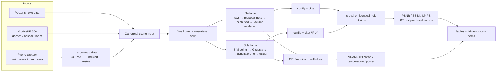
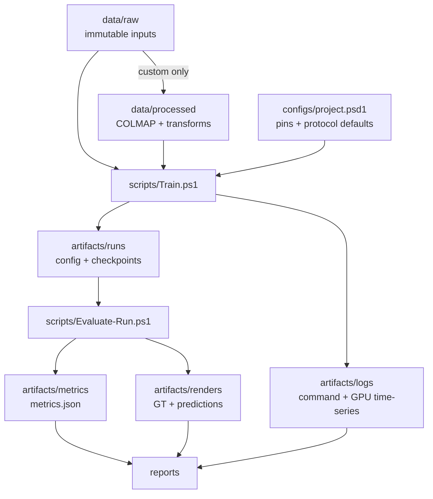

# Construction Architecture — Topic 16: NeRF vs 3D Gaussian Splatting

> Trạng thái: **implementation blueprint v2.0 — native Windows PowerShell**
> Ngày chốt nghiên cứu nguồn: **2026-09-23**
> Phần cứng mục tiêu: **ThinkPad P1 Gen 5, NVIDIA RTX A4500 Laptop GPU 16 GB**
> Tài liệu đầu vào: [`README.md`](README.md)
> Quy ước: nếu README ban đầu và tài liệu này khác nhau, dùng tài liệu này cho
> triển khai. README vẫn giữ vai trò mô tả đề tài và nền tảng toán học.
> Danh sách lệnh vận hành đầy đủ: [`setup_full_command.md`](setup_full_command.md).
> Danh sách module/giao việc: [`Modular_construct.md`](Modular_construct.md).

## Mục lục

1. [Kết luận kiến trúc](#1-kết-luận-kiến-trúc)
2. [Mục tiêu và phạm vi](#2-mục-tiêu-và-phạm-vi)
3. [Kiến trúc hệ thống](#3-kiến-trúc-hệ-thống)
4. [Cấu trúc repository](#4-cấu-trúc-repository)
5. [Phân tích paper và code repository](#5-phân-tích-paper-và-code-repository)
6. [Dataset đã chốt](#6-dataset-đã-chốt)
7. [Protocol thí nghiệm công bằng](#7-protocol-thí-nghiệm-công-bằng)
8. [Tối ưu cho RTX A4500 16 GB](#8-tối-ưu-cho-rtx-a4500-16-gb)
9. [Cài đặt và runbook](#9-cài-đặt-và-runbook)
10. [Data contract và artifact contract](#10-data-contract-và-artifact-contract)
11. [Roadmap triển khai](#11-roadmap-triển-khai)
12. [Rủi ro, guardrail và tiêu chí hoàn thành](#12-rủi-ro-guardrail-và-tiêu-chí-hoàn-thành)
13. [Nguồn chính thức](#13-nguồn-chính-thức)

---

## 1. Kết luận kiến trúc

### 1.1 Quyết định đã chốt

| Hạng mục | Quyết định | Lý do |
|---|---|---|
| Câu hỏi chính | So sánh Nerfacto và 3DGS trên cùng ảnh/camera/split/phần cứng | Đúng trọng tâm README, đo được và demo được |
| NeRF runtime | `nerfacto` trong Nerfstudio | Có hash encoding, proposal sampling, scene contraction; phù hợp ảnh thật |
| 3DGS runtime | `splatfacto` trong Nerfstudio, rasterizer `gsplat` | Chung data/eval/output với Nerfacto; tiết kiệm VRAM hơn code gốc |
| Framework chung | Nerfstudio `v1.1.5`, commit `6b60855...` | Một runtime chung; source snapshot và dependency pin được verify |
| gsplat runtime | `v1.4.0`, do Nerfstudio v1.1.5 pin | Tránh tự nâng version làm sai reproducibility |
| Pose | COLMAP qua `ns-process-data` | Một lần pose estimation, cả hai model dùng đúng cùng pose |
| Smoke test | Nerfstudio `poster` | Nhỏ, có sẵn format và sparse points; test cả hai method nhanh |
| Benchmark | Mip-NeRF 360: `garden`, `bonsai`, `room` | Đại diện outdoor, indoor nhỏ chi tiết, indoor rộng; giới hạn khối lượng hợp lý |
| Demo thực tế | Một scene điện thoại của nhóm, train/eval chụp tách riêng | Trả lời đúng “phone photos to 3D”, không làm loãng benchmark |
| Độ phân giải mặc định | `downscale_factor=2` cho cả hai method | Guardrail đầu tiên cho 16 GB VRAM; giữ công bằng |
| Train budget | 30,000 iterations, seed 42 | Mặc định thực dụng, cố định trong một config chung |
| Eval split benchmark | Mỗi ảnh thứ 8 làm eval (`interval=8`) | Khớp convention phổ biến của Mip-NeRF 360 và parser Nerfstudio |
| Metric chính | PSNR ↑, SSIM ↑, LPIPS ↓ | Được `ns-eval` tính trên held-out views |
| Metric hệ thống | wall time, peak VRAM, GPU utilization, model size, render throughput | Trả lời phần “in practice”, không chỉ chất lượng ảnh |
| Hệ điều hành | Native Windows 10/11, PowerShell-only | Khớp workflow người dùng; chấp nhận Windows upstream ít được test và bù bằng exact pins + smoke gate |
| Environment | Conda `topic16-ns115`; mọi wrapper dùng `conda run` | Pixi của Nerfstudio v1.1.5 chỉ khai báo `linux-64`; không dùng WSL trá hình |
| CUDA stack | Python 3.10, Torch 2.1.2/cu118, CUDA toolkit 11.8 | Cặp Windows được Nerfstudio hướng dẫn; tương thích A4500 CC 8.6 |
| Compiler | VS Build Tools, ưu tiên MSVC 14.29 cho CUDA 11.8 | tiny-cuda-nn cần native compiler; giảm lỗi do toolset quá mới |

### 1.2 Một runtime, nhiều nguồn tham chiếu

Không chạy Nerfacto bằng Nerfstudio rồi chạy 3DGS bằng repo INRIA như pipeline
chính. Cách đó làm khác data loader, camera conversion, eval split, metric code và
viewer, khiến kết quả khó quy trách nhiệm cho thuật toán. Thiết kế này dùng:

```text
Nerfstudio
├── nerfacto   → neural radiance field
└── splatfacto → 3D Gaussians → gsplat CUDA rasterizer
```

Repo NeRF gốc, MultiNeRF, Instant-NGP và 3DGS INRIA vẫn được pin trong
`third_party/` khi cần đọc code hoặc tái lập paper, nhưng **không trộn dependency**
vào environment chạy benchmark.

### 1.3 Những điểm README ban đầu cần hiệu chỉnh

1. Con số **4 GB VRAM** trong repo 3DGS gốc là khuyến nghị cho viewer; optimizer
   gốc ghi **24 GB VRAM để train ở chất lượng đánh giá của paper**. FAQ nói có thể
   giảm bằng cách hạn chế densification nhưng chất lượng có thể đổi. Vì vậy A4500
   16 GB không được mô tả là “dư sức” cho implementation gốc ở mọi scene.
2. `gsplat` báo cáo trên benchmark của chính dự án rằng có thể dùng tối đa khoảng
   **4× ít GPU memory** và train nhanh hơn tối đa **15%** so với rasterizer gốc.
   Đây là claim upstream, không phải kết quả của nhóm; nhóm phải đo lại.
3. Nerfacto không phải “original NeRF”. Nó là composite model: pose refinement,
   appearance embeddings, proposal sampling, scene contraction và hash encoding.
   Kết luận cuối bài phải ghi rõ là **Nerfacto vs Splatfacto**, không khái quát tuyệt
   đối thành mọi NeRF vs mọi 3DGS.
4. Không tuyên bố NeRF “xử lý transparency” tốt hơn nếu chưa có thí nghiệm. Volume
   density có thể biểu diễn hiệu ứng bán trong suốt, nhưng multi-view inconsistency,
   refraction và specular view dependence vẫn là bài toán khó.
5. Các bảng “expected PSNR/time/FPS” trong README chỉ là giả thuyết lập kế hoạch,
   không được chép sang Results như số đo.

---

## 2. Mục tiêu và phạm vi

### 2.1 Research question

Trên một laptop RTX A4500 16 GB, với cùng input views và camera poses:

> Nerfacto và Splatfacto khác nhau thế nào về chất lượng novel-view synthesis,
> thời gian huấn luyện, VRAM, kích thước model và tốc độ render trên scene indoor,
> outdoor và ảnh chụp điện thoại?

### 2.2 Các câu hỏi con đo được

- Phương pháp nào cho PSNR/SSIM/LPIPS tốt hơn trên từng loại scene?
- Đổi lại chất lượng đó cần bao nhiêu wall time, peak VRAM và dung lượng checkpoint?
- Artifact khác nhau ở foliage, thin structures, specular surfaces và vùng ít view ra sao?
- Khi dùng ảnh điện thoại thực tế, bottleneck nằm ở camera pose hay representation?
- Kết quả có còn đúng khi cùng giảm ảnh xuống 1/2 để vừa 16 GB VRAM?

### 2.3 Deliverables bắt buộc

- Pipeline chạy lại được bằng script từ raw data đến metrics.
- Kết quả đủ cho 3 benchmark scenes × 2 methods và 1 custom scene × 2 methods.
- Mỗi run giữ config, command, code revision, GPU log, checkpoint và eval JSON.
- Bảng định lượng; figure held-out side-by-side; failure-case crops.
- Một demo viewer/flythrough và video dự phòng.
- Báo cáo nêu đúng implementation/version, không biến expected result thành result.

### 2.4 Ngoài phạm vi v1

- Dynamic NeRF/4D Gaussian, relighting, semantic segmentation, SLAM online.
- Mesh reconstruction chất lượng sản xuất hoặc đo accuracy hình học bằng laser scan.
- Benchmark hàng chục paper mới; multi-GPU; mobile deployment.
- Tự viết lại CUDA rasterizer hoặc NeRF engine.

Chỉ mở rộng sau khi ma trận thí nghiệm cốt lõi hoàn tất.

---

## 3. Kiến trúc hệ thống

### 3.1 End-to-end flow



### 3.2 Shared-control architecture

Các biến cần khóa để so sánh có ý nghĩa:

| Shared control | Cách khóa |
|---|---|
| Raw input | Cùng scene directory, không copy/chỉnh khác nhau theo method |
| Camera pose/intrinsics | Cùng COLMAP result hoặc cùng `transforms.json` |
| Train/eval indices | `interval=8` cho benchmark; filename split cho custom |
| Image scale | `downscale_factor=2` |
| Hardware | Một GPU, không chạy song song workload khác |
| Iteration cap | 30k cho primary comparison |
| Seed | 42 |
| Evaluation code | Cùng `ns-eval` từ đúng runtime pin |
| System logging | Cùng `nvidia-smi` sampling mỗi 10 giây |

Điểm **không nên ép giống nhau** là batch semantics: Nerfacto tối ưu ray batches,
Splatfacto tối ưu full images. Vì thế 30k steps không đồng nghĩa cùng FLOPs. Report
cần công bố cả iteration budget và wall time; không dùng “step nhanh hơn” như kết
luận độc lập.

### 3.3 Kiến trúc dữ liệu



Nguyên tắc: `data/raw` là immutable; `processed`, `runs`, `metrics`, `renders` là
derived artifacts có thể tái tạo; code và config mới được Git quản lý.

### 3.4 Kiến trúc bên trong hai nhánh

#### Nerfacto

```text
camera ray
  → piecewise initial samples
  → proposal density network 1
  → proposal density network 2
  → concentrated samples near visible surfaces
  → contracted coordinates + multiresolution hash encoding
  → small fused MLP predicts density/features
  → view direction + appearance embedding predicts RGB
  → differentiable volume compositing
  → RGB/depth + losses
```

#### Splatfacto

```text
COLMAP sparse points
  → initialize 3D Gaussian means/colors/scales
  → project anisotropic covariance to screen-space ellipses
  → visibility-aware, tiled gsplat rasterization
  → front-to-back alpha compositing
  → photometric loss
  → optimize mean/scale/rotation/opacity/SH
  → clone/split/prune densification loop
```

Khác biệt cốt lõi: Nerfacto là hàm ẩn truy vấn dọc ray; Splatfacto giữ tập
primitive tường minh và rasterize chúng. Đây là cơ sở giải thích trade-off model
size, tốc độ render và loại artifact.

---

## 4. Cấu trúc repository

### 4.1 Cây thư mục đã scaffold

```text
Topic_16_CV/
├── README.md                       # Đề tài, toán nền và kế hoạch ban đầu
├── Construction_architect.md       # Source of truth triển khai (file này)
├── setup_full_command.md           # Runbook lệnh copy-paste từ setup đến eval
├── Modular_construct.md            # Working list P0..P10 + core/production gate
├── Invoke-Topic16.ps1              # Dispatcher PowerShell có help
├── .gitignore                      # Chặn data/checkpoint/upstream source
├── .gitattributes                  # Ép LF, đánh dấu binary artifacts
├── .editorconfig                   # Quy ước editor/indent/newline
├── configs/
│   └── project.psd1                # PowerShell data: version/dataset/protocol pins
├── scripts/
│   ├── lib/Common.ps1              # Root paths, helpers, config/Conda runner
│   ├── Install-HostTools.ps1       # Git/Miniconda/MSVC bootstrap
│   ├── Check-Environment.ps1       # Windows/GPU/disk/runtime preflight
│   ├── Setup-Project.ps1           # Setup hoàn chỉnh + requirements snapshot
│   ├── Setup-Runtime.ps1           # Conda + CUDA imports validation
│   ├── Test-Runtime.ps1            # CUDA/native CLI validation không cài lại
│   ├── Download-Repositories.ps1   # Exact runtime/research snapshots
│   ├── Download-Papers.ps1         # 7 PDF cốt lõi
│   ├── Download-Datasets.ps1       # smoke/benchmark/all, resume + validation
│   ├── Process-Capture.ps1         # Ảnh custom → COLMAP/Nerfstudio data
│   ├── Monitor-Gpu.ps1             # GPU/VRAM/temp/power CSV
│   ├── Train.ps1                   # Training entrypoint cho hai methods
│   ├── Evaluate-Run.ps1            # Inference/eval held-out views
│   └── Run-Benchmark.ps1           # Paired sequential experiment matrix
├── data/
│   ├── .cache/                     # Archive download có thể resume, ignored
│   ├── raw/                        # Input bất biến, ignored trừ README
│   └── processed/                  # Derived custom data, ignored trừ README
├── third_party/                    # Upstream source snapshots, ignored
├── docs/
│   ├── research/papers/            # PDF library; analysis nằm trong file này
│   └── protocols/                  # Checklist vận hành ngắn sau này
├── src/topic16/                    # Code nhóm tự sở hữu, importable package
├── tests/                          # Test cho code trong src, không test upstream
├── notebooks/                      # EDA/plot thử; không là pipeline chính
├── artifacts/
│   ├── runs/                       # Nerfstudio configs + checkpoints
│   ├── logs/                       # Runtime/GPU/provenance logs
│   ├── metrics/                    # Machine-readable eval JSON
│   ├── renders/                    # GT/predicted held-out frames
│   ├── exports/                    # PLY/point-cloud output, ignored
│   └── videos/                     # Flythrough/demo video, ignored
└── reports/                        # Nguồn báo cáo, bảng và figure đã chọn
```

### 4.2 Folder ownership

| Folder | Được ghi bởi | Nội dung hợp lệ | Không đặt ở đây |
|---|---|---|---|
| `configs/` | integration lead | Pin/version/default có review | Secret, checkpoint |
| `scripts/` | data/eval leads | Entrypoint tái lập, fail-fast | Notebook ad-hoc |
| `data/raw/` | downloader/capture lead | Original dataset/capture | Output model |
| `data/processed/` | preprocessing script | Pose, resized images, metadata | Ảnh chỉnh tay không log |
| `third_party/` | repo downloader | Exact upstream snapshots | Code nhóm sửa trực tiếp |
| `src/topic16/` | project developers | Aggregation/plot/analysis logic | Copy nguyên upstream |
| `artifacts/` | train/eval scripts | Derived run outputs | Tài liệu viết tay |
| `docs/research/papers/` | paper downloader | PDF local library | Dataset |
| `reports/` | writing lead | Paper/report/figures final | Raw logs/checkpoints |

### 4.3 Quy tắc cleanliness

- Không commit dataset, PDF, checkpoint, video lớn hoặc source upstream.
- Không sửa trực tiếp `third_party/*`; mọi khác biệt cần wrapper trong `src/` hoặc
  patch có mô tả rõ.
- Không hard-code đường dẫn Windows. Script suy ra project root từ vị trí file.
- Mọi entrypoint là PowerShell `.ps1`; không thêm Bash/Make/WSL command vào pipeline.
- Mọi download lớn hỗ trợ resume hoặc idempotent skip; không xóa dữ liệu sẵn có.
- Mỗi training run có UTC ID riêng; không overwrite run trước.
- Notebook chỉ khám phá. Code tạo bảng/figure cuối phải chuyển sang `src/topic16`.
- Secret/API key tuyệt đối không đặt vào `configs/project.psd1`.

---

## 5. Phân tích paper và code repository

### 5.1 Bản đồ paper → thành phần project

| Paper | Ý tưởng dùng trong project | Repo | Vai trò |
|---|---|---|---|
| NeRF (ECCV 2020) | Radiance field + volume rendering | `bmild/nerf` | Nền tảng lý thuyết |
| Mip-NeRF 360 (CVPR 2022) | Unbounded contraction, proposal sampling/distortion ideas | `google-research/multinerf` | Thành phần tư tưởng của Nerfacto + dataset |
| Instant-NGP (SIGGRAPH 2022) | Multiresolution hash encoding, fused CUDA MLP | `NVlabs/instant-ngp`, tiny-cuda-nn | Gia tốc Nerfacto |
| Nerfstudio (SIGGRAPH 2023) | Modular pipeline, Nerfacto, common CLI/eval | `nerfstudio-project/nerfstudio` | Runtime chính |
| 3DGS (SIGGRAPH 2023) | Explicit anisotropic Gaussians + densification + rasterizer | `graphdeco-inria/gaussian-splatting` | Nền tảng Splatfacto |
| gsplat (JMLR 2025) | Memory-efficient CUDA Gaussian rasterization | `nerfstudio-project/gsplat` | Backend Splatfacto |
| COLMAP / SfM Revisited (CVPR 2016) | Robust incremental Structure-from-Motion | `colmap/colmap` | Camera poses/sparse init |

### 5.2 NeRF — Representing Scenes as Neural Radiance Fields for View Synthesis

**Nguồn:** [project](https://www.matthewtancik.com/nerf),
[paper](https://arxiv.org/abs/2003.08934),
[official code](https://github.com/bmild/nerf).

**Paper làm gì.** NeRF học hàm liên tục
$F_\Theta(\mathbf{x},\mathbf{d})\rightarrow(\sigma,\mathbf{c})$. Một pixel được
tạo bằng lấy mẫu nhiều điểm trên camera ray rồi tích phân thể tích khả vi. Direction
đi vào nhánh màu để mô hình hóa view-dependent appearance; positional encoding giúp
MLP học chi tiết tần số cao. Coarse/fine sampling dành nhiều mẫu ở vùng có density.

**Kiến trúc paper.** Hai MLP coarse/fine; input vị trí 3D qua Fourier positional
encoding; viewing direction vào các layer muộn; alpha compositing tạo RGB; loss RGB
giữa render và ảnh thật cập nhật network.

**Repo làm gì.** Repo TensorFlow 1.x là reference implementation: loaders cho
Blender/LLFF/DeepVoxels, training/render script và Tiny-NeRF notebook. Nó hữu ích để
đọc formulation nguyên bản nhưng chậm và dependency cũ; project không dùng nó làm
runtime.

**Đầu tư sâu cho bài.** Hiểu volume rendering weights, transmittance và tại sao nhiều
query/ray làm rendering tốn kém. Khi phân tích artifact, liên hệ blur/floater với
density phân tán và pose error; không gọi Nerfacto là kiến trúc NeRF 2020 nguyên bản.

### 5.3 Mip-NeRF 360 — Unbounded Anti-Aliased Neural Radiance Fields

**Nguồn:** [project + dataset](https://jonbarron.info/mipnerf360/),
[paper](https://arxiv.org/abs/2111.12077),
[official code](https://github.com/google-research/multinerf).

**Paper làm gì.** Mở rộng mip-NeRF cho cảnh unbounded bằng scene contraction phi
tuyến, proposal MLP được online distillation để phân bổ samples, và distortion loss
để giảm floaters/background collapse. Đây là paper đứng sau benchmark thật 360° mà
dự án dùng.

**Kiến trúc paper.** Ray intervals được biểu diễn bằng conical frustums/integrated
encoding; tọa độ xa được contract vào miền hữu hạn; proposal network dự báo vùng có
khối lượng; NeRF chính render; proposal và distortion objectives regularize samples.

**Repo làm gì.** MultiNeRF là code JAX cho Mip-NeRF 360, Ref-NeRF và RawNeRF; có
LLFF/COLMAP loader, train/eval/render configs. Repo đã được GitHub đánh dấu archive
ngày 2025-02-11, nên chỉ là reference source, không phải runtime được bảo trì cho bài.

**Liên hệ Nerfacto.** Nerfacto mượn tinh thần proposal sampling và scene contraction,
nhưng thêm hash encoding, appearance conditioning, pose refinement và các lựa chọn
engineering khác. Kết quả Nerfacto không phải reproduction của Mip-NeRF 360 paper.

### 5.4 Instant Neural Graphics Primitives (Instant-NGP)

**Nguồn:** [project/paper](https://nvlabs.github.io/instant-ngp/),
[official code](https://github.com/NVlabs/instant-ngp),
[tiny-cuda-nn](https://github.com/NVlabs/tiny-cuda-nn).

**Paper làm gì.** Thay Fourier features lớn + MLP sâu bằng multiresolution hash tables
chứa feature học được và MLP nhỏ; hash collisions được phân giải qua nhiều mức độ
phân giải. Fully fused CUDA kernels giảm memory traffic và overhead.

**Repo làm gì.** Một C++/CUDA testbed cho NeRF, SDF, neural image và neural volume;
chứa GUI, bindings và dùng tiny-cuda-nn. Nó không chỉ là một Python NeRF package và
không dùng trực tiếp trong benchmark.

**Liên hệ Nerfacto.** Nerfacto dùng hash encoding và fused MLP cho density/field,
đây là lý do thực tế khiến “NeRF hiện đại” nhanh hơn NeRF 2020 nhiều bậc. Báo cáo cần
tách contribution của representation khỏi contribution của CUDA implementation.

### 5.5 Nerfstudio — A Modular Framework for Neural Radiance Field Development

**Nguồn:** [paper](https://arxiv.org/abs/2302.04264),
[official code](https://github.com/nerfstudio-project/nerfstudio),
[Nerfacto docs](https://docs.nerf.studio/nerfology/methods/nerfacto.html),
[installation](https://docs.nerf.studio/quickstart/installation.html).

**Paper làm gì.** Đề xuất framework module hóa DataParser → DataManager → Model →
Pipeline → Trainer/Viewer và giới thiệu Nerfacto như cấu hình kết hợp nhiều kỹ thuật
đã chứng minh hữu ích cho real captures.

**Nerfacto architecture.** Piecewise initial sampler; hai proposal density fields;
scene contraction cho unbounded content; multires hash encodings + small MLP; per-image
appearance embeddings; tùy chọn camera pose refinement; volume renderer.

**Repo làm gì.** Cung cấp `ns-process-data`, `ns-train`, `ns-eval`, `ns-render`,
viewer, exporters, data conventions và nhiều method. Nó là integration layer duy
nhất của project. Pin `v1.1.5` vì release này có Pixi environment Linux gồm CUDA
11.8/PyTorch 2.2.x để tham chiếu và `pyproject.toml` pin `gsplat==1.4.0`. Vì Pixi
manifest chỉ khai báo `linux-64`, Windows runtime dùng Conda với cặp theo official
Windows guide: PyTorch 2.1.2/cu118, Python 3.10, COLMAP 3.9.1, gsplat wheel 1.4.0
pt21/cu118 và tiny-cuda-nn commit đã pin.

**Giới hạn.** Nerfacto là “defacto method”, không phải một paper architecture độc
lập với ablation đầy đủ cho mọi thành phần. Splatfacto cũng có thể drift khỏi code
3DGS gốc; phải ghi version và tên method cụ thể.

### 5.6 3D Gaussian Splatting for Real-Time Radiance Field Rendering

**Nguồn:** [project/paper](https://repo-sam.inria.fr/fungraph/3d-gaussian-splatting/),
[official code](https://github.com/graphdeco-inria/gaussian-splatting).

**Paper làm gì.** Dùng sparse SfM points để khởi tạo tập 3D Gaussian tường minh.
Mỗi Gaussian có mean, anisotropic covariance (scale + rotation), opacity và spherical
harmonics cho màu phụ thuộc hướng. Visibility-aware tile rasterizer chiếu ellipse 2D
và alpha composite theo depth. Interleaved optimization/density control clone, split
hoặc prune primitive.

**Repo làm gì.** Bốn phần chính theo README upstream: PyTorch optimizer, network
viewer, SIBR real-time viewer và conversion script từ ảnh sang SfM layout. Đây là
implementation chuẩn để đọc/tái lập paper, nhưng có CUDA extensions/submodules và
stack riêng.

**Ràng buộc hardware.** Upstream yêu cầu GPU compute capability ≥7.0 và ghi 24 GB
VRAM cho paper-evaluation-quality training; 4 GB là khuyến nghị viewer. Đây là lý do
không chọn repo này làm critical path trên A4500 16 GB.

**Đầu tư sâu cho bài.** Giải thích covariance projection, ordered alpha blending,
densification và vì sao tập primitive có thể phình thành hàng triệu phần tử. Artifact
“needle/spike”, floater và model size phải được liên hệ với scale/densification, không
chỉ mô tả bằng mắt.

### 5.7 gsplat — An Open-Source Library for Gaussian Splatting

**Nguồn:** [JMLR paper](https://jmlr.org/papers/v26/24-1476.html),
[official code](https://github.com/nerfstudio-project/gsplat),
[docs](https://docs.gsplat.studio/).

**Paper/library làm gì.** Cung cấp CUDA-accelerated differentiable Gaussian
rasterization với Python API, memory-efficient training, nhiều camera model và các
strategy densification. Đây là rendering backend, không tự nó là toàn bộ reconstruction
pipeline.

**Repo làm gì.** Có core operators, examples train COLMAP captures, benchmark script,
viewer và evaluation so với implementation gốc. Upstream báo cáo tối đa 4× ít memory
và tối đa 15% ít training time trong benchmark của họ; bài này sẽ coi đó là hypothesis
cần đo trên A4500.

**Liên hệ project.** Splatfacto dùng gsplat. Không cài gsplat `main` riêng vì có thể
không tương thích; Nerfstudio v1.1.5 pin 1.4.0. Repo gsplat mới chỉ clone khi nghiên
cứu source, không override package runtime.

### 5.8 COLMAP — Structure-from-Motion Revisited

**Nguồn:** [paper](https://openaccess.thecvf.com/content_cvpr_2016/html/Schonberger_Structure-From-Motion_Revisited_CVPR_2016_paper.html),
[official code/docs](https://github.com/colmap/colmap).

**Paper làm gì.** Cải thiện incremental SfM bằng scene graph, robust initialization,
triangulation và bundle adjustment để suy ra intrinsics, extrinsics và sparse 3D
points từ ảnh overlap.

**Repo làm gì.** Feature extraction/matching, sparse/dense reconstruction, GUI/CLI và
camera models. `ns-process-data` gọi COLMAP rồi chuyển convention camera sang format
Nerfstudio.

**Tại sao quan trọng.** Pose error ảnh hưởng cả hai methods và có thể lớn hơn khác
biệt representation. Project phải log tỷ lệ registered images, xem sparse point cloud
trước khi train, và không kết luận “model kém” nếu COLMAP fail.

---

## 6. Dataset đã chốt

### 6.1 Ma trận dữ liệu tối thiểu

| Tier | Dataset/scene | Vai trò | Dùng trong kết quả chính? |
|---|---|---|---|
| 0 | Nerfstudio `poster` | Smoke test install, CUDA, cả hai trainers, eval | Không |
| 1 | Mip-NeRF 360 `garden` | Outdoor, foliage, background unbounded | Có |
| 1 | Mip-NeRF 360 `bonsai` | Indoor object-centric, chi tiết nhỏ | Có |
| 1 | Mip-NeRF 360 `room` | Indoor rộng, texture/occlusion | Có |
| 2 | `custom:<scene>` | Phone-captured real workflow + demo | Có, bảng riêng |

Không dùng NeRF Synthetic làm benchmark chính: synthetic clean background không đại
diện phone capture, và Splatfacto hoạt động tốt hơn khi có SfM sparse geometry. Nếu
cần dạy toán NeRF có thể tải riêng, nhưng không thêm vào ma trận v1.

### 6.2 Mip-NeRF 360

- Nguồn chính thức: `https://storage.googleapis.com/gresearch/refraw360/360_v2.zip`.
- Kích thước archive đã kiểm tra qua HTTP metadata: `12,535,427,936` bytes (~11.67 GiB).
- Script tải có resume, retry, size check, ZIP integrity check và chỉ extract ba scene.
- Archive giữ tại `data/.cache/360_v2.zip` để lần chạy sau không tải lại.
- Cần tối thiểu 20 GiB trống trước download/extract; nên dự trù 30–40 GiB cho data + runs.
- Không redistribute archive trong Git/release. Giữ citation và kiểm tra điều khoản
  dataset trước khi public mirror.

### 6.3 Phone capture protocol

**Scene chọn:** một vật/cụm vật static, nhiều texture, có cả vùng mảnh; tránh kính
trong suốt/gương lớn trong lần baseline đầu.

**Capture:**

1. Khóa exposure/focus/white balance nếu app cho phép; không đổi zoom/lens giữa chừng.
2. Diffuse light, không để vật/người di chuyển, không dùng portrait blur/HDR thay đổi mạnh.
3. Hai vòng camera: thấp và cao, overlap khoảng 70–80%; thêm một số view top/detail.
4. Ưu tiên 80–150 ảnh sắc hơn video hàng nghìn frame gần trùng nhau.
5. Chụp train và eval thành hai thư mục riêng. Eval gồm khoảng 10–15% viewpoints xen
   giữa quỹ đạo train nhưng không trùng frame.
6. Không crop/rotate riêng lẻ sau capture; loại frame blur trước COLMAP và ghi lại count.

Layout raw đề nghị:

```text
data/raw/custom/object_v1/
├── train/   # filenames train_0001.jpg ...
└── eval/    # filenames eval_0001.jpg ...
```

Process:

```powershell
.\scripts\Process-Capture.ps1 `
  -Scene object_v1 `
  -TrainImages '.\data\raw\custom\object_v1\train' `
  -EvalImages '.\data\raw\custom\object_v1\eval'
```

`ns-process-data --eval-data` giữ split theo filename. Nếu không có eval folder,
wrapper train dùng interval split; cách đó chỉ là fallback, không phải protocol final.

### 6.4 Data quality gate trước training

- Ít nhất 90% ảnh train được COLMAP register; nếu thấp hơn, sửa capture trước khi tune model.
- Sparse cloud có hình dạng hợp lý, camera frustums bao quanh scene, không có cluster rời lớn.
- Intrinsics/lens đúng; không trộn ultra-wide và main lens.
- Eval images không xuất hiện trong train list.
- Cả hai methods trỏ đến cùng một processed directory và downscale.

---

## 7. Protocol thí nghiệm công bằng

### 7.1 Primary protocol

| Biến | Giá trị |
|---|---|
| GPU | RTX A4500 Laptop 16 GB, 1 device |
| Runtime | Nerfstudio v1.1.5 / gsplat 1.4.0 |
| Methods | `nerfacto`, `splatfacto` |
| Iterations | 30,000 |
| Image scale | 1/2 (`downscale_factor=2`) |
| Random seed | 42 |
| Benchmark split | eval every 8th image |
| Custom split | explicit train/eval filename split |
| Visualizer | TensorBoard; viewer tắt trong benchmark training |
| GPU logging | 10 s interval |

Giữ method defaults của pinned release cho baseline. Chỉ tune sau khi baseline của
cả hai method chạy xong; mọi tuned result phải đặt bảng riêng, không thay lặng lẽ.

### 7.2 Metric definitions

- **PSNR ↑:** fidelity theo pixel từ MSE; dễ bị background/brightness chi phối.
- **SSIM ↑:** local structure/contrast; vẫn không hoàn toàn tương ứng perception.
- **LPIPS ↓:** khoảng cách feature perceptual; ghi rõ implementation/version từ runtime.
- **Train wall time ↓:** từ lúc `ns-train` bắt đầu đến kết thúc; first run có thể chứa
  CUDA JIT warm-up nên phải ghi chú hoặc warm-up trước.
- **Peak VRAM ↓:** max `memory.used` trong GPU CSV; nêu sampling interval 10 s nên có
  thể bỏ lỡ spike ngắn.
- **Model size ↓:** tổng byte của checkpoint/export dùng để demo; không so PLY với
  checkpoint nếu chưa ghi rõ format.
- **Render throughput ↑:** render cùng camera path, cùng resolution, cùng machine;
  bỏ frame warm-up. Viewer-reported FPS chỉ là secondary vì browser/UI overhead.

### 7.3 Experiment matrix

```text
poster:  nerfacto, splatfacto           # gate only
garden:  nerfacto, splatfacto           # primary outdoor
bonsai:  nerfacto, splatfacto           # primary indoor object
room:    nerfacto, splatfacto           # primary indoor scene
custom:  nerfacto, splatfacto           # phone workflow/demo
```

Tổng tối thiểu: 10 runs, trong đó 8 runs đưa vào phân tích. Nếu còn budget, lặp
`bonsai` với seeds 43/44 để báo variance; không mở rộng thêm dataset trước bước này.

### 7.4 Trình tự mỗi run

1. Xác nhận data quality gate và disk space.
2. Đóng workload GPU khác; ghi driver/GPU/code status.
3. Warm-up smoke run trước benchmark đầu tiên để compile CUDA kernels.
4. Train bằng `scripts/Train.ps1`; script ghi command và GPU series.
5. Eval bằng exact `config.yml` sinh ra, không reconstruct command bằng trí nhớ.
6. Kiểm tra GT/prediction count, JSON metrics và NaN.
7. Đo checkpoint/export size; đánh dấu success/failure bằng manifest sau này.
8. Chỉ aggregate khi đủ hai methods của cùng scene.

### 7.5 Phân tích định tính bắt buộc

Chọn cùng pixel crop/camera cho cả hai phương pháp:

- foliage/thin edges (`garden`),
- fine texture and specular leaves/pot (`bonsai`),
- distant/low-overlap regions (`room`),
- phone scene: ít texture, highlight và vùng ngoài capture hull.

Mỗi failure case phải có giả thuyết nguyên nhân: pose, under-coverage, appearance
change, density ambiguity hoặc Gaussian densification. Không chỉ ghi “ảnh xấu/đẹp”.

---

## 8. Tối ưu cho RTX A4500 16 GB

### 8.1 Guardrail theo thứ tự

1. **Mặc định 1/2 resolution cho cả hai.** Đây là thiết lập benchmark, không phải
   emergency tweak riêng cho một method.
2. Không mở viewer trong lúc đo; `--vis tensorboard` giảm UI/render interference.
3. Không chạy hai training job cùng lúc; đóng ứng dụng dùng GPU.
4. Đảm bảo CUDA extension compile trước timed runs bằng poster smoke test.
5. Giữ đủ system RAM/pagefile; compile tiny-cuda-nn có thể cần nhiều RAM.
6. Nếu Splatfacto OOM, trước tiên xác nhận scene/resolution và version; chỉ sau đó
   tạo một **low-memory protocol riêng**. Không đổi densification cho riêng một run
   rồi trộn vào baseline.
7. Nếu data cache full GPU/RAM ở scene lớn, dùng option cache-to-disk của Splatfacto
   theo docs pinned release; ghi flag đầy đủ trong command log.

### 8.2 Native Windows và đường dẫn hiện tại

Laptop lead hiện chạy tại `D:\Desktop_informations\...\Topic_16_CV`; máy khác
clone vào thư mục tùy chọn theo runbook. PowerShell
scripts suy ra root bằng `$PSScriptRoot`, vì vậy khoảng trắng và Unicode trong path
không được xử lý bằng string nối thủ công. Mọi native command nhận argument array;
runbook luôn quote path copy-paste.

Conda environment độc lập với project data; wrapper dùng `conda run -n
topic16-ns115` nên không dựa vào `conda activate`. Nerfstudio ghi rõ Windows ít được
test hơn Linux; do đó exact pin, precompiled gsplat wheel, MSVC gate và poster smoke
test là điều kiện bắt buộc, không phải bước tùy chọn.

### 8.3 Nhiệt và power

Laptop dễ throttle. GPU CSV ghi temperature và power draw; đặt máy ở chế độ AC,
performance mode và thông gió ổn định. Không tự đặt power limit trong script vì đây
là thay đổi hệ thống; nếu nhóm chọn power cap, dùng cùng cap cho mọi run và ghi vào
protocol.

### 8.4 Không hứa trước performance

Không sử dụng con số thời gian/FPS từ GPU khác như kết quả dự kiến chắc chắn. Sau
smoke test, chạy một pair `bonsai` để hiệu chỉnh schedule rồi mới ước lượng toàn bộ.

---

## 9. Cài đặt và runbook

### 9.1 Prerequisites

- Windows 10/11 x64 và Windows PowerShell 5.1+ hoặc PowerShell 7.
- NVIDIA driver nhìn thấy GPU qua `nvidia-smi`.
- Git, Miniconda và Visual Studio Build Tools với C++ workload/MSVC v142.
- Ít nhất 20 GiB trống trước dataset; 30–40 GiB thực tế cho data + artifacts.

Kiểm tra host:

```powershell
Set-ExecutionPolicy -Scope Process Bypass
.\scripts\Check-Environment.ps1
.\scripts\Install-HostTools.ps1 -InstallBuildTools  # chỉ khi preflight báo thiếu
```

### 9.2 Fetch runtime đã pin

```powershell
.\scripts\Setup-Project.ps1
.\scripts\Check-Environment.ps1 -RequireRuntime
```

Setup checkout detached exact SHA, tạo Conda env, cài CUDA toolkit,
COLMAP/FFmpeg, PyTorch, exact source Nerfstudio, wheel gsplat, build tiny-cuda-nn
cho CC 8.6, tải/kiểm tra cả hai dataset profiles và xuất snapshot
`artifacts/logs/runtime/requirements.txt`. Snapshot bị Git ignore, không phải
installer/lockfile; nguồn pin là `configs/project.psd1`. Không activate; wrapper
luôn dùng `conda run`. Trên laptop lead runtime và dữ liệu PASS 2026-09-24;
training/inference và G-Core chưa PASS. CPU members không chạy setup CUDA;
GPU 6 GB chỉ diagnostic, không thay phép đo A4500. Runbook bắt đầu bằng clone
portable cho máy khác, không cần Codex hoặc ổ D:.

### 9.3 Paper/repo research library

```powershell
.\scripts\Download-Papers.ps1
.\scripts\Download-Repositories.ps1 -Mode research
```

Các repo research khá lớn, đặc biệt repo có submodules. Không cần tải để chạy
benchmark; chỉ chạy khi người phụ trách paper cần đọc implementation.

### 9.4 Smoke gate

```powershell
.\scripts\Download-Datasets.ps1 -Mode smoke
.\scripts\Train.ps1 -Method nerfacto -Dataset poster
.\scripts\Train.ps1 -Method splatfacto -Dataset poster
```

Sau mỗi run, lấy path `config.yml` được in ra và chạy:

```powershell
.\scripts\Evaluate-Run.ps1 -ConfigPath '.\artifacts\runs\poster\nerfacto\<UTC-ID>\config.yml'
.\scripts\Evaluate-Run.ps1 -ConfigPath '.\artifacts\runs\poster\splatfacto\<UTC-ID>\config.yml'
```

Gate pass khi cả hai train, save checkpoint, `ns-eval` sinh JSON và không OOM/NaN.

### 9.5 Benchmark data và runs

```powershell
.\scripts\Download-Datasets.ps1 -Mode benchmark
.\scripts\Run-Benchmark.ps1 -Scenes bonsai  # calibration pair trước
.\scripts\Run-Benchmark.ps1 -Scenes garden,room
```

Download chính thức có dung lượng 12.5 GB, resume và exact-byte validation. Benchmark
chạy tuần tự để không có hai workload tranh 16 GB VRAM.

### 9.6 Custom capture

```powershell
.\scripts\Process-Capture.ps1 `
  -Scene object_v1 `
  -TrainImages '.\data\raw\custom\object_v1\train' `
  -EvalImages '.\data\raw\custom\object_v1\eval'

.\scripts\Train.ps1 -Method nerfacto -Dataset 'custom:object_v1'
.\scripts\Train.ps1 -Method splatfacto -Dataset 'custom:object_v1'
```

### 9.7 Truyền override có kiểm soát

Các argument sau dataset key được chuyển thẳng tới `ns-train`, ví dụ một diagnostic
run ngắn:

```powershell
.\scripts\Train.ps1 -Method nerfacto -Dataset poster --max-num-iterations 1000
```

Lưu ý argument lặp sau sẽ override giá trị trước theo parser behavior; command đầy
đủ được ghi lại. Override không được đưa vào primary table nếu không tạo protocol
name mới.

---

## 10. Data contract và artifact contract

### 10.1 Canonical input contracts

**COLMAP scene:**

```text
scene/
├── images/ or images_2/
└── sparse/0/
    ├── cameras.bin|txt
    ├── images.bin|txt
    └── points3D.bin|txt
```

**Nerfstudio scene:**

```text
scene/
├── transforms.json
├── images/
├── images_2/
└── colmap/sparse/0/ or sparse_pc.ply  # nếu ns-process-data tạo
```

Camera convention không chuyển tay. Nerfstudio dùng camera/view convention kiểu
OpenGL (+X right, +Y up, -Z look direction), còn COLMAP/OpenCV dùng +Y down, +Z
forward; parser chịu trách nhiệm chuyển đổi.

### 10.2 Run contract

Một run hợp lệ phải có:

- `artifacts/runs/.../config.yml`,
- ít nhất một checkpoint trong `nerfstudio_models/`,
- `artifacts/logs/.../command.txt`, `train.log`, `run.env`,
- `gpu.csv` nếu `nvidia-smi` khả dụng,
- Git status và GPU/driver snapshot,
- sau eval: `metrics.json` và held-out renders.

Nếu thiếu một mục, đánh dấu incomplete và không aggregate tự động.

### 10.3 Naming

```text
dataset key: poster | garden | bonsai | room | custom:<slug>
method:      nerfacto | splatfacto
run id:      YYYYMMDDTHHMMSSfffZ (UTC, millisecond precision)
```

Không dùng tên `final`, `final2`, `best_new`. Selection “best” phải diễn ra ở report
manifest, không rename artifact gốc.

### 10.4 Provenance tối thiểu khi public kết quả

- Project Git commit/tag.
- Nerfstudio/gsplat exact refs.
- NVIDIA driver, CUDA runtime reported by PyTorch, GPU name.
- Dataset source and scene; split; downscale.
- Full generated `config.yml` và command.
- Failure/exclusion reason nếu một run bị bỏ.

---

## 11. Roadmap triển khai

Roadmap executable và Definition of Done chi tiết nằm trong
[`Modular_construct.md`](Modular_construct.md). Thứ tự bắt buộc:

1. `P0–P1`: Windows runtime và contracts.
2. `P2–P3`: official datasets, phone capture, pose và frozen split.
3. `P4`: training core; `P5`: inference/evaluation core.
4. `P6`: paired benchmark; `P7`: analysis và gate `G-Core`.
5. Chỉ khi `G-Core` PASS mới làm `P8–P9` production/demo.
6. `P10` QA chạy xuyên suốt nhưng GPU smoke nằm trên laptop mục tiêu.

Ranh giới này ngăn tình trạng dựng UI/production quanh model chưa train/evaluate
đúng, hoặc dùng training views như inference evidence.

### Thứ tự đầu tư sâu

1. **Pose/data quality** — lỗi ở đây làm cả hai nhánh vô nghĩa.
2. **Fair split/evaluation** — không dùng training views để tính metrics.
3. **Reproducibility/runtime logging** — tránh mất kết quả sau nhiều giờ train.
4. **Core paper understanding** — volume rendering, contraction, hash grid,
   covariance projection, densification.
5. **Failure analysis** — phần tạo giá trị học thuật hơn leaderboard nhỏ.
6. Chỉ sau đó mới tune hyperparameter hoặc thêm scene/method.

---

## 12. Rủi ro, guardrail và tiêu chí hoàn thành

### 12.1 Risk register

| Rủi ro | Dấu hiệu sớm | Guardrail/response |
|---|---|---|
| CUDA/PyTorch/compiler lệch | build tcnn/import gsplat fail | Conda exact pins, gsplat Windows wheel, MSVC gate; không pip-upgrade tùy tiện |
| Windows GPU không thấy | `nvidia-smi` fail | Sửa NVIDIA Windows driver trước Python setup |
| MSVC quá mới cho CUDA 11.8 | nvcc rejects compiler | Cài/activate v142 14.29; không nâng stack giữa protocol |
| 3DGS OOM | VRAM tăng theo densification | 1/2 resolution; no viewer; low-memory protocol riêng nếu cần |
| COLMAP register thấp | camera cluster rời, sparse cloud sai | Capture lại/tăng overlap, không tune model để chữa pose |
| Data leakage | metrics quá cao, eval frame trùng train | Frozen interval/filename split, inspect file lists |
| First-run timing bias | run đầu chậm do JIT | Poster warm-up trước timed benchmark |
| Upstream drift | lệnh hôm sau khác behavior | Exact commits + generated config archived |
| Disk đầy | checkpoint/download fail | 20 GiB gate download; theo dõi 30–40 GiB reserve |
| Viewer FPS không công bằng | resolution/UI khác | Fixed offline camera path/resolution; viewer FPS secondary |
| Claim vượt dữ liệu | “3DGS luôn tốt hơn” | Chỉ kết luận trong methods/scenes/hardware đã đo |

### 12.2 Definition of done

Project v1 hoàn thành khi:

- Tất cả PowerShell scripts pass parser/PSScriptAnalyzer checks.
- Poster pass end-to-end cho hai methods.
- Ba benchmark scenes có đủ paired runs và eval JSON.
- Custom scene có explicit held-out views, COLMAP quality gate và paired runs.
- Metrics table không có training-view leakage; mọi số có artifact truy ngược.
- Hardware table dùng số đo trên A4500, không dùng expected values trong README.
- Báo cáo giải thích ít nhất ba failure cases bằng kiến trúc/paper.
- Một người mới clone repo có thể đi theo section 9 mà không đoán folder/path.

### 12.3 Các kiểm tra local hiện có

```powershell
.\Invoke-Topic16.ps1 help
.\scripts\Check-Environment.ps1
.\scripts\Check-Environment.ps1 -RequireRuntime
```

CI chỉ parse/lint PowerShell, unit test code nhóm và validate contracts; GPU poster
smoke chạy trên RTX A4500 mục tiêu.

---

## 13. Nguồn chính thức

Các link dưới đây được ưu tiên hơn blog/tutorial thứ ba và đã được kiểm tra khi xây
blueprint ngày 2026-09-21.

### Papers, projects, code

- NeRF: [project](https://www.matthewtancik.com/nerf) ·
  [paper](https://arxiv.org/abs/2003.08934) ·
  [code](https://github.com/bmild/nerf)
- Mip-NeRF 360: [project/dataset](https://jonbarron.info/mipnerf360/) ·
  [paper](https://arxiv.org/abs/2111.12077) ·
  [MultiNeRF code](https://github.com/google-research/multinerf)
- Instant-NGP: [project/paper](https://nvlabs.github.io/instant-ngp/) ·
  [code](https://github.com/NVlabs/instant-ngp) ·
  [tiny-cuda-nn](https://github.com/NVlabs/tiny-cuda-nn)
- Nerfstudio: [paper](https://arxiv.org/abs/2302.04264) ·
  [code/releases](https://github.com/nerfstudio-project/nerfstudio) ·
  [installation](https://docs.nerf.studio/quickstart/installation.html) ·
  [Nerfacto](https://docs.nerf.studio/nerfology/methods/nerfacto.html) ·
  [Splatfacto](https://docs.nerf.studio/nerfology/methods/splat.html) ·
  [data convention](https://docs.nerf.studio/quickstart/data_conventions.html)
- 3D Gaussian Splatting: [project/paper](https://repo-sam.inria.fr/fungraph/3d-gaussian-splatting/) ·
  [official code](https://github.com/graphdeco-inria/gaussian-splatting)
- gsplat: [JMLR paper](https://jmlr.org/papers/v26/24-1476.html) ·
  [code](https://github.com/nerfstudio-project/gsplat) ·
  [docs](https://docs.gsplat.studio/)
- COLMAP: [SfM paper](https://openaccess.thecvf.com/content_cvpr_2016/html/Schonberger_Structure-From-Motion_Revisited_CVPR_2016_paper.html) ·
  [code/docs](https://github.com/colmap/colmap)

### Dataset/download verification

- Official Mip-NeRF 360 archive:
  `https://storage.googleapis.com/gresearch/refraw360/360_v2.zip`
- The current gsplat official downloader uses the same archive:
  [`examples/datasets/download_dataset.py`](https://github.com/nerfstudio-project/gsplat/blob/main/examples/datasets/download_dataset.py)
- Nerfstudio smoke command and poster capture:
  [`ns-download-data nerfstudio --capture-name=poster`](https://github.com/nerfstudio-project/nerfstudio)

### Pin registry in this repo

`configs/project.psd1` là registry executable cho exact commits, dataset size, selected
scenes và protocol defaults. Khi nâng version, tạo một change có review, rerun smoke
gate, và không trộn kết quả trước/sau upgrade trong cùng bảng.
