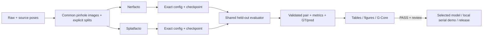

# Kiến trúc thực thi — Topic 16

Nguồn pin: [configs/project.psd1](configs/project.psd1). Lệnh vận hành:
[setup_full_command.md](setup_full_command.md). Evidence:
[docs/implementation_status.md](docs/implementation_status.md).

## 1. Phạm vi và protocol

Nerfacto vs Splatfacto trong cùng Nerfstudio pinned checkout, một A4500 Laptop
16 GB; primary 30.000 iterations, seed 42, downscale 2, eval interval 8.
Poster là smoke; garden/bonsai/room là benchmark; custom có bảng riêng.
Giữ method defaults, không đổi riêng một method để tránh OOM. `diagnostic` phải
có nhãn riêng; `repeat` dùng seeds 43/44 và report riêng. Không lấy số GPU 6 GB
hoặc paper thay số đo A4500. Phân tích không phải reproduction NeRF/3DGS gốc.


```mermaid
flowchart LR
    R[Raw + source poses] --> C[Common pinhole images + explicit splits]
    C --> N[Nerfacto]
    C --> S[Splatfacto]
    N --> AN[Exact config + checkpoint]
    S --> AS[Exact config + checkpoint]
    AN --> E[Shared held-out evaluator]
    AS --> E
    E --> P[Validated pair + metrics + GT/pred]
    P --> A[Tables / figures / G-Core]
    A -->|PASS + review| D[Selected model / local serial demo / release]
```

Theo yêu cầu tích hợp toàn bộ code ngày 2026-09-30, adapter demo được chuẩn bị cùng
core; **activation và release** vẫn cần G-Core PASS. Không đánh dấu gate nghiên
cứu hoàn thành chỉ vì source/test đã viết.

## 2. Cấu trúc tối giản và dependency

| Module | Đọc từ | Cung cấp | Không phụ thuộc |
|---|---|---|---|
| `contracts.py` | JSON/files/hash | path guards, run/pair/split/metric validation | CUDA, upstream import |
| `data.py` | pins, source images/poses | capture quality, canonical pinhole input, frozen split | trainer, report, demo |
| `video.py` | video + FFprobe timestamps | deterministic frames/split/hashes/contact sheet | training, CUDA |
| `safety.py` | registry + nvidia-smi | clock preflight, watchdog, owned-process stop | model/upstream imports |
| `sessions.py` | stop request + committed resume record | stop giữa camera, strict checkpoint/budget/identity | CUDA, upstream import |
| `training_worker.py` | pinned Trainer + sessions | atomic checkpoint, optimizer/scheduler/RNG restore, remaining budget | analysis/demo |
| `runtime.py` | contracts + data + pinned upstream | training/eval/render/export, OS GPU lock | analysis/UI |
| `experiments.py` | contracts; runtime khi chạy | sequential matrices, exact resume | demo |
| `analysis.py` | verified paired artifacts | CSV/JSON/MD, crops/plots, G-Core | trainer; không load model |
| `demo.py` | contracts + analysis gate + runtime loader | read-only serial inference, selection/release | optimizer/training requests |
| `cli.py` | arguments + registry JSON | dispatcher nội bộ | imports GPU lười theo task |

PowerShell entrypoints ở `scripts/`, chỉ `lib/Common.ps1` dùng chung. Kiểm tra
generated config của helper cũ được tích hợp vào `runtime.py`; bỏ hai helper
`Capture.ps1`/`Run.ps1` không có caller. COLMAP binary/parser dùng pinned upstream
thay vì duy trì một binary reader thứ hai.
Không thêm production subtree hay notebook placeholder. Giữ `data/raw`,
`data/processed`, các artifact categories vì chúng có ranh giới lifecycle thực.

## 3. Data contract: source → canonical → run

```text
data/raw/nerfstudio/poster/             nguồn giữ nguyên, 226 metadata entries / 100 ảnh
data/processed/nerfstudio/poster/       subset matched 100 frames, UTF-8 không BOM
data/raw/mipnerf360/<scene>/            ảnh nguồn + images_2 + sparse/0
data/raw/custom/<slug>/{train,eval}/    ảnh người dùng, không trùng hash/tên
data/processed/custom/<slug>/          ns-process-data output + capture.json
data/processed/canonical/<scene>/      input chung của cả hai methods
  images/ + images_2/ + transforms.json + sparse_pc.ply + preparation.json
```

`prepare_scene` lấy actual train/test outputs từ parser pinned ở full resolution,
bao gồm convention conversion/normalization và sparse points trong cùng hệ.
Distorted images dùng đúng `_undistort_image` ở pinned FullImageDatamanager;
GT được crop và intrinsics cập nhật **trước cả hai trainers**. Resize lossless PNG
bằng Pillow LANCZOS; distortion bằng zero. Explicit train/val/test filename lists
preserve source membership/order, không chia lại bằng folder order mới.

`preparation.json` ghi source/output hashes, recipe, registry snapshot hash và
data fingerprint. Sửa ảnh/pose/downscale/split/upstream bị từ chối; thay thermal/
clock policy không thay ảnh canonical. Legacy fingerprint chỉ nâng cấp khi
immutable registry snapshot chứng minh data settings tương đương và mọi hash
vẫn đúng; giữ metadata backup. Partial output không được coi là thành công.
Không sửa/copy COLMAP pose thủ công. Canonical dataset không phải archive gốc,
vì vậy report phải nêu preprocessing và không so trực tiếp với published scores
như một reproduction có cùng preprocessing.

`freeze_split` đọc actual canonical dataparser: filename, image SHA-256, camera
matrix/intrinsics/resolution/type/distortion, sparse/pose checksums. Hash của
canonical JSON (sort keys, compact separators, UTF-8) vào run schema P1.
Không có raw duplicate train/eval; evaluator kiểm tra lại loaded image/camera
identities, intrinsics, poses và GT checksums giữa hai methods.

Custom cần ≥90% train register, mọi eval image register, ≥8 train/≥2 eval,
không duplicate/corrupt, và review frustums/sparse geometry có reviewer/notes.
`Approve-Capture.ps1` ghi sự duyệt thật; không tự suy pose PASS từ exit 0.
Số ảnh đề nghị vẫn 80–150 với 10–15% viewpoints eval.

`Extract-Video.ps1` lấy frame theo timestamp (hỗ trợ VFR), split trước SfM, lưu
source/index/time/image hashes và contact sheet. Một video chỉ cung cấp held-out
interpolation có tương quan. `tea_sets_2.mp4` là nguồn cảnh tĩnh chính đã
được process/review; `tea_sets.mp4` có tay xoay khay giữ làm attempt cũ.

## 4. Runtime và Windows paths

Tất cả public commands là `.ps1`, root suy từ `$PSScriptRoot`, chạy `conda run`
không activate. Registry được serialize vào JSON tạm, xóa sau invocation;
Python không có bộ pin riêng. UTF-8 JSON sinh ra không BOM, PowerShell đọc
`-Encoding UTF8` để tránh corrupt đường dẫn tiếng Việt.

Open3D trên Windows đã thực tế từ chối Unicode path. `native_workspace` tạo
junction ASCII dưới Windows TEMP, trỏ đến repo; không copy dataset. Manifests
lưu repo-relative path; path guard resolve junction về repo gốc và reject escape.
Nếu TEMP cũng chứa Unicode thì lỗi rõ. Khi transfer artifacts, loader relocate
chỉ data/output paths đã biết qua callback `eval_setup`; không ghi lại config
hay đổi camera/model settings.

OS file lock giữ tối đa một GPU operation giữa mọi process trong repo; crash
releases lock. Monitor thread chỉ chạy short `nvidia-smi` queries, flush từng mẫu,
dừng trong `finally`, không có native `--loop` child bị orphan. Chỉ đo GPU 0.
Không mở viewer trong timed training. Mọi GPU job reapply 300–800 MHz trong
Administrator PowerShell. Watchdog 2 giây dừng job ở ≥78°C/≥80 W/≥95% VRAM,
clock vượt ceiling hoặc telemetry mất; chỉ start dưới 65°C. Không tăng power
limit/reset GPU. Xem [GPU safety](docs/protocols/gpu_safety.md).

## 5. Run / evaluation / pair contracts

Key: `<scene-folder>/<method>/<YYYYMMDDTHHMMSSfffZ>`;
`custom:<slug>` ánh xạ `custom-<slug>`.

| Path theo cùng key | Nội dung |
|---|---|
| `artifacts/runs/` | exact `config.yml`, đúng final `step-<iterations-1>.ckpt` |
| `artifacts/logs/` | P1 `manifest.json`, command/train/timing/GPU, split/settings/provenance, Git/dependency snapshot |
| `artifacts/metrics/` | upstream `metrics.json` + `evaluation.json` |
| `artifacts/renders/` | upstream combined frames + tách `gt_*.png`, `pred_*.png` |
| `artifacts/videos/` | camera-hash directory: warm-up timing, frames, optional MP4 |
| `artifacts/exports/` | PLY + format/size/hash provenance |

Training dùng P1 atomic writer `running → succeeded|failed`; completed manifest
immutable. Eval là lifecycle độc lập, không sửa manifest training. Khi failure,
giữ attempt/log; không nhập vào pair/table. Git SHA/dirty/diff + source checksums
và source ZIP giữ lại code đang chạy; runtime requirement snapshot ghi từng run.

Runtime inventory mới loại riêng metadata trong `setuptools/_vendor` khỏi
installed-package snapshot để thứ tự import không đổi runtime identity. Loader
chấp nhận đúng hash installed inventory hoặc đúng legacy inventory cộng toàn bộ
vendor distributions của cùng bản setuptools; version drift thật vẫn bị reject.
Saved requirements/provenance giữ nguyên; compatibility được kiểm chứng bằng
`artifacts/logs/validation/runtime-snapshot-fix-20261002.json`.

Evaluator dùng pinned `eval_setup` callback để load exact recorded checkpoint,
`get_average_image_metrics` với stoppable fixed eval loader và metric implementation
upstream; hỗ trợ dataloader property chỉ đọc của FullImageDatamanager.
Không tự triển khai PSNR/SSIM/LPIPS. Reject nonfinite/missing metric, wrong config,
wrong checkpoint, camera/count/dimensions/leakage và modified images/JSON.
Nerfacto export dùng `--normal-method open3d` vì default model không predict normals.
Checkpoint bytes và derived PLY bytes có định nghĩa riêng.

Renderer dùng actual eval cameras hoặc explicit viewer JSON, cùng frame count /
resolution / camera hash, warm-up rồi CUDA synchronize từng frame, lặp 3 lần.
Thời gian load model, IO và encoding nằm ngoài FPS. Renderer giữ GPU samples riêng.
Không dùng upstream unsynchronized metric FPS làm primary throughput.

Matrix giữ explicit config path của mỗi method ngay sau training. Resume reuse
successful training/eval đúng identity; clean paused training load explicit checkpoint
trong segment mới, giữ ancestry hashes và tổng budget; failure khác giữ attempt để audit. Pair chỉ
PASS khi đủ methods và same scene/split/protocol/settings/source/runtime/hardware.
Không có lựa chọn latest, half-pair hoặc hidden hyperparameter override.

## 6. Analysis, demo và gate

Aggregator chỉ đọc matrix được chọn rõ; duplicate scene selection bị reject.
Primary, diagnostic và repeats xuất report riêng. Primary excludes poster; custom
có scene group riêng. Figure mặc định là cùng first held-out camera và center crop,
lưu XYXY trong `crops.json`; researcher phải chọn/giải thích failure cases thêm.
Không tự sinh kết luận foliage/specular nếu chưa review ảnh.

G-Core cần poster full pair, bonsai calibration, đủ ba benchmark pairs, custom
pair, complete contracts, evidence independent replay và research review.
Diagnostic report luôn BLOCKED. JSON review là bằng chứng người thật cung cấp,
không auto-fill approval. Selection/demo/release revalidate gate evidence hashes
và actual pairs; model không được thay sau selection.

Demo chỉ bind `127.0.0.1`, HTTPServer serial, backlog 1, camera index bounded,
fixed trajectory/resolution, no optimizer/raw writes. Startup verify hashes,
CUDA/runtime, warm-up và repeated 8-bit render determinism; `/health` kiểm tra
service readiness. Ctrl+C đóng server/loader/lock. Video fallback offline giữ cùng
model/camera hash. Đây là local course demo, không phải service public internet.

## 7. Nghiệm thu và giới hạn

Chạy `Test-Project.ps1` cho parser + P1/P2 negative fixtures + Python contracts;
`-RequireRuntime` cho máy A4500; `-RequireAnalyzer` enforce analyzer khi đã cài.
CI Windows chỉ CPU contracts. Nghiệm thu GPU phải lấy actual runs; test fixture
không chứng minh memory của 30k/densification, pose review hay independent replay.

Báo cáo ghi limitation: một laptop/primary seed, thermal/power, khác batch
semantics, Windows, VRAM sampling 10 s. Theory/source notes đã chuyển sang
[foundations](docs/research/foundations.md) và [paper notes](docs/research/paper_notes.md)
để file này tập trung vào kiến trúc hiện chạy.

## Static tea-set branch và resume đến demo

`tea_sets_2.mp4` → timestamp sampling → 105 train/15 eval → CPU COLMAP → chọn
largest **single connected component** đạt ≥90% train và mọi eval → refine/convert
qua pinned SDK → canonical → frustum/projection evidence → recorded visual review.
Default tiny model 0 được lưu trong `.attempts`; model 1 đạt 120/120 ảnh. Không
ghép disconnected models hay bỏ eval để làm gate PASS. `-CpuOnly` tắt GPU SIFT,
bound CPU threads; `-Recover` reuse sparse models đã hoàn tất, giữ lỗi ban đầu.

Plot worker CPU chạy riêng tránh xung đột Torch/MKL OpenMP ở pinned Windows.
Không dùng `KMP_DUPLICATE_LIB_OK`. `Review-Capture -VerifyOnly` kiểm tra frozen
split và review evidence mà không tạo lại ảnh. Run-Research preflight custom trước
training; sau actual G-Core PASS, tạo shared demo path, render hai methods,
select explicit DemoMethod, health check và release. Service mở bằng Start-Demo.

Primary FPS luôn dùng held-out trajectory khi có thêm demo path. Gate kiểm tra
render/export safety và hashes; review endorse exact run_keys/settings_hash.
Analyze giữ nguyên gate bytes nếu evidence không đổi để resume không làm mất
model selection. Release liệt kê cả gate runs/render/exports/safety/review graph.

Demo startup lưu `<model>.health.json` với exact model/checkpoint hash, CUDA
inference/determinism checks và safety record. Release bắt buộc health thật của
selected model và current registry; include health/safety evidence trong graph.

## Managed sessions và tmux

`Manage-Session.ps1` lưu job/registry và mở native Windows Administrator worker;
`Session-Worker.ps1` giữ exclusive OS lock, gọi wrappers hiện có và lưu console/state.
Tmux trên WSL chỉ đọc log, attach/detach không đổi lifecycle của GPU worker.
Task research/benchmark/train/inference/runtime/demo dùng cùng guard và contracts.

Stop dùng request file: trainer lưu sau iteration hoàn tất; eval/render dừng giữa
cameras; export dừng owned child tree. Resume trainer restore model, optimizers
(sau khi resize Gaussian Parameters), schedulers/scaler, RNG/sampler/strategy state.
SDK loop chỉ chạy số bước còn lại; config giữ tổng 30.000. Checkpoint commit mỗi
500 bước và khi stop. Partial inference bị loại, stage chưa hoàn tất chạy lại
từ exact model; complete stages verify/reuse. Không cập nhật source/registry của
run đang chạy nếu cần resume. Unexpected kill/safety stop cần kiểm tra evidence.

Commands và giới hạn: [session_operations](docs/session_operations.md).
