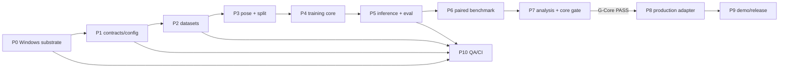

# Modular Construction Working List — Topic 16

> Trạng thái: **executable working list v1.0**
> Nền tảng duy nhất: **Windows 10/11 + PowerShell + NVIDIA RTX A4500 16 GB**
> Source of truth kỹ thuật: [`Construction_architect.md`](Construction_architect.md)
> Runbook copy-paste: [`setup_full_command.md`](setup_full_command.md)

Tài liệu này biến kiến trúc nghiên cứu thành các module có thể giao việc và code
ngay. Ký hiệu `P0…P10` là thứ tự dependency, không phải danh sách tùy chọn. Mỗi P
chỉ được đánh dấu `DONE` khi đạt đủ Definition of Done (DoD), không đánh dấu theo
phần trăm cảm tính.

## 1. Quy tắc xuyên suốt

- Mọi entrypoint vận hành là `.ps1`; không thêm Bash, Makefile, WSL path hay lệnh
  cần người dùng tự dịch sang PowerShell.
- `configs/project.psd1` là nơi duy nhất pin environment, upstream commit, dataset
  và protocol. Không hard-code lại version trong script khác.
- Dữ liệu raw bất biến. Pose/split chỉ sinh một lần rồi cấp cùng input cho cả hai
  methods.
- Training và inference là hai module riêng. Inference chỉ nhận `config.yml` đã
  sinh từ training, không tự đoán checkpoint mới nhất khi công bố kết quả.
- Không bắt đầu production trước khi gate `G-Core` ở cuối P7 đạt PASS.
- Mỗi paired comparison phải có cùng scene, split, downscale, seed, iteration cap,
  evaluator và GPU. Nerfacto ray batch và Splatfacto image batch không bị ép giống
  nhau; wall time/VRAM phải được report bên cạnh iterations.
- Baseline laptop là `downscale=2`, `30,000` iterations, seed `42`, không viewer
  trong lúc đo. Nếu OOM, tạo protocol low-memory có tên riêng và chạy lại cả cặp.

## 2. Dependency graph



## P0 — Windows runtime substrate

**Nhiệm vụ cốt lõi:** tạo một runtime native Windows tái lập được, tránh mismatch
CUDA/PyTorch/MSVC vốn là failure mode lớn nhất của project.

**Input:** NVIDIA driver hoạt động; Git; Miniconda; Visual Studio Build Tools C++.

**Code/file sở hữu:**

- `scripts/Install-HostTools.ps1`
- `scripts/Check-Environment.ps1`
- `scripts/Setup-Runtime.ps1`
- `scripts/lib/Common.ps1`
- `configs/project.psd1`

**Công việc:**

- [x] P0.1 Phát hiện PowerShell native Windows và từ chối WSL/Linux.
- [x] P0.2 Pin Python 3.10, PyTorch 2.1.2/cu118, Nerfstudio 1.1.5, gsplat 1.4.0.
- [x] P0.3 Dùng wheel gsplat Windows đúng cặp `pt21cu118`; không JIT gsplat ngẫu nhiên.
- [x] P0.4 Pin tiny-cuda-nn commit và compile duy nhất cho compute capability 8.6.
- [x] P0.5 Cài COLMAP/FFmpeg/CUDA toolkit bên trong Conda env, không ô nhiễm base.
- [ ] P0.6 Chạy setup thật trên laptop và lưu output validation. Lần thử
  2026-09-23 còn thiếu MSVC v142 và chưa tải xong CUDA/data; xem
  [`docs/setup_status_2026-09-23.md`](docs/setup_status_2026-09-23.md).

**Lệnh kiểm chứng:**

```powershell
Set-ExecutionPolicy -Scope Process Bypass
.\scripts\Check-Environment.ps1
.\scripts\Setup-Runtime.ps1
.\scripts\Check-Environment.ps1 -RequireRuntime
```

**DoD:** import được `torch`, `tinycudann`, `gsplat`, `nerfstudio`; PyTorch thấy
RTX A4500; CUDA tensor chạy được; `ns-train`, `ns-eval`, `colmap`, `ffmpeg` có trong
environment; mọi version đúng pin.

## P1 — Configuration, data và artifact contracts

**Nhiệm vụ cốt lõi:** khóa interface giữa tất cả module để người làm data, training,
inference và report không tự tạo layout khác nhau.

**Input:** P0; protocol trong `Construction_architect.md`.

**Code/file sở hữu:** `configs/project.psd1`, `scripts/lib/Common.ps1`, `.gitignore`,
`data/*/README.md`, `artifacts/*/README.md`.

**Công việc:**

- [x] P1.1 Registry pin chỉ có một nguồn.
- [x] P1.2 Dataset keys chuẩn: `poster`, `garden`, `bonsai`, `room`, `custom:<slug>`.
- [x] P1.3 Run key chuẩn: `<scene>/<method>/<UTC-ID>`.
- [x] P1.4 Raw/processed/generated boundaries và Git ignore.
- [ ] P1.5 Viết JSON schema cho run manifest khi bắt đầu aggregator.

**Contract output:**

```text
data/raw/<source>/<scene>/             immutable
data/processed/custom/<scene>/         transforms + shared poses/splits
artifacts/runs/<scene>/<method>/<id>/  config + checkpoints
artifacts/logs/<scene>/<method>/<id>/  command + timing + GPU + provenance
artifacts/metrics/<same-key>/           metrics.json + size
artifacts/renders/<same-key>/           held-out GT/prediction
```

**DoD:** cùng một run key ánh xạ một-một giữa run/log/metrics/renders; script không
ghi dataset vào artifact hoặc checkpoint vào source tree.

## P2 — Dataset acquisition và validation

**Nhiệm vụ cốt lõi:** cung cấp dataset có nguồn, kích thước và layout xác minh được
trước khi tốn GPU.

**Input:** P0–P1.

**Code/file sở hữu:** `scripts/Download-Datasets.ps1`, `data/raw/`, `data/.cache/`.

**Profiles:**

| Profile | Scene | Mục đích | Đưa vào result chính |
|---|---|---|---|
| smoke | Nerfstudio `poster` | CUDA/trainer/evaluator gate | Không |
| benchmark | `garden`, `bonsai`, `room` | paired research benchmark | Có |
| custom | phone scene, train/eval riêng | end-to-end thực tế | Bảng riêng |

**Công việc:**

- [x] P2.1 Poster downloader qua đúng Nerfstudio environment.
- [x] P2.2 Mip-NeRF 360 resume/retry và exact-byte validation.
- [x] P2.3 Chỉ extract ba scene để hạn chế disk trên laptop.
- [x] P2.4 Idempotent skip, không overwrite dữ liệu hợp lệ.
- [ ] P2.5 Ghi scene manifest: số ảnh, resolution, sparse files, source URL.

**Lệnh kiểm chứng:**

```powershell
.\scripts\Download-Datasets.ps1 -Mode smoke
.\scripts\Download-Datasets.ps1 -Mode benchmark
```

**DoD:** poster có `transforms.json`; mỗi benchmark scene có `images_2` và
`sparse\0`; archive đúng `12,535,427,936` bytes; rerun không tải lại.

## P3 — Phone capture, pose estimation và frozen split

**Nhiệm vụ cốt lõi:** biến ảnh điện thoại thành input canonical duy nhất cho cả
Nerfacto và Splatfacto; chặn data leakage trước training.

**Input:** ảnh sắc, static, overlap 70–80%; thư mục `train` và `eval` không trùng.

**Code/file sở hữu:** `scripts/Process-Capture.ps1`,
`data/processed/custom/<scene>/`.

**Công việc:**

- [x] P3.1 Validate scene slug và input folder.
- [x] P3.2 Chạy `ns-process-data images`/COLMAP một lần.
- [x] P3.3 Từ chối overwrite processed scene để giữ provenance.
- [ ] P3.4 Tạo báo cáo registered/total train images.
- [x] P3.5 Kiểm tra duplicate/hash giữa train và eval.
- [ ] P3.6 Duyệt camera frustums và sparse cloud bằng mắt.

**Lệnh:**

```powershell
.\scripts\Process-Capture.ps1 `
    -Scene object_v1 `
    -TrainImages .\data\raw\custom\object_v1\train `
    -EvalImages .\data\raw\custom\object_v1\eval
```

**DoD:** ≥90% ảnh train register; không duplicate train/eval; frustums không thành
cluster sai; `transforms.json` và sparse points tồn tại; split filename đã frozen.

## P4 — Training core

**Nhiệm vụ cốt lõi:** một entrypoint chung huấn luyện hai representation nhưng giữ
đúng semantics riêng của từng method.

**Input:** dataset pass P2/P3; runtime pass P0.

**Code/file sở hữu:** `scripts/Train.ps1`, `scripts/Monitor-Gpu.ps1`.

**Công việc:**

- [x] P4.1 Route dataset key sang parser và eval mode đúng.
- [x] P4.2 Khóa iterations/downscale/seed trong shared config.
- [x] P4.3 Ghi full command, Git state, GPU/driver, wall time và GPU CSV.
- [x] P4.4 UTC run ID, không overwrite run trước.
- [x] P4.5 Stop GPU monitor kể cả training lỗi.
- [ ] P4.6 Thêm machine-readable run status `running/succeeded/failed`.

**Lệnh:**

```powershell
.\scripts\Train.ps1 -Method nerfacto -Dataset poster
.\scripts\Train.ps1 -Method splatfacto -Dataset poster
```

**DoD:** mỗi method sinh `config.yml`, checkpoint, command log, timing và GPU log;
NaN/OOM tạo failure rõ, không được xem như completed run.

## P5 — Inference, held-out evaluation và export

**Nhiệm vụ cốt lõi:** tách model execution sau training khỏi optimizer và chỉ đo
trên held-out cameras.

**Input:** exact `config.yml` từ một P4 run thành công.

**Code/file sở hữu:** `scripts/Evaluate-Run.ps1`; tiếp theo là
`scripts/Render-Run.ps1`, `scripts/Export-Run.ps1`.

**Công việc:**

- [x] P5.1 Eval chỉ chấp nhận config nằm trong `artifacts/runs`.
- [x] P5.2 Gọi `ns-eval` để sinh PSNR/SSIM/LPIPS và paired renders.
- [x] P5.3 Reject non-finite metric; ghi checkpoint/run byte size.
- [ ] P5.4 Render cùng camera path và resolution cho hai methods.
- [ ] P5.5 Đo offline throughput sau warm-up, không dùng cảm giác viewer.
- [ ] P5.6 Export Gaussian PLY và Nerfacto point cloud dưới artifact key.

**Lệnh:**

```powershell
.\scripts\Evaluate-Run.ps1 -ConfigPath '<absolute-or-relative-config.yml>'
conda run --no-capture-output -n topic16-ns115 ns-viewer --load-config '<config.yml>'
```

**DoD:** metrics JSON hữu hạn; số held-out GT/pred frames khớp; không có train
frame trong eval; kết quả truy ngược được đúng config/checkpoint.

## P6 — Paired experiment orchestrator

**Nhiệm vụ cốt lõi:** đảm bảo không có scene chỉ chạy method thuận lợi hoặc config
khác nhau mà vẫn lọt vào bảng so sánh.

**Input:** P2–P5 đều pass.

**Code/file sở hữu:** `scripts/Run-Benchmark.ps1`.

**Công việc:**

- [x] P6.1 Vòng lặp scene × method chạy tuần tự để bảo vệ 16 GB VRAM.
- [x] P6.2 Evaluate ngay config mới sinh của từng run.
- [ ] P6.3 Thêm paired manifest chỉ PASS khi đủ hai methods.
- [ ] P6.4 Resume ở run boundary, không tự resume checkpoint mơ hồ.
- [ ] P6.5 Optional seeds 43/44 chỉ sau matrix chính.

**Lệnh:**

```powershell
# Calibration pair trước, không chạy cả matrix ngay
.\scripts\Run-Benchmark.ps1 -Scenes bonsai

# Sau khi bonsai pair vừa VRAM và artifact pass
.\scripts\Run-Benchmark.ps1
```

**DoD:** ba scenes × hai methods có config/checkpoint/log/metrics/renders; không có
hai GPU jobs đồng thời; paired manifest không nhận half-pair.

## P7 — Research analysis và G-Core

**Nhiệm vụ cốt lõi:** chuyển artifacts thành bằng chứng định lượng/định tính, chưa
đóng gói production.

**Input:** completed P6 và paired custom run từ P3–P5.

**Code/file dự kiến:** `src/topic16/aggregate.py`, `src/topic16/validate_runs.py`,
`reports/figures/`, `reports/tables/`.

**Công việc:**

- [ ] P7.1 Aggregate PSNR↑, SSIM↑, LPIPS↓, wall time, peak VRAM, model bytes.
- [ ] P7.2 Chọn cùng held-out camera/crop cho cả hai methods.
- [ ] P7.3 Phân tích foliage, thin structures, specular, low-overlap regions.
- [ ] P7.4 Tách measured results khỏi planning estimates/upstream claims.
- [ ] P7.5 Ghi limitation của native Windows và single-laptop experiment.

**Gate `G-Core` — tất cả phải PASS:**

- [ ] Poster end-to-end pass cho cả hai methods.
- [ ] `bonsai` calibration pair không OOM và artifact đầy đủ.
- [ ] Đủ 6 benchmark runs + paired eval.
- [ ] Custom scene có frozen held-out split + paired eval.
- [ ] Không NaN, leakage, missing provenance hoặc half-pair.
- [ ] Một máy mới có thể lặp lại bằng runbook PowerShell.

Nếu bất kỳ ô nào chưa đạt, **P8/P9 bị BLOCKED**. Đây là ranh giới bắt buộc giữa
research core và production.

## P8 — Production adapter (chỉ sau G-Core)

**Nhiệm vụ cốt lõi:** đóng gói inference đã chứng minh, không đưa trainer và raw
research state vào service.

**Input:** G-Core PASS; một model được chọn qua report manifest, không đổi tên run.

**Thiết kế:**

```text
production/
├── manifests/model.json       selected immutable artifact + checksum
├── app/                       thin inference/viewer adapter
├── scripts/Start-Demo.ps1     PowerShell entrypoint
└── tests/                     startup, missing-model, render smoke
```

**Công việc:**

- [ ] P8.1 Model manifest gồm method, run key, hash, version và expected inputs.
- [ ] P8.2 Read-only artifact loader; không train/tune trong request path.
- [ ] P8.3 Warm-up, health check, fixed camera/resolution defaults.
- [ ] P8.4 Bounded queue/concurrency=1 trên laptop.
- [ ] P8.5 Clear error nếu CUDA/model/input contract sai.

**DoD:** start/stop bằng PowerShell; cùng model cho kết quả deterministic trong sai
số cho phép; production không sửa `data/raw` hay `artifacts/runs`.

## P9 — Demo, packaging và release

**Nhiệm vụ cốt lõi:** tạo đường trình diễn ổn định và gói bằng chứng tái lập được.

**Input:** P8 pass.

**Công việc:**

- [ ] P9.1 Viewer demo và video fallback dùng cùng camera path.
- [ ] P9.2 Release manifest: Git SHA, dependencies, dataset citations, model hashes.
- [ ] P9.3 Copy-paste clean-machine runbook test.
- [ ] P9.4 Không bundle dataset/checkpoint lớn vào Git; công bố retrieval rules.
- [ ] P9.5 Báo cáo 6–8 trang, bảng/failure cases liên kết artifact IDs.

**DoD:** demo không phụ thuộc notebook hoặc đường dẫn cá nhân; mất mạng vẫn chạy
được sau khi model đã được stage; báo cáo truy xuất được từng số liệu.

## P10 — QA, tests và maintenance

**Nhiệm vụ cốt lõi:** phát hiện lỗi rẻ trước GPU run và ngăn documentation drift.

**Công việc:**

- [x] P10.1 Parse toàn bộ `.ps1` bằng PowerShell parser; không syntax error
  (đã kiểm chứng bằng Windows PowerShell 5.1 ngày 2026-09-23).
- [ ] P10.2 PSScriptAnalyzer cho style/safety chính.
- [ ] P10.3 Unit test path mapping, dataset key, config pin và non-finite metrics.
- [ ] P10.4 Data-contract test bằng fixture nhỏ, không cần GPU.
- [ ] P10.5 GPU smoke test thủ công trên A4500; CI thường không train.
- [ ] P10.6 Khi nâng pin: new protocol ID, rerun P0/P4/P5, không trộn bảng cũ.

**Lệnh QA nền:**

```powershell
$errors = $null
Get-ChildItem -Recurse -Filter *.ps1 | ForEach-Object {
    [void][System.Management.Automation.Language.Parser]::ParseFile(
        $_.FullName, [ref]$null, [ref]$errors
    )
    if ($errors) { $errors; throw "PowerShell parse failed: $($_.FullName)" }
}
git status --short
```

## 3. Trình tự giao việc thực tế

1. Một người nhận P0+P1 và không đổi version ngoài registry.
2. Một người chuẩn bị P2+P3 nhưng chỉ ghi vào đúng data contract.
3. Một người sở hữu P4; một người độc lập sở hữu P5 để tránh evaluator bị gắn với
   giả định trainer.
4. P6 chỉ orchestration, không chứa model-specific hyperparameter bí mật.
5. P7 do nhóm cùng review; mọi số không có artifact ID bị loại.
6. Chỉ khi G-Core ký PASS mới phân công P8/P9.
7. P10 chạy xuyên suốt, nhưng GPU tests theo gate để không đốt thời gian laptop.

## 4. Definition of project done

Project chỉ hoàn thành khi `G-Core` PASS, production/demo nếu được yêu cầu cũng PASS,
và một thành viên không viết code ban đầu có thể dùng duy nhất
`setup_full_command.md` để setup, tải data, train, inference và tìm artifacts mà
không cần hỏi đường dẫn hoặc tự đổi lệnh Bash sang PowerShell.
