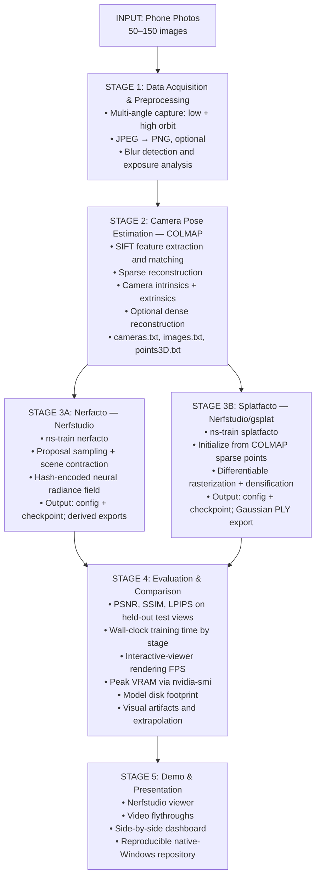

# Topic 16 — From Photos to 3D: NeRF and Gaussian Splatting in Practice

> A Complete, Reproducible Project for ThinkPad P1 Gen 5 (RTX A4500 16GB)

> **Implementation note:** Kiến trúc và protocol hiện hành ở
> [`Construction_architect.md`](Construction_architect.md); thứ tự P0–P10 ở
> [`Modular_construct.md`](Modular_construct.md); phân công **4 thành viên** ở
> [`Members_jobs.md`](Members_jobs.md). README giới thiệu đề tài, không thay
> thế các gate nghiệm thu trong những tài liệu đó.

> Toàn bộ lệnh copy-paste từ cài host tools đến tải dữ liệu, train, evaluate và
> vận hành Git nằm tại [`setup_full_command.md`](setup_full_command.md).

Setup trên laptop lead đã PASS ở mức host/runtime/dataset ngày 2026-09-24;
**training và inference thực tế chưa PASS**. Xem
[`setup_status_2026-09-23.md`](docs/setup_status_2026-09-23.md). Thành viên clone
repo không nhận dataset, Conda env hay `requirements.txt` snapshot vì chúng bị
Git ignore. Trên Windows PowerShell, từ thư mục repo, chạy
`Set-ExecutionPolicy -Scope Process Bypass` rồi dùng lệnh đúng vai trò ở runbook.
Các pin cài đặt duy nhất nằm trong [`project.psd1`](configs/project.psd1);
`artifacts\logs\runtime\requirements.txt` chỉ được sinh sau
`Setup-Project.ps1` để kiểm toán, **không dùng `pip install -r`** trên máy khác.
Máy CPU làm P0–P4 phần code/data/test nhưng không chạy setup CUDA; GPU 6 GB chỉ
diagnostic tương thích, không phải máy baseline A4500 16 GB.

## Table of Contents

- [1. Project Overview & Scope](#1-project-overview--scope)
- [2. Mathematical Foundations](#2-mathematical-foundations)
- [3. Architecture & System Design](#3-architecture--system-design)
- [4. Dataset Strategy](#4-dataset-strategy)
- [5. Hardware & Performance Plan](#5-hardware--performance-plan)
- [6. Professional Workflow](#6-professional-workflow)
- [7. Measurement & Comparison Framework](#7-measurement--comparison-framework)
- [8. Team Division (4 Members)](#8-team-division-4-members)
- [9. Milestones & Deliverables](#9-milestones--deliverables)
- [10. Risk Mitigation](#10-risk-mitigation)
- [11. Repository Structure (Deliverable)](#11-repository-structure-deliverable)
- [12. Why This Project Achieves Excellence](#12-why-this-project-achieves-excellence)
- [13. Presentation Strategy (Week 15)](#13-presentation-strategy-week-15)

## 1. Project Overview & Scope

**Title:** From Phone Photos to Real-Time 3D: A Practical Comparison of NeRF and Gaussian Splatting on Consumer Hardware

**Core task:** Capture a real object or scene with a smartphone, reconstruct it using both a NeRF variant (Nerfacto via Nerfstudio) and 3D Gaussian Splatting (via the gsplat library), then systematically compare quality, training time, rendering speed, and memory footprint — all on a single RTX A4500 16GB laptop.

**Why this project is viable on your hardware:**

- Nerfstudio documents the default Nerfacto configuration at roughly 6 GB and its larger variants at roughly 12/24 GB; the default model is therefore the appropriate baseline for 16 GB.
- The original 3DGS repository states 24 GB VRAM for paper-evaluation-quality optimizer runs; its 4 GB recommendation is for the viewer. This project therefore uses Splatfacto with the more memory-efficient gsplat backend and fixes both methods at half-resolution initially.
- The local preflight detects the RTX A4500 Laptop GPU, 16,384 MiB VRAM and compute capability 8.6. Actual time/VRAM remain measurements to collect, not assumed results.

**Deliverables:** A reproducible GitHub repository, a 6–8 page conference-format report, a live demo (interactive viewer), and a comparative evaluation on at least two datasets.

## 2. Mathematical Foundations

Understanding the mathematics is essential for explaining why the results look the way they do. This section covers the core formulations you must understand and present.

### 2.1 Neural Radiance Fields (NeRF)

A NeRF represents a scene as a continuous volumetric function:

$$
F_{\Theta} : (\mathbf{x}, \mathbf{d}) \rightarrow (\mathbf{c}, \sigma)
$$

where:

- $\mathbf{x} = (x, y, z)$ is a 3D spatial coordinate;
- $\mathbf{d} = (\theta, \phi)$ is a viewing direction;
- $\mathbf{c} = (r, g, b)$ is the emitted color; and
- $\sigma$ is the volume density.

The function $F_{\Theta}$ is parameterized by a multi-layer perceptron (MLP) with weights $\Theta$.

#### Volume Rendering

To render a pixel, a ray $\mathbf{r}(t) = \mathbf{o} + t\mathbf{d}$ is cast from the camera origin $\mathbf{o}$ through the pixel center. The expected color is computed via numerical integration:

$$
C(\mathbf{r}) = \int_{t_n}^{t_f} T(t) \cdot \sigma(\mathbf{r}(t)) \cdot \mathbf{c}(\mathbf{r}(t), \mathbf{d})\,dt
$$

where the transmittance

$$
T(t) = \exp\left(-\int_{t_n}^{t} \sigma(\mathbf{r}(s))\,ds\right)
$$

represents the probability that the ray reaches point $t$ without being occluded. In practice, this integral is discretized using stratified sampling:

$$
\hat{C}(\mathbf{r}) = \sum_{i=1}^{N} T_i \left(1 - \exp(-\sigma_i\delta_i)\right)\mathbf{c}_i
$$

with

$$
T_i = \exp\left(-\sum_{j=1}^{i-1}\sigma_j\delta_j\right),
\qquad
\delta_i = t_{i+1} - t_i.
$$

#### Positional Encoding

To allow the MLP to learn high-frequency details, coordinates are mapped through:

$$
\gamma(p) = \left(\sin(2^0\pi p), \cos(2^0\pi p), \ldots, \sin(2^{L-1}\pi p), \cos(2^{L-1}\pi p)\right)
$$

#### Hierarchical Sampling

NeRF uses two networks — a "coarse" network to identify relevant regions, then a "fine" network to sample densely there. This is why the original NeRF requires 1–2 days per scene on a single GPU.

### 2.2 3D Gaussian Splatting (3DGS)

3DGS abandons the implicit MLP entirely. Instead, it represents the scene as a set of explicit 3D Gaussian primitives:

$$
G(\mathbf{x}) = \exp\left(-\frac{1}{2}(\mathbf{x}-\boldsymbol{\mu})^T \boldsymbol{\Sigma}^{-1}(\mathbf{x}-\boldsymbol{\mu})\right)
$$

Each Gaussian is parameterized by:

- Mean position $\boldsymbol{\mu} \in \mathbb{R}^3$;
- Anisotropic covariance $\boldsymbol{\Sigma} \in \mathbb{R}^{3 \times 3}$, decomposed as $\boldsymbol{\Sigma} = \mathbf{R}\mathbf{S}\mathbf{S}^T\mathbf{R}^T$, where $\mathbf{R}$ is a rotation quaternion and $\mathbf{S}$ is a diagonal scaling matrix;
- Opacity $\alpha \in [0,1]$; and
- Spherical harmonic coefficients for view-dependent color.

#### Splatting (Rasterization)

Each 3D Gaussian is projected onto the 2D image plane. The 2D covariance is computed via the Jacobian of the projective transformation:

$$
\boldsymbol{\Sigma}' = \mathbf{J}\mathbf{W}\boldsymbol{\Sigma}\mathbf{W}^T\mathbf{J}^T
$$

where $\mathbf{W}$ is the viewing transformation and $\mathbf{J}$ is the Jacobian of the affine approximation of the projective transformation. The final pixel color is computed via front-to-back alpha compositing:

$$
C = \sum_{i \in \mathcal{N}} c_i\alpha_i \prod_{j=1}^{i-1}(1-\alpha_j)
$$

**Why 3DGS can render quickly:** Its explicit Gaussians are rasterized rather than
evaluating a NeRF along many ray samples. The original paper reports real-time
rendering in its own setting; FPS on this laptop remains to be measured.

### 2.3 Key Mathematical Differences to Highlight in Your Report

| Aspect | NeRF | 3D Gaussian Splatting |
|---|---|---|
| Representation | Implicit (MLP weights) | Explicit (point cloud of Gaussians) |
| Rendering | Ray marching + volume rendering | Differentiable rasterization (splatting) |
| Training speed | TBD for pinned Nerfacto/A4500 | TBD for pinned Splatfacto/A4500 |
| Rendering speed | TBD at fixed resolution/path | TBD at the same resolution/path |
| Memory | Model weights (~10–100 MB) | Millions of Gaussians (~100 MB–1 GB) |
| Extractability | Checkpoint is implicit; point cloud/mesh is a derived export | Gaussians are explicit and can be exported directly |
| View extrapolation | Must be measured on the chosen scenes | Must be measured on the chosen scenes |

## 3. Architecture & System Design

### 3.1 High-Level Pipeline



### 3.2 Repository Ecosystem & Dependency Matching

This is the critical path — mismatched CUDA/PyTorch versions are the #1 cause of project abandonment. Here is a tested, coherent stack.

#### Recommended Stack (Pinned Native Windows Conda Environment)

| Component | Version | Rationale |
|---|---|---|
| CUDA | 11.8 | Tested with Nerfstudio; stable with A4500 (Ampere, CC 8.6) |
| PyTorch | 2.1.2 (cu118) | Official Nerfstudio Windows-compatible pair |
| Python | 3.10 | Best compatibility across all libraries |
| Nerfstudio | v1.1.5 | Pinned release; modular framework and common evaluator |
| gsplat | 1.4.0 | Exact version required by Nerfstudio v1.1.5 |
| COLMAP | 3.9.1 | Pinned native Windows Conda package |
| tiny-cuda-nn | Exact Git commit, CC 8.6 | Required by Nerfstudio for fast MLP |

#### Installation Order (Critical)

1. **Driver:** `nvidia-smi` in native Windows PowerShell must see the RTX A4500.
2. **Host tools:** install Git, Miniconda and Visual Studio Build Tools C++/MSVC v142.
3. **Pinned runtime:** run `.\scripts\Setup-Runtime.ps1`; it creates an isolated Conda environment and validates CUDA imports.
4. **Execution:** wrappers use `conda run -n topic16-ns115`; no manual activation or WSL path translation.

#### Alternative: Official Container

The official Nerfstudio documentation also describes its GHCR container. Treat it as a separate protocol and do not mix container results with this native Windows protocol.

## 4. Dataset Strategy

### 4.1 Why Dataset Choice Matters

The project must be executable without requiring you to capture hundreds of perfect photos on day one. We use a three-tier dataset strategy:

- **Tier 0 (Smoke gate):** Nerfstudio `poster`; prove both methods, CUDA and evaluation work.
- **Tier 1 (Benchmark):** Mip-NeRF 360 `garden`, `bonsai`, `room`.
- **Tier 2 (Demo):** one phone-captured scene with separate train/eval views.

### 4.2 Tier 0: Nerfstudio Poster (Development)

| Property | Value |
|---|---|
| Download | `.\scripts\Download-Datasets.ps1 -Mode smoke` |
| Scene | `poster` |
| Camera poses | Included in Nerfstudio format, with sparse initialization data |
| Why use it first | Small official capture that exercises the same Nerfstudio interfaces used by both methods |

**Use for:** Verifying the environment, CUDA kernels, checkpointing and `ns-eval`. Do not include it in the final benchmark table.

### 4.3 Tier 1: Mip-NeRF 360 Dataset (Final Evaluation)

| Property | Value |
|---|---|
| Download | `.\scripts\Download-Datasets.ps1 -Mode benchmark` (resume and size validation included) |
| Archive size | 12,535,427,936 bytes; only three selected scenes are extracted |
| Selected scenes | `garden`, `bonsai`, `room` |
| Camera poses | COLMAP output included for most scenes |
| Why use it | Industry-standard benchmark for both NeRF and 3DGS. Published results exist for comparison. |

**Planning estimate only:** reserve 1–2 hours per scene/method until the first paired `bonsai` runs provide measurements on this exact stack. Do not report this estimate as a result.

### 4.4 Tier 2: Your Own Phone Capture (Demo WOW Factor)

- **Capture protocol:** Two orbital passes, low and high, about 80–150 sharp
  photos total with 70–80% overlap; reserve 10–15% of viewpoints as separate
  evaluation frames. See the frozen split rules in `Construction_architect.md`.
- **Lighting:** Diffuse, consistent. Avoid harsh shadows and reflective surfaces if possible.
- **Processing:** Run `ns-process-data`, which invokes COLMAP and converts its result into the shared Nerfstudio format. If registration quality is low, improve the capture rather than tuning the models around bad poses.
- **Budget:** Capture/processing/training time is an estimate until the first
  complete custom run; record actual wall time per phase.

## 5. Hardware & Performance Plan

### 5.1 RTX A4500 16GB — Verified Capability

| Metric | NeRF (Nerfacto) | 3D Gaussian Splatting |
|---|---|---|
| Upstream memory guidance | Default Nerfacto ~6 GB | Original optimizer: 24 GB for paper-quality training; viewer: 4 GB |
| Project configuration | Default Nerfacto, 1/2 images | Splatfacto/gsplat, 1/2 images |
| A4500 16GB | Expected feasible; must measure | Feasible target with guardrails; smoke test required |
| Training time (Mip-NeRF 360 scene) | TBD on the pinned A4500 stack | TBD on the pinned A4500 stack |
| Rendering FPS | TBD at a fixed resolution/path | TBD at the same resolution/path |
| Peak system RAM | TBD during setup/training | TBD during setup/training |

> **System RAM note:** If your ThinkPad has 16 GB RAM, compile tiny-cuda-nn with all other applications closed. Even with 32 GB, do not run parallel GPU training jobs.

### 5.2 Performance Monitoring Protocol

Track these metrics with `nvidia-smi` (run in a separate terminal every 10 seconds):

```powershell
.\scripts\Monitor-Gpu.ps1 -Output .\artifacts\logs\manual_gpu.csv -IntervalSeconds 10
```

Log: GPU utilization %, VRAM used (GB), GPU temperature (°C). This data goes directly into your report's resource-consumption section.

### 5.3 Training Time Budget (Realistic)

| Phase | Duration | Notes |
|---|---|---|
| Environment setup | Already validated on lead; varies per new PC | Network, MSVC and tiny-cuda-nn compilation can dominate |
| Poster smoke pair | Measure on first setup | First successful runs; includes CUDA JIT warm-up |
| Mip-NeRF 360 (3 scenes) | Calibrate after paired `bonsai` runs | Per method, per scene |
| Phone capture (1 scene) | 2–4 hours planning allowance | Including capture and COLMAP |
| Full evaluation | 1–2 days | Metrics + visualization |
| Writing & demo prep | 3–5 days | Report + presentation |

**Planning allowance:** 3–4 weeks part-time là ước lượng ban đầu, không phải
cam kết tiến độ cho nhóm 4 người; điều chỉnh theo kết quả smoke và thời gian GPU.

## 6. Professional Workflow

### 6.1 Phase 1: Environment Validation (Week 1)

**Goal:** Prove the hardware and software stack works.

1. Install the pinned native Windows stack (Nerfstudio 1.1.5, CUDA 11.8, PyTorch 2.1.2, gsplat 1.4.0).
2. Download the Nerfstudio `poster` smoke scene.
3. Train Nerfacto and require a saved checkpoint plus finite held-out metrics.
4. Train Splatfacto and require a saved checkpoint plus finite held-out metrics.
5. Record VRAM usage, training time, GPU temperature.

**Deliverable:** A paired "hello world" reconstruction of `poster`. It validates infrastructure, not the research conclusion.

### 6.2 Phase 2: Benchmark Evaluation (Weeks 2–3)

1. Download Mip-NeRF 360 scenes: `garden`, `bonsai`, `room`.
2. For each scene, run both methods. Use consistent hyperparameters.
3. Compute metrics: PSNR, SSIM, LPIPS on held-out test views.
4. Log GPU utilization throughout training.
5. Generate side-by-side render comparisons (same camera path).

### 6.3 Phase 3: Own Capture & Demo (Week 4)

1. Capture one well-designed scene with your phone using the two-orbit protocol.
2. Process with COLMAP (or `ns-process-data`).
3. Train both methods on your captures.
4. Open both trained methods through the common Nerfstudio viewer at `localhost:7007`.
5. Record flythrough videos for the presentation.

### 6.4 Phase 4: Analysis & Writing (Week 5)

- **Quantitative analysis:** Metric tables, training time bars, VRAM usage plots.
- **Qualitative analysis:** Identify failure modes — reflective surfaces, thin structures, view extrapolation.
- **Mathematical discussion:** Connect observed artifacts to the math (e.g., 3DGS covariance projection → blurry regions when view differs from training).
- **Reproducibility:** Ensure `README.md` has exact commands, dataset links, and environment file.

## 7. Measurement & Comparison Framework

### 7.1 Quantitative Metrics

| Metric | NeRF (Nerfacto) | 3DGS (gsplat) | Interpretation |
|---|---|---|---|
| PSNR ↑ | TBD | TBD | No winner assumed before measurement |
| SSIM ↑ | TBD | TBD | No winner assumed before measurement |
| LPIPS ↓ | TBD | TBD | No winner assumed before measurement |
| Training time | TBD | TBD | Measure wall clock |
| Rendering FPS | TBD | TBD | Measure fixed path/resolution |
| VRAM peak | TBD | TBD | Measure from 10-second GPU logs |
| Model size | TBD | TBD | Measure exact run/export bytes |

### 7.2 Qualitative Failure Modes to Document

- **Reflective/metallic surfaces:** Both methods struggle. 3DGS produces "floating" Gaussians; NeRF produces smeared density.
- **Transparent/refractive objects:** both methods may fail because observations are multi-view inconsistent; compare artifacts empirically rather than assuming a winner.
- **View extrapolation:** 3DGS degrades rapidly when the camera moves far from training viewpoints — "fog" appears in the render.
- **Thin structures:** Both methods may miss thin branches or wires. 3DGS can produce needle-like artifacts.

## 8. Team Division (4 Members)

| Person | Hardware | Contiguous ownership | Acceptance |
|---|---|---|---|
| Member 1 | CPU | P0–P2: setup/contracts/datasets | CPU checks locally; lead signs GPU runtime |
| Member 2 | CPU | P3–P4: capture/pose/split/training wrapper | CPU fixtures locally; lead runs training |
| Member 3 | GPU 6 GB | P5–P7: inference, paired benchmark, analysis | Diagnostic locally if compatible; lead runs official A4500 pair |
| Member 4 (lead) | A4500 16 GB laptop | P8–P10: production after G-Core, QA throughout | Owns hardware acceptance and final gate |

Read [`Members_jobs.md`](Members_jobs.md) for exact outputs/tests per Px. P8/P9
must not start until P7's G-Core is PASS; P10 runs throughout.

## 9. Milestones & Deliverables

| Week | Milestone | Deliverable |
|---|---|---|
| 4 | Topic finalized, team roles assigned | Team list, ranked preferences |
| 5 | Proposal | 2 pages: problem, datasets, methods, evaluation plan, division of work |
| 6–7 | Environment validated | Both methods train and evaluate successfully on `poster` |
| 8–9 | Benchmark results | Metrics for 3 Mip-NeRF 360 scenes |
| 10 | Milestone report | 3 pages: baseline results, what broke, revised plan |
| 11–12 | Own capture + demo | Phone-captured scene reconstructed, viewers working |
| 13–14 | Full evaluation | Complete metric tables, failure mode analysis |
| 15 | Final presentation | 15 min talk + questions, all members present |
| 15 | Code & report | Reproducible repo, 6–8 page conference-format report |

## 10. Risk Mitigation

| Risk | Probability | Impact | Mitigation |
|---|---|---|---|
| tiny-cuda-nn fails to compile | High | High | Use the pinned MSVC v142/CUDA 11.8 stack and rerun exact PowerShell setup; do not upgrade packages ad hoc. |
| COLMAP fails on phone photos | Medium | Medium | Use `ns-process-data`, which handles common failures. Fall back to Mip-NeRF 360. |
| VRAM OOM during training | Medium | Medium | Keep the shared half-resolution baseline; if needed, define a separately named low-memory protocol rather than silently changing one method. |
| GPU overheating | Low | Low | Monitor temperature/power. If the team applies a power cap, use the same cap for every run and record it. |
| Team member unavailable | Medium | Medium | Cross-train. Document all setup steps in shared repo. |
| Dataset download fails | Low | Low | Use the resumable official-archive script and retain the validated local archive. |

## 11. Repository Structure (Deliverable)

```text
Topic_16_CV/
├── setup_full_command.md        # Complete copy-paste command runbook
├── configs/project.psd1         # Version pins + protocol defaults
├── scripts/                     # Setup/download/process/train/evaluate/monitor
├── data/{raw,processed}/        # Immutable inputs and derived camera data
├── third_party/                 # Pinned upstream snapshots, Git-ignored
├── docs/research/papers/        # Local paper library, Git-ignored PDFs
├── src/topic16/                 # Project-owned analysis utilities
├── tests/ and notebooks/        # Tests and exploratory analysis
├── artifacts/{runs,logs,metrics,renders,exports,videos}/
└── reports/                     # Final writing and selected figures
```

The complete tree, ownership rules and artifact contracts are maintained in
`Construction_architect.md`.

## 12. Why This Project Achieves Excellence

- It targets the detected RTX A4500 16 GB with explicit half-resolution and memory guardrails; feasibility is accepted only after the paired smoke gate passes.
- It uses pinned official/established repositories — Nerfstudio, gsplat (JMLR 2025), COLMAP and the original 3DGS reference implementation.
- It uses an official small smoke capture, the Mip-NeRF 360 benchmark, and one controlled phone capture with held-out views.
- It demonstrates mathematical depth — you explain volume rendering, positional encoding, Gaussian covariance projection, and alpha compositing.
- It produces a professional deliverable — interactive viewers, metric tables, failure mode analysis, and a reproducible repository.
- It has a focused practical angle: quantify where phone-capture quality and pose coverage become the bottleneck for the two representations.

## 13. Presentation Strategy (Week 15)

### 15-Minute Talk Structure

| Time | Content |
|---|---|
| 0–2 min | Problem: NeRF vs 3DGS — what's the practical difference? |
| 2–5 min | Math: Volume rendering vs Gaussian splatting (with diagrams) |
| 5–8 min | Pipeline: Capture → COLMAP → Train → Evaluate |
| 8–11 min | Results: Metric tables, side-by-side renders, VRAM/training time |
| 11–13 min | Demo: Interactive viewer + flythrough video |
| 13–15 min | Conclusion: When to use which, failure modes, future work |

> **Demo setup:** Load each pinned Nerfstudio `config.yml` in turn and keep prerecorded flythroughs as a fallback. If two machines are available, open one method on each through the same viewer stack.
