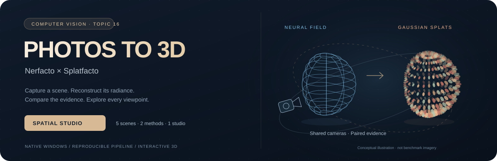
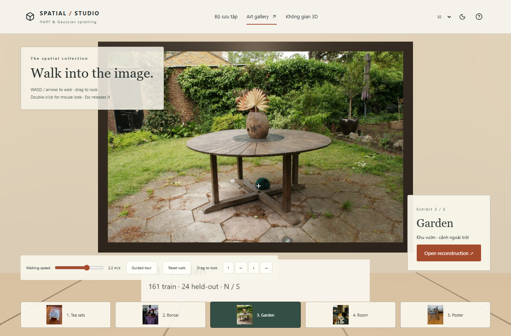
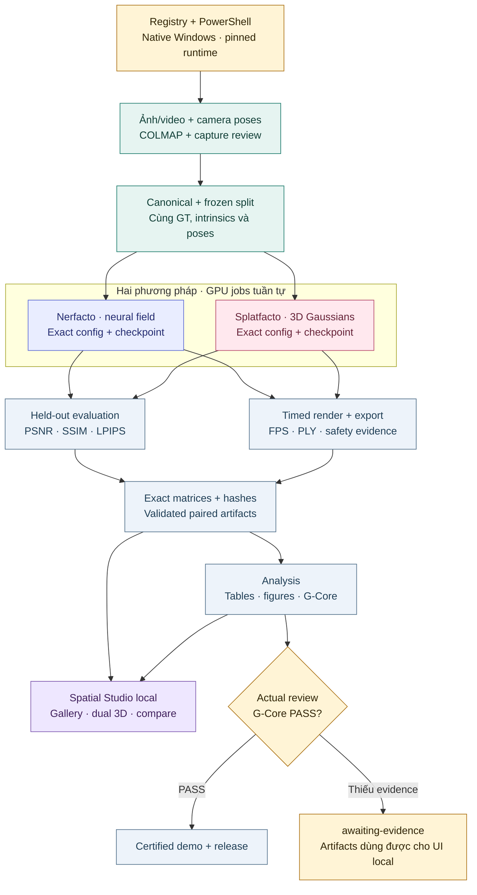
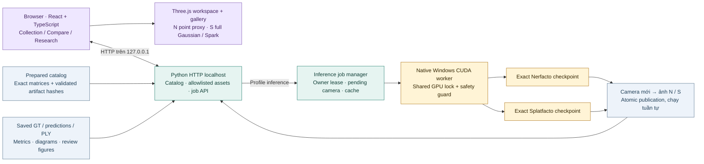

<p align="center">
  
</p>

<h1 align="center">Photos to 3D · Nerfacto × Splatfacto</h1>

<p align="center">
  <strong>Chụp quanh vật thể. Dựng lại không gian. Khám phá từng góc nhìn.</strong><br/>
  Topic 16 · Computer Vision · Reconstruction, benchmark và gallery 3D tương tác
</p>

<p align="center">
  
  
  
  
</p>

<p align="center">
  <a href="#1-setup-và-chạy-đầy-đủ-trên-máy-mới">Bắt đầu</a> ·
  <a href="#2-mở-ui-khi-đã-có-kết-quả">Mở Spatial Studio</a> ·
  <a href="#6-cấu-trúc-project-và-điểm-vào-code">Đọc code</a> ·
  <a href="Report_computer_vision.md">Báo cáo khoa học</a> ·
  <a href="reports/topic16-full/results.md">Kết quả đo</a> ·
  <a href="setup_full_command.md">Runbook</a>
</p>

---

## Từ ảnh chụp đến một không gian có thể khám phá

Một bộ ảnh nhiều góc nhìn có thể trở thành cảnh 3D cho phép di chuyển camera và tạo góc nhìn mới. Project đặt **Nerfacto** và **Splatfacto** trên cùng dữ liệu để so sánh chất lượng ảnh, thời gian huấn luyện, bộ nhớ và tốc độ render; kết quả được đưa vào **Spatial Studio** để khám phá và kiểm tra trực quan.

| Capture | Reconstruct | Compare | Explore |
|:---:|:---:|:---:|:---:|
| Video bộ trà từ iPhone 14 Pro + datasets official | Neural radiance field và 3D Gaussians | Cùng held-out views, metrics và provenance | Gallery, dual-view 3D, camera sync và exact-model render |

**Bạn nhận được:** pipeline native Windows có pins/checksums và checkpoint resume; **5 scenes / 10 primary runs** đã có train, evaluation, timed render và exports; UI có chọn dataset bằng ảnh, xem một hoặc hai phương pháp, so sánh GT/prediction và đọc architecture/benchmark. Banner phía trên là minh họa thiết kế; ảnh và số đo nghiên cứu được lấy từ artifacts thật.

<details>
<summary><strong>Xem Spatial Studio thực tế · workspace và art gallery</strong></summary>




Ảnh chụp từ UI chạy thật trên Windows. Pane Nerfacto là point-cloud proxy; nút render checkpoint cung cấp ảnh neural chính xác. Pane Splatfacto dùng full Gaussian export.

</details>

## Nhóm thực hiện

| Thành viên | Vai trò | Phạm vi phụ trách theo phân công project |
|---|---|---|
| **Khổng Gia Minh** | Member 1 | Runtime/setup, dữ liệu official và artifact contracts |
| **Nguyễn Phú Nam** | Member 2 | Capture/preprocessing, canonical input và training |
| **Hồ Đức Mạnh** | Member 3 | Evaluation, render/export, benchmark và phân tích |
| **Đinh Nam Khánh** | **Member 4 · Tech Lead** | Capture bằng iPhone 14 Pro, tích hợp hệ thống, QA và nghiệm thu trên GPU |

Phân công và phạm vi thực nghiệm được trình bày trong [báo cáo Topic 16](Report_computer_vision.md). Tác giả báo cáo là bốn thành viên trên; vai trò được trình bày theo phân công, không thay chữ ký nghiệm thu hoặc bằng chứng commit.

> **Chọn đúng điểm bắt đầu:** máy mới → [setup và chạy đầy đủ](#1-setup-và-chạy-đầy-đủ-trên-máy-mới); máy đã có kết quả → [mở UI](#2-mở-ui-khi-đã-có-kết-quả). Clone Git chỉ lấy code và tài liệu, không lấy dataset, video custom, Conda environment hoặc checkpoint.

[Hướng dẫn Spatial Studio](UI_design/README.md) · [Kiến trúc project](#4-kiến-trúc-từ-input-đến-kết-quả-có-bằng-chứng) · [Báo cáo Topic 16](Report_computer_vision.md) · [Research review HTML](reports/topic16-full/review/research_review.html)

## 1. Setup và chạy đầy đủ trên máy mới

### 1.1. Điều kiện trước khi bắt đầu

| Thành phần | Yêu cầu của cấu hình đã kiểm chứng |
|---|---|
| Hệ điều hành / shell | Windows x64; **Windows PowerShell 5.1**, mở **Run as administrator** cho các bước GPU |
| GPU | Baseline: **RTX A4500 Laptop, 16 GB, compute capability 8.6**; NVIDIA driver hoạt động và `nvidia-smi` có trong PATH |
| Build tools | Git, Miniconda, Visual Studio C++ **v142 / 14.29**, Windows SDK; installer bên dưới cài host tools |
| Lưu trữ / mạng | Archive Mip-NeRF 360 khoảng **12,5 GB**, còn phải có chỗ cho giải nén, environment, canonical data, checkpoint và exports; ngưỡng 20 GiB của downloader chỉ là kiểm tra tối thiểu |
| Dữ liệu custom | Cần **video gốc `tea_sets_2.mp4` do chủ dự án cung cấp** để tái lập đủ 5 scenes; video không nằm trong Git |
| Trình duyệt | WebGL2; UI đã kiểm thử trên Brave, Chrome và Edge native Windows |

Installer hiện build tiny-cuda-nn cho kiến trúc **8.6**. GPU khác cần kiểm tra và cấu hình build/protocol tương ứng; không mặc định mọi GPU NVIDIA sẽ dùng nguyên recipe này. Không cần WSL/tmux cho luồng chạy trực tiếp bên dưới.

### 1.2. Clone và cài host tools

Mở **Windows PowerShell Administrator**. Copy từng block theo thứ tự, dừng tại bước báo lỗi. `C:\CVProjects\Topic_16_CV` là thư mục mẫu có thể dùng ngay; thay `$checkoutRoot` nếu muốn đặt nơi khác.

```powershell
Set-ExecutionPolicy -Scope Process Bypass
$ErrorActionPreference = 'Stop'

if (-not (Get-Command git -ErrorAction SilentlyContinue)) {
    winget install --id Git.Git --exact --accept-package-agreements --accept-source-agreements
    if ($LASTEXITCODE -ne 0) { throw 'Git installation failed.' }
    throw 'Git installed. Reopen Administrator PowerShell and run this block again.'
}

$checkoutRoot = 'C:\CVProjects\Topic_16_CV'
if (Test-Path -LiteralPath $checkoutRoot) { throw 'Checkout already exists. Use the existing checkout instead of cloning over it.' }
New-Item -ItemType Directory -Path (Split-Path $checkoutRoot) -Force | Out-Null
git clone --branch main https://github.com/HelcurtLordno1/Photos_to_3d-NeRF-and-guassian-splatting.git $checkoutRoot
if ($LASTEXITCODE -ne 0) { throw 'Clone failed.' }
Set-Location -LiteralPath $checkoutRoot
.\scripts\Install-HostTools.ps1 -InstallBuildTools
```

**Đóng rồi mở lại Windows PowerShell Administrator** sau khi cài host tools để nhận PATH mới. NVIDIA driver phải được cài trên Windows trước bước tiếp theo; script không cài driver. Recipe này yêu cầu source revision có `UI_design\scripts\Setup-UI.ps1`; nếu checkout chưa có UI, nhận đúng revision từ chủ dự án trước khi tiếp tục.

### 1.3. Cài đầy đủ environment và tải official datasets

```powershell
Set-Location -LiteralPath 'C:\CVProjects\Topic_16_CV'
Set-ExecutionPolicy -Scope Process Bypass
$ErrorActionPreference = 'Stop'

.\scripts\Check-Environment.ps1
.\scripts\Setup-Project.ps1
.\scripts\Check-Environment.ps1 -RequireRuntime
.\scripts\Test-Project.ps1 -RequireRuntime
.\scripts\Test-Datasets.ps1 -Mode all -WriteManifest
.\UI_design\scripts\Setup-UI.ps1
```

`Setup-Project.ps1` lấy upstream đúng commit, tạo Conda env `topic16-ns115`, cài CUDA/PyTorch/native tools, build tiny-cuda-nn, kiểm runtime, tải Poster và Mip-NeRF 360 rồi xuất snapshot Python. `Setup-UI.ps1` tải Node đúng pin nếu thiếu, kiểm checksum và cài packages bằng lockfile. **Không cần `conda activate`, cài CUDA bằng tay hoặc chạy `npm install` tùy ý.**

Các phiên bản chính dưới đây chỉ để nhận diện runtime; installer đọc trực tiếp registry, không cần copy chúng thành lệnh cài riêng.

| Python / CUDA core | UI runtime |
|---|---|
| Python 3.10 · CUDA toolkit 11.8.0 | Node 24.16.0 · React 19.3.0 |
| PyTorch 2.1.2+cu118 · Nerfstudio v1.1.5 / exact commit | Three.js 0.186.1 · Spark 2.3.1 |
| gsplat 1.4.0+pt21cu118 · pinned tiny-cuda-nn commit | Mermaid 12.0.0 · package-lock cho dependency tree |

**Về `requirements.txt`:** nguồn setup là [configs/project.psd1](configs/project.psd1), không phải một file pip chung. File được xuất sau setup tại `artifacts/logs/runtime/requirements.txt` là **snapshot kiểm toán**, có thể chứa đường dẫn build/local của máy tạo nó và không cài được CUDA toolkit, compiler hay official datasets. Vì vậy lệnh cài đầy đủ, tái lập đúng cho máy khác là **`Setup-Project.ps1`**, thay vì `pip install -r artifacts/logs/runtime/requirements.txt`. Python pins và UI pins cùng được quản lý tại registry; dependency gián tiếp của UI được khóa trong `UI_design/package-lock.json`.

### 1.4. Chuẩn bị video custom và kiểm tra camera

Nếu chưa có video tại vị trí chuẩn, block sau hỏi đường dẫn video gốc rồi copy vào project. SHA-256 xác nhận đúng nguồn của kết quả công bố.

```powershell
$videoTarget = '.\data\testing_real_video\tea_sets_2.mp4'
if (-not (Test-Path -LiteralPath $videoTarget -PathType Leaf)) {
    $sourceVideo = Read-Host 'Full path to the original tea_sets_2.mp4'
    if (-not (Test-Path -LiteralPath $sourceVideo -PathType Leaf)) { throw 'Source video not found.' }
    New-Item -ItemType Directory -Path (Split-Path $videoTarget) -Force | Out-Null
    Copy-Item -LiteralPath $sourceVideo -Destination $videoTarget
}
$expectedVideoHash = 'dda518b9a383dc97f88d53d60ee6c972e5cb13c12e1f9d9ac770a4d7335b5c9d'
if ((Get-FileHash -LiteralPath $videoTarget -Algorithm SHA256).Hash.ToLowerInvariant() -ne $expectedVideoHash) {
    throw 'Video differs from the original dataset. Use the original video, or define a separate custom scene/protocol.'
}

.\scripts\Extract-Video.ps1 -Video $videoTarget -Scene tea_sets_2
.\scripts\Process-Capture.ps1 -Scene tea_sets_2 -CpuOnly `
    -TrainImages '.\data\raw\custom\tea_sets_2\train' `
    -EvalImages '.\data\raw\custom\tea_sets_2\eval'
.\scripts\Review-Capture.ps1 -Scene tea_sets_2
Start-Process '.\reports\custom_capture\tea_sets_2\poses.png'
Start-Process '.\reports\custom_capture\tea_sets_2\projections.png'
```

**Dừng để xem hai ảnh:** camera phải bao quanh cảnh hợp lý, sparse geometry và projection phải khớp vật thể. Sau khi thật sự kiểm tra, ghi reviewer và nhận xét bằng block riêng này. Đây là duyệt chất lượng capture, chưa phải nghiệm thu nghiên cứu.

```powershell
$reviewer = Read-Host 'Your name after inspecting the pose and projection figures'
$notes = Read-Host 'Your actual observations about camera poses and sparse geometry'
if ([string]::IsNullOrWhiteSpace($reviewer) -or [string]::IsNullOrWhiteSpace($notes)) {
    throw 'A real reviewer and actual review notes are required.'
}
.\scripts\Approve-Capture.ps1 -Scene tea_sets_2 -Reviewer $reviewer -Notes $notes
.\scripts\Review-Capture.ps1 -Scene tea_sets_2 -VerifyOnly
```

Không có video gốc vẫn chạy được các official scenes theo [runbook](setup_full_command.md), nhưng chưa tái lập đủ bộ custom/5-scene UI mặc định. Video khác phải có scene identity riêng; không đổi tên rồi coi là cùng dataset.

### 1.5. Chạy toàn bộ pipeline, sau đó mở UI

Vẫn ở root repo trong Administrator PowerShell. Đây là **lượt mới**; không chạy cùng lúc với trainer hoặc UI inference khác. Chờ research hoàn tất trước khi sang block UI.

```powershell
.\scripts\Check-GpuSafety.ps1
.\scripts\Run-Research.ps1 `
    -SessionDirectory '.\artifacts\logs\research\topic16-full' `
    -CustomScene tea_sets_2
```

Pipeline chạy tuần tự **Poster → Bonsai → Garden/Room → Tea sets**, mỗi scene có Nerfacto + Splatfacto, tổng **10 runs × 30.000 iterations**; tiếp theo là evaluation, timed render, export và analysis. Script tự tạo canonical input dùng chung. Thời gian thực phụ thuộc GPU, nhiệt độ và kích thước cảnh; đây là luồng research dài, không phải thao tác mở UI.

Tái lập nghĩa là chạy cùng recipe và ghi **evidence mới**, không cam kết checkpoint/metrics giống từng byte. Run IDs và số đo của máy mới có thể khác; các HTML/case-gallery/source bundles trong `reports/topic16-full/review/` là snapshot của lượt nghiên cứu gốc, không tự trở thành review/approval của runs mới.

Tên `topic16-full` được đặt rõ để tạo đúng bốn matrices mà UI hiện đọc: `topic16-full-{poster,calibration,benchmark,custom}.json`. Không dùng `Run-Research.ps1` không tham số cho recipe này: session mặc định theo timestamp sẽ có tên matrix khác. Nếu session trên đã tồn tại và cần tiếp tục một stage chưa xong, dùng **cùng path và custom selection** với `-Resume`; xem [runbook](setup_full_command.md).

```powershell
.\UI_design\scripts\Prepare-UIAssets.ps1
.\UI_design\scripts\Build-UI.ps1
.\UI_design\scripts\Start-UI.ps1 -Profile artifacts
```

Trình duyệt mở theo URL server công bố, mặc định **http://127.0.0.1:7016**, tự thử tới 7020 nếu cổng bận. Giữ terminal server đang chạy. Profile `artifacts` xem model exports, ảnh evaluation, benchmark và diagram. Để render ảnh chính xác tại camera mới từ checkpoint, dừng server ở terminal khác rồi mở profile inference trong Administrator PowerShell:

```powershell
.\UI_design\scripts\Stop-UI.ps1
```

```powershell
.\UI_design\scripts\Start-UI.ps1 -Profile inference
```

`awaiting-evidence` sau research có nghĩa artifacts đã tạo nhưng còn thiếu review evidence của G-Core. Có thể dùng **Spatial Studio local** với artifacts hợp lệ; demo/release nghiên cứu được chứng nhận vẫn có gate riêng. Không điền approval giả để đổi trạng thái.

## 2. Mở UI khi đã có kết quả

**Laptop đã chạy xong không cần train hoặc replay lại để mở UI.** Mở PowerShell tại root checkout:

```powershell
Set-ExecutionPolicy -Scope Process Bypass
.\Invoke-Topic16.ps1 ui
```

Lệnh tương đương `UI_design\scripts\Start-UI.ps1`: reuse server cùng checkout/catalog nếu phù hợp; `auto` bật inference khi đang chạy elevated, nếu không dùng artifacts. Nếu mở từ shell không có Conda trong PATH, xem [cách chỉ rõ Conda](setup_full_command.md#2-máy-đã-setup-mở-ui-trước).

Chỉ khi UI chưa setup/build hoặc artifacts/catalog vừa thay đổi:

```powershell
.\UI_design\scripts\Setup-UI.ps1
.\UI_design\scripts\Prepare-UIAssets.ps1
.\UI_design\scripts\Build-UI.ps1
.\UI_design\scripts\Start-UI.ps1
```

| Trong Spatial Studio | Bạn làm được gì? |
|---|---|
| **Collection** | Chọn Tea sets, Bonsai, Garden, Room, Poster bằng ảnh thật; tìm theo tên/ID |
| **3D workspace** | Orbit, zoom, pan, reset, camera presets, tự xoay, fullscreen; chọn N / S / song song và bật/tắt camera sync |
| **Art gallery** | Đi bằng WASD/arrows, nhìn bằng chuột, chỉnh tốc độ, guided tour, map/teleport; chọn tranh để mở đúng reconstruction |
| **Image comparison** | GT / Nerfacto / Splatfacto ở cùng camera; slider wipe, zoom, ROI và absolute RGB error ×4 |
| **Research** | Bảng, chart, units, sơ đồ pipeline/model, figures và provenance; xem config/checkpoint/split hashes |
| **Render ảnh model** | Trong profile inference: hai checkpoint render tuần tự tại camera hiện tại; cũng hỗ trợ một phương pháp |
| **Lưu và chia sẻ** | Bookmarks + backup JSON, screenshot PNG + metadata, print/save PDF, giao diện VI/EN và light/dark |

**Đọc đúng hình 3D:** Nerfacto trong viewport là **point-cloud proxy** giúp điều hướng; Splatfacto dùng **Gaussian export đầy đủ** qua Spark. Proxy không phải ảnh neural render của Nerfacto. Ảnh evaluation hoặc nút Render ảnh model mới lấy kết quả từ checkpoint thật. Cả hai viewport dùng cùng hệ tọa độ camera đã freeze, không căn chỉnh riêng để làm đẹp.

## 3. Project giải quyết bài toán gì?

Một bộ ảnh chụp quanh vật thể chỉ cho biết các góc đã chụp. **Novel-view synthesis** là học biểu diễn cảnh rồi tạo ảnh tại một vị trí camera khác. Project đặt hai cách biểu diễn cạnh nhau để trả lời: hình ảnh nào sát ảnh thật hơn, cần bao lâu để train, tốn bao nhiêu bộ nhớ và render nhanh đến đâu trên cùng laptop?

| Khái niệm | Giải thích dễ hình dung | Trong project |
|---|---|---|
| **NeRF** | Một hàm học được trả lời “tại điểm này có mật độ và màu gì khi nhìn theo hướng này?”; tích hợp các mẫu trên tia camera để tạo pixel | **Nerfacto** là phương pháp trong Nerfstudio, dùng hash-grid và mạng nhỏ cùng các thành phần huấn luyện của nó |
| **3D Gaussian Splatting** | Cảnh gồm nhiều Gaussian 3D có vị trí, kích thước, hướng, độ trong suốt và màu phụ thuộc góc nhìn; chiếu và hòa trộn lên ảnh | **Splatfacto** là implementation của Nerfstudio, dùng gsplat |
| **Camera pose / intrinsics** | Pose là camera ở đâu và quay hướng nào; intrinsics mô tả phép chiếu, tiêu cự và tâm ảnh | Official data có poses; custom video được COLMAP ước lượng |
| **COLMAP / SfM** | Tìm cùng chi tiết giữa các ảnh để suy camera và các điểm 3D thưa | Chạy CPU cho custom; cần kiểm tra hình học thật trước training |
| **Canonical input** | Một bản dữ liệu đã chuẩn hóa, dùng cùng ảnh pinhole, intrinsics, poses và split cho cả hai model | Tránh mỗi phương pháp tự undistort/crop khác nhau làm lệch ảnh GT |
| **Train / held-out eval** | Train là ảnh để model học; eval là các viewpoints có ảnh thật dùng để kiểm tra | Eval pixels không đi vào optimizer; cùng danh sách eval cho hai model |
| **Checkpoint / export** | Checkpoint giữ trạng thái model học được; export là biểu diễn dẫn xuất phục vụ xem/chia sẻ | `.ckpt` dùng inference; PLY của Nerfacto là point cloud, PLY của Splatfacto chứa Gaussians |
| **Matrix / provenance** | Matrix chỉ rõ cặp runs; provenance cho biết data, source, runtime và model nào tạo kết quả | Dùng exact config + hashes, không tìm “model mới nhất” theo timestamp |

Mô tả phương pháp tham khảo tài liệu chính thức [Nerfacto](https://docs.nerf.studio/nerfology/methods/nerfacto.html) và [Splatfacto](https://docs.nerf.studio/nerfology/methods/splat.html); source đã pin trong project mới quyết định cấu hình thực nghiệm.

Đây là **so sánh Nerfacto–Splatfacto trong Nerfstudio**, không phải tái lập nguyên bản mọi kết quả NeRF/3DGS trong paper. Reconstruction cũng không tự trở thành CAD mesh có vật liệu, kích thước chế tạo hay collision mesh kín.

## 4. Kiến trúc: từ input đến kết quả có bằng chứng

### Pipeline nghiên cứu


```mermaid
flowchart TB
    CFG["Registry + PowerShell<br/>Native Windows · pinned runtime"]:::control
    INPUT["Ảnh/video + camera poses<br/>COLMAP + capture review"]:::data
    CAN["Canonical + frozen split<br/>Cùng GT, intrinsics và poses"]:::data
    CFG --> INPUT --> CAN
    subgraph MODEL["Hai phương pháp · GPU jobs tuần tự"]
        N["Nerfacto · neural field<br/>Exact config + checkpoint"]:::nerf
        S["Splatfacto · 3D Gaussians<br/>Exact config + checkpoint"]:::splat
    end
    CAN --> N
    CAN --> S
    N --> E["Held-out evaluation<br/>PSNR · SSIM · LPIPS"]:::result
    S --> E
    N --> X["Timed render + export<br/>FPS · PLY · safety evidence"]:::result
    S --> X
    E --> P["Exact matrices + hashes<br/>Validated paired artifacts"]:::result
    X --> P
    P --> A["Analysis<br/>Tables · figures · G-Core"]:::result
    P --> U["Spatial Studio local<br/>Gallery · dual 3D · compare"]:::ui
    A --> U
    A --> G{"Actual review<br/>G-Core PASS?"}:::control
    G -->|PASS| D["Certified demo + release"]:::result
    G -->|Thiếu evidence| W["awaiting-evidence<br/>Artifacts dùng được cho UI local"]:::control
    classDef control fill:#fff4d6,stroke:#ad7318,color:#322400;
    classDef data fill:#e6f4f1,stroke:#237f70,color:#103f37;
    classDef nerf fill:#e9edff,stroke:#5d6bd3,color:#242c72;
    classDef splat fill:#ffe8ee,stroke:#b8496b,color:#682338;
    classDef result fill:#edf3fa,stroke:#55738d,color:#203f57;
    classDef ui fill:#eee7ff,stroke:#805bb1,color:#40215e;
```

Safety đi cùng mọi CUDA stage: một GPU operation tại một thời điểm, reapply clock cap, watchdog và log. Analysis không load model; UI đọc artifacts đã được kiểm chứng. Hai model dùng chung data/cameras nhưng giữ defaults của từng phương pháp.

### Kiến trúc Spatial Studio


```mermaid
flowchart LR
    B["Browser · React + TypeScript<br/>Collection / Compare / Research"]:::ui
    V["Three.js workspace + gallery<br/>N point proxy · S full Gaussian / Spark"]:::ui
    H["Python HTTP localhost<br/>Catalog · allowlisted assets · job API"]:::server
    C["Prepared catalog<br/>Exact matrices + validated artifact hashes"]:::data
    F["Saved GT / predictions / PLY<br/>Metrics · diagrams · review figures"]:::data
    J["Inference job manager<br/>Owner lease · pending camera · cache"]:::server
    W["Native Windows CUDA worker<br/>Shared GPU lock + safety guard"]:::worker
    N["Exact Nerfacto checkpoint"]:::worker
    S["Exact Splatfacto checkpoint"]:::worker
    R["Camera mới → ảnh N / S<br/>Atomic publication, chạy tuần tự"]:::data
    B <-->|HTTP trên 127.0.0.1| H
    B --> V
    C --> H
    F --> H
    H -->|Profile inference| J --> W
    W --> N
    W --> S
    N --> R
    S --> R
    R --> H
    classDef ui fill:#eee7ff,stroke:#805bb1,color:#40215e;
    classDef server fill:#e6f4f1,stroke:#237f70,color:#103f37;
    classDef data fill:#edf3fa,stroke:#55738d,color:#203f57;
    classDef worker fill:#fff4d6,stroke:#ad7318,color:#322400;
```

HTTP process không import Torch; CUDA chỉ load trong worker riêng. Inference dùng exact checkpoint và camera hiện tại, không train lại. Khi render GPU, preview tạm ngừng vẽ; ảnh novel camera có nhóm riêng, không ghép với GT cũ hoặc tạo metric không có ảnh thật đối chiếu.

## 5. Datasets, protocol và cách đọc benchmark

| Scene | Tổng ảnh | Train / eval | Vai trò |
|---|---:|---:|---|
| Poster | 100 matched images | 87 / 13 | Smoke đầy đủ và gate; không đưa vào bảng primary tổng hợp |
| Bonsai | 292 | 255 / 37 | Calibration và indoor benchmark |
| Garden | 185 | 161 / 24 | Outdoor benchmark |
| Room | 311 | 272 / 39 | Indoor benchmark |
| Tea sets 2 | 120 từ video 64,07 s | 105 / 15 | Custom static scene; báo cáo thành nhóm riêng |

Official archive/source revisions, checksums và counts được khóa trong registry. Poster raw metadata có 226 entries nhưng chỉ 100 ảnh khớp được giữ trong processed input. Custom video lấy frame theo timestamp, giữ provenance rồi dùng một connected COLMAP model đủ registration. Một video cung cấp các góc liên quan theo thời gian: held-out eval ở đây đo interpolation, không thay thế independent capture.

**Primary:** 30.000 iterations, seed 42, downscale 2, official eval interval 8; các GPU jobs tuần tự. **Diagnostic** là smoke ít bước, không nhập bảng primary. **Repeat** dùng protocol/seeds riêng, không trộn vào primary. Bằng nhau về iterations không có nghĩa bằng FLOPs hoặc batch size.

| Chỉ số | Cách đọc | Lưu ý |
|---|---|---|
| PSNR ↑ | Sai số pixel thấp hơn thường cho PSNR cao hơn; đơn vị dB | Dùng implementation upstream và cùng GT |
| SSIM ↑ | Mức tương đồng cấu trúc ảnh | Hai model giữ backend SSIM upstream khác nhau; xem caveat trong report và đối chiếu PSNR/LPIPS |
| LPIPS ↓ | Khoảng cách cảm nhận giữa hai ảnh | Nhỏ hơn tốt hơn trên cùng evaluator |
| Train seconds ↓ | Thời gian train ghi cho run | Phụ thuộc protocol, GPU và safety policy |
| Peak sampled VRAM ↓ | Bộ nhớ GPU lớn nhất trong các mẫu; MiB | Sampling 10 s có thể bỏ lỡ spike |
| Checkpoint bytes ↓ | Kích thước checkpoint | Khác kích thước PLY/export |
| Offline FPS ↑ | Timed model rendering trên cùng camera/resolution | Warm-up 3 frames, 3 repeats, CUDA sync; loại model loading, encoding và IO |

**Browser FPS** là tốc độ viewport; **render latency** là thời gian một request camera mới; hai số này không thay thế offline benchmark FPS.

**Trạng thái evidence ngày 2026-10-02:** session `topic16-full` đã hoàn tất **10/10 train + eval và toàn bộ timed render/export**, có reports và UI local. Research session là `awaiting-evidence`; **G-Core chưa PASS** vì còn approvals nghiên cứu/independent replay. Trạng thái này không yêu cầu laptop hiện tại train lại để dùng UI. Kết quả tại [results.md](reports/topic16-full/results.md), [CSV](reports/topic16-full/results.csv), [research review](reports/topic16-full/review/research_review.md); số đo chỉ áp dụng cho cấu hình/protocol đã ghi.

## 6. Cấu trúc project và điểm vào code

### 6.1. Tìm thông tin theo nhu cầu

| Bạn muốn làm gì? | Bắt đầu ở đâu? |
|---|---|
| Hiểu bài toán, hai model và kết quả nghiên cứu | [Khái niệm ở mục 3](#3-project-giải-quyết-bài-toán-gì), [kiến trúc ở mục 4](#4-kiến-trúc-từ-input-đến-kết-quả-có-bằng-chứng), [báo cáo đầy đủ](Report_computer_vision.md) |
| Cài máy mới, chạy lại pipeline, xử lý lỗi hoặc resume | [Setup ở mục 1](#1-setup-và-chạy-đầy-đủ-trên-máy-mới), [runbook đầy đủ](setup_full_command.md) |
| Mở UI, điều khiển camera, so sánh ảnh hoặc thêm scene | [UI ở mục 2](#2-mở-ui-khi-đã-có-kết-quả), [UI_design/README.md](UI_design/README.md) |
| Tìm số benchmark và ảnh so sánh đã đo | [results.md](reports/topic16-full/results.md), [results.json](reports/topic16-full/results.json), [research review](reports/topic16-full/review/research_review.md), [case gallery](reports/topic16-full/review/case-gallery.html) |
| Hiểu hash, manifest, paired-run validation và GPU guard | [contracts.py](src/topic16/contracts.py), [run manifest protocol](docs/protocols/run_manifest.md), [GPU safety protocol](docs/protocols/gpu_safety.md) |
| Xem phần nào đã hoàn thành và giới hạn kiểm thử | [implementation status](docs/implementation_status.md), [UI acceptance](UI_design/ACCEPTANCE.md), [g-core.json](reports/topic16-full/g-core.json) |

### 6.2. Bản đồ thư mục hiện tại

```text
Topic_16_CV/
├── README.md                     Tổng quan, setup nhanh, kiến trúc và bản đồ code
├── setup_full_command.md          Commands đầy đủ, stop/resume và troubleshooting
├── Report_computer_vision.md      Báo cáo khoa học của nhóm
├── Invoke-Topic16.ps1             Dispatcher: help / research / qa / ui / ...
├── configs/
│   ├── project.psd1               Pins, datasets, protocol, GPU policy, UI settings
│   └── run_manifest_schema.json   Schema lifecycle của training run
├── scripts/                      Public entrypoints native Windows PowerShell
│   └── lib/Common.ps1            Root/path, registry, Conda và Python dispatch
├── src/topic16/                   Python core pipeline do project triển khai
│   ├── cli.py                    Internal dispatch từ PowerShell sang từng module
│   ├── contracts.py settings.py  Validation và tách identity experiment/UI
│   ├── data.py video.py          Capture, SfM, canonical input, frozen splits
│   ├── runtime.py experiments.py Train/eval/render/export và paired matrices
│   ├── safety.py sessions.py     GPU guard, managed session, stop/resume
│   ├── training_worker.py        Controlled trainer loop và checkpoint state
│   └── analysis.py demo.py       Reports/gates và selected-model demo/release
├── tests/                        Core contracts và các trường hợp sai đầu vào
├── UI_design/                    Toàn bộ mã và tài liệu của Spatial Studio
│   ├── index.html                HTML mount point cho frontend
│   ├── frontend/                 React/TypeScript, 3D, gallery, ảnh, research
│   ├── backend/                  Catalog, localhost HTTP, jobs, CUDA worker
│   ├── scripts/                  Setup/prepare/build/start/stop/dev/test
│   ├── tests/                    CPU, frontend, browser/API và fixture E2E
│   ├── spike/                    Renderer feasibility test và quyết định ban đầu
│   ├── package.json              Direct dependencies sinh từ registry UI pins
│   ├── package-lock.json         Dependency tree khóa cho npm
│   ├── README.md                 Sử dụng, profiles, thêm scene và QA
│   ├── IMPLEMENTATION_PLAN.md    Các bước triển khai và evidence hoàn thành
│   └── ACCEPTANCE.md             U01–U40, kết quả kiểm thử và giới hạn
├── docs/
│   ├── assets/                   Banner, pipeline SVG và screenshots trong README
│   ├── protocols/                Manifest, GPU safety, review evidence template
│   ├── research/                 Nền tảng toán và paper/source notes
│   ├── session_operations.md     Vận hành managed sessions, log/stop/resume
│   └── implementation_status.md  Trạng thái core và lịch sử integration
├── reports/
│   ├── topic16-full/             Primary tables/plots và G-Core evidence
│   │   └── review/               Research review, cases, audit, reproduction package
│   └── diagnostic/               Smoke results; không trộn vào primary benchmark
├── data/                         Video/raw/processed/canonical tạo hoặc tải ở local
├── artifacts/                    Checkpoints, logs, metrics, renders, exports local
│   └── ui/                       Catalog, derived assets, job cache và server state
├── third_party/                  Upstream source checkouts được khóa revision
└── .github/workflows/qa.yml       Windows core/UI contract CI
```

Các dòng có hai filename là hai file độc lập trong cùng thư mục. `data/`, `artifacts/`, `third_party/`, cùng `UI_design/node_modules/` và `UI_design/dist/` chứa phần lớn dữ liệu được tải hoặc sinh sau setup; cây ở trên mô tả cả source và workspace khi vận hành. Các README giữ chỗ trong thư mục dữ liệu vẫn được version control.

### 6.3. Điểm vào thực thi và luồng gọi core

**Public entrypoints là các `.ps1`**. [Invoke-Topic16.ps1](Invoke-Topic16.ps1) là menu tác vụ ngắn; scripts trong `scripts/` cung cấp tham số chi tiết. Chạy `Invoke-Topic16.ps1 help` để xem menu. Luồng core thông thường:

```text
Invoke-Topic16.ps1 hoặc scripts/<task>.ps1
  → scripts/lib/Common.ps1
      đọc configs/project.psd1, derive root, chọn Conda runtime
  → Invoke-TopicPython: truyền registry bằng JSON tạm
  → src/topic16/cli.py: dispatch task
  → module chuyên trách → upstream Nerfstudio/COLMAP khi cần
  → validated artifacts → analysis hoặc UI catalog
```

Các installer/host tools và session orchestration có logic PowerShell riêng; không phải mọi script đều chỉ là một wrapper Python. Để lần theo một command, tìm `Invoke-TopicPython` trong script, xem task tương ứng trong `cli.py`, rồi mở hàm được gọi.

| Công việc | Public script cần đọc | Python implementation chính |
|---|---|
| Cài host/runtime/data | [Setup-Project.ps1](scripts/Setup-Project.ps1), [Setup-Runtime.ps1](scripts/Setup-Runtime.ps1), [Download-Datasets.ps1](scripts/Download-Datasets.ps1) | Chủ yếu PowerShell; đọc pins ở registry và helper trong [Common.ps1](scripts/lib/Common.ps1) |
| Video → frames và capture poses | [Extract-Video.ps1](scripts/Extract-Video.ps1), [Process-Capture.ps1](scripts/Process-Capture.ps1) | [video.py](src/topic16/video.py): `extract_video`; [data.py](src/topic16/data.py): conversion/registration, capture inputs |
| Review/approve và canonical input | [Review-Capture.ps1](scripts/Review-Capture.ps1), [Approve-Capture.ps1](scripts/Approve-Capture.ps1), [Prepare-Scene.ps1](scripts/Prepare-Scene.ps1) | [data.py](src/topic16/data.py): `capture_preview`, `prepare_scene`, `freeze_split`; approval dispatch trong [cli.py](src/topic16/cli.py) |
| Train một method hoặc resume checkpoint | [Train.ps1](scripts/Train.ps1) | [runtime.py](src/topic16/runtime.py): `train`; [training_worker.py](src/topic16/training_worker.py); [sessions.py](src/topic16/sessions.py): `resume_source` |
| Evaluate/render/export exact config | [Evaluate-Run.ps1](scripts/Evaluate-Run.ps1), [Render-Run.ps1](scripts/Render-Run.ps1), [Export-Run.ps1](scripts/Export-Run.ps1) | [runtime.py](src/topic16/runtime.py): `load_pipeline`, `evaluate`, `render`, `export` |
| Chạy hai methods trên nhiều scenes | [Run-Benchmark.ps1](scripts/Run-Benchmark.ps1) | [experiments.py](src/topic16/experiments.py): `benchmark`, gọi runtime tuần tự |
| Full research và quản lý tiến trình | [Run-Research.ps1](scripts/Run-Research.ps1), [Manage-Session.ps1](scripts/Manage-Session.ps1), [Session-Worker.ps1](scripts/Session-Worker.ps1) | Orchestration PowerShell + [sessions.py](src/topic16/sessions.py), runtime và contracts |
| Tạo bảng/plots, kiểm paired runs và G-Core | [Analyze-Results.ps1](scripts/Analyze-Results.ps1) | [analysis.py](src/topic16/analysis.py): `collect_pairs`, `result_rows`, `core_gate`, `analyze` |
| Selected-model demo/release đã qua gate | [Select-Model.ps1](scripts/Select-Model.ps1), [Start-Demo.ps1](scripts/Start-Demo.ps1), [Write-Release.ps1](scripts/Write-Release.ps1) | [demo.py](src/topic16/demo.py): `select_model`, `start_demo`, `release`; đây là nhánh khác Spatial Studio |

Hai module cần hiểu trước khi sửa pipeline: [contracts.py](src/topic16/contracts.py) kiểm paths/hashes, run lifecycle, frozen splits, exports và `validate_pair`; [settings.py](src/topic16/settings.py) tách registry UI khỏi experiment identity nhưng vẫn chặn thay đổi protocol/runtime/data/safety. [safety.py](src/topic16/safety.py) cung cấp `GpuGuard`; GPU operations dùng chung lock/guard trong runtime và worker.

**Model code nằm ở đâu?** `src/topic16/` là phần điều phối, kiểm chứng và đo lường của project. Kiến trúc/loss/trainer của Nerfacto và Splatfacto nằm trong source Nerfstudio tải vào `third_party/nerfstudio/nerfstudio/`, đặc biệt `models/nerfacto.py`, `models/splatfacto.py` và `configs/method_configs.py`. gsplat/tiny-cuda-nn là dependencies của runtime. Xem [report](Report_computer_vision.md) và [paper notes](docs/research/paper_notes.md) để nối implementation với lý thuyết; thay upstream cần pin revision và chạy lại protocol phù hợp.

### 6.4. Điểm vào UI và nơi sửa từng tính năng

Luồng chuẩn bị catalog: [Prepare-UIAssets.ps1](UI_design/scripts/Prepare-UIAssets.ps1) → [Common-UI.ps1](UI_design/scripts/Common-UI.ps1): `Invoke-UiPython` → [backend/cli.py](UI_design/backend/cli.py) → [catalog.py](UI_design/backend/catalog.py): `prepare`. Builder đọc exact matrices và validated artifacts, tạo allowlist/cover/derived assets rồi publish `artifacts/ui/catalog.json`.

Luồng mở app: [Start-UI.ps1](UI_design/scripts/Start-UI.ps1) → backend `cli.py serve` → [server.py](UI_design/backend/server.py). Browser tải [index.html](UI_design/index.html) và bundle tạo từ [frontend/main.tsx](UI_design/frontend/main.tsx). Frontend không import Python; nó trao đổi với localhost backend qua [api.ts](UI_design/frontend/api.ts), theo types trong [types.ts](UI_design/frontend/types.ts).

| Bạn muốn đọc/sửa | File chính | Ranh giới trách nhiệm |
|---|---|---|
| App shell, chọn dataset/tab, preferences và inference flow | [main.tsx](UI_design/frontend/main.tsx) | App state và lazy-load các workspace; không chứa thuật toán training |
| Orbit/pan/zoom, single/dual view, đồng bộ camera | [Viewer.tsx](UI_design/frontend/Viewer.tsx), [point.worker.ts](UI_design/frontend/point.worker.ts) | N point proxy, S Spark Gaussian; worker decode PLY, lifecycle/dispose renderer |
| Gallery, tốc độ đi, tour/map/teleport, chọn tranh | [Gallery.tsx](UI_design/frontend/Gallery.tsx) | Gallery geometry, movement và scene selection |
| GT/N/S, wipe, zoom/ROI và ảnh checkpoint mới | [Compare.tsx](UI_design/frontend/Compare.tsx) | Saved và live image groups; giữ đúng camera/group identity |
| Charts, bảng metrics, diagrams, figures và provenance | [Research.tsx](UI_design/frontend/Research.tsx) | Hiển thị số đã đo; không recompute benchmark trên browser |
| Bookmarks và JSON backup/import | [bookmarks.ts](UI_design/frontend/bookmarks.ts) | Validate schema, camera, giới hạn entries/file size |
| Theme, responsive, accessibility, print styles | [global.css](UI_design/frontend/global.css), [studio.module.css](UI_design/frontend/studio.module.css) | Global tokens và component styling |
| Scene descriptors và asset catalog | [catalog.py](UI_design/backend/catalog.py) | `LABELS`, exact pair validation, hash/allowlist và atomic publication |
| API routes, localhost server, profiles và file/Range serving | [server.py](UI_design/backend/server.py) | HTTP process không import Torch; đọc catalog và giao jobs |
| Camera validation, owner lease, active/pending và cache | [jobs.py](UI_design/backend/jobs.py) | `validate_camera`, `Jobs`; điều phối worker và reject stale results |
| Render camera mới từ exact checkpoint | [worker.py](UI_design/backend/worker.py) | `execute`; CUDA process riêng, shared lock/guard, publication của cặp ảnh |

Khi người dùng bấm render: `main.tsx`/`api.ts` → `server.py` → `Jobs` → CUDA `worker.py` → exact Nerfacto/Splatfacto checkpoints → cặp ảnh mới → UI. Preview 3D và checkpoint rendering có hai luồng riêng: point proxy của N giúp điều hướng; ảnh neural chính xác đến từ saved evaluation hoặc worker. Xem [UI README](UI_design/README.md) để chạy profile `artifacts`/`inference` và [ACCEPTANCE.md](UI_design/ACCEPTANCE.md) để hiểu giới hạn từng tính năng.

### 6.5. Logs, kết quả và dữ liệu tìm ở đâu?

| Loại thông tin | Vị trí trong local workspace | Cách dùng |
|---|---|---|
| Source/frame provenance, camera và frozen split | `data/raw/`, `data/processed/`; đường dẫn chính xác trong manifest/split | Theo record của scene; không sửa pose/hash bằng tay |
| Config và checkpoint của một run | `artifacts/runs/<scene>/<method>/<timestamp>/` | Dùng exact `config.yml` được matrix/manifest ghi, thay vì chọn timestamp mới nhất |
| Manifest, source/runtime snapshot và GPU logs | `artifacts/logs/<scene>/<method>/<timestamp>/` | So `run_key`, `status`, checkpoint/split/source/runtime hashes |
| Managed session, stage state và resume history | `artifacts/logs/sessions/`; session directory truyền vào runbook | Xem stage/stop state và executions; không suy trạng thái từ ảnh UI |
| Exact configs của từng pair | `artifacts/logs/matrices/` | Matrix là đầu vào analysis/catalog, không phải CSV benchmark |
| Evaluation, render, PLY và video | `artifacts/metrics/`, `artifacts/renders/`, `artifacts/exports/`, `artifacts/videos/` | Artifacts gắn với checkpoint và camera identities |
| Benchmark đã xuất để đọc/chia sẻ | [reports/topic16-full/](reports/topic16-full/results.md) | `results.{md,json,csv}`, figures, `g-core.json` và `review/` |
| URL/profile UI, catalog và inference job state | `artifacts/ui/server.json`, `catalog.json`, `jobs/` | Đọc URL thực của launcher; catalog revision và job metadata giúp kiểm tra kết quả |
| Kết quả QA và bằng chứng nghiệm thu | `artifacts/logs/validation/`, `artifacts/ui/qa/`; [UI acceptance](UI_design/ACCEPTANCE.md) | Tách unit/fixture/browser evidence khỏi measured GPU benchmark |

Các paths runtime phụ thuộc scene/run/session được chọn. `contracts.py: run_paths` và các manifest là nguồn xác định paths thực tế; tên thư mục có timestamp chỉ nhận diện run, không quyết định run nào hợp lệ.

### 6.6. Thứ tự đọc và kiểm tra khi thay đổi code

1. Đọc [khái niệm](#3-project-giải-quyết-bài-toán-gì), [kiến trúc](#4-kiến-trúc-từ-input-đến-kết-quả-có-bằng-chứng), rồi [configs/project.psd1](configs/project.psd1) để nắm input/protocol/pins.
2. Đọc `contracts.py` và `settings.py`; lần theo một public script qua `cli.py` đến module chuyên trách. Bắt đầu với `Prepare-Scene.ps1` → `prepare_scene` hoặc `Evaluate-Run.ps1` → `evaluate` để thấy ranh giới data/model/artifact.
3. Với UI, đọc `types.ts` → `api.ts` → `main.tsx`, sau đó component muốn thay đổi. Nếu lỗi dữ liệu/API, đọc `catalog.py` và `server.py` trước `jobs.py`/`worker.py`.
4. Xem tests tương ứng trong [tests/](tests/README.md), [UI_design/tests/](UI_design/tests/) và [workflow QA](.github/workflows/qa.yml). Các `.mjs` kiểm browser/API/inference có scope khác fixture E2E; xem UI README trước khi chạy.
5. Kiểm core bằng `Test-Project.ps1`, UI bằng `Test-UI.ps1` và `Build-UI.ps1`. Nếu thay data/model/protocol, tạo artifact/run mới theo contracts và kiểm paired evidence; typecheck/CPU tests không thay phép đo GPU.

Git chứa source code, package lock, tài liệu và research evidence được track. Dữ liệu lớn, video custom, Conda environment, upstream clones, `node_modules`/`dist`, runtime caches và phần lớn artifacts được bỏ qua theo [.gitignore](.gitignore). Một checkout mới cần setup và chạy pipeline hoặc nhận đủ artifact graph có checksums để dùng UI với reconstruction thật.

## 7. Kiểm tra và tài liệu tiếp theo

Sau khi setup, kiểm tra contracts/build mà không train thêm:

```powershell
.\scripts\Test-Project.ps1 -RequireRuntime
.\UI_design\scripts\Test-UI.ps1
```

Browser QA cần server đang chạy và trình duyệt Windows đã cài; xem URL thực trong `artifacts/ui/server.json`. Stop/resume training, official-only runs, thêm scene, GPU safety và xử lý lỗi nằm trong [setup_full_command.md](setup_full_command.md). CPU-only developer có thể chạy `Test-Project.ps1 -PythonExecutable python` với Python 3.10+, nhưng CPU tests không chứng nhận CUDA training.

- [Spatial Studio: thao tác, profiles, QA, thêm scene](UI_design/README.md)
- [UI implementation plan](UI_design/IMPLEMENTATION_PLAN.md) và [acceptance evidence](UI_design/ACCEPTANCE.md)
- [Kiến trúc project](#4-kiến-trúc-từ-input-đến-kết-quả-có-bằng-chứng), [bản đồ code](#6-cấu-trúc-project-và-điểm-vào-code) và [manifest contracts](docs/protocols/run_manifest.md)
- [Session operations và lịch sử stop/resume](docs/session_operations.md)
- [Setup snapshot 2026-09-23](docs/setup_status_2026-09-23.md) — lịch sử môi trường, không phải training status hiện tại
- [GPU safety protocol](docs/protocols/gpu_safety.md)
- [Nền tảng toán](docs/research/foundations.md) và [paper/source notes](docs/research/paper_notes.md)
- [Independent reproduction runbook](reports/topic16-full/review/replay_runbook.md) — dành cho review/tái lập trên máy khác khi cần nghiệm thu
