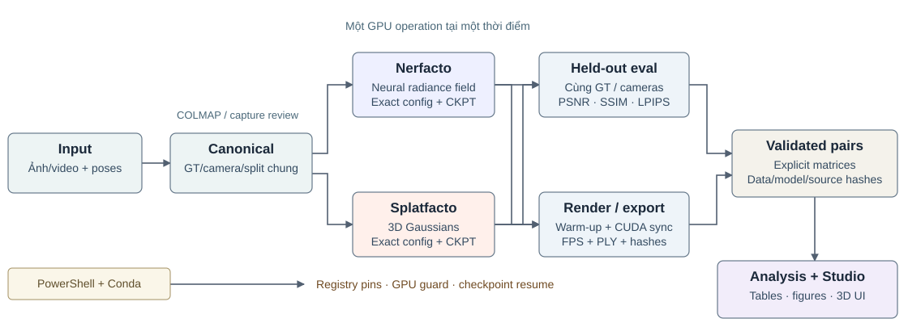
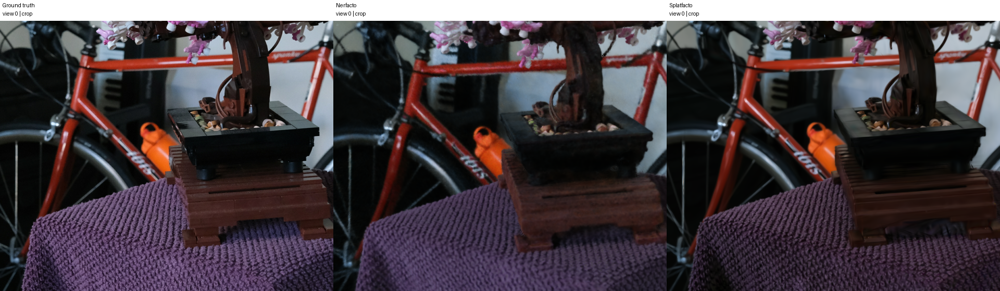
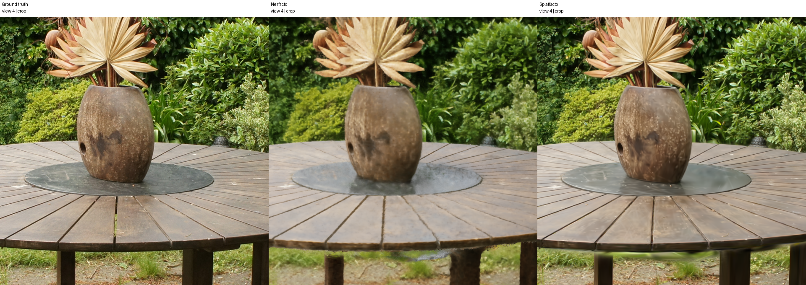
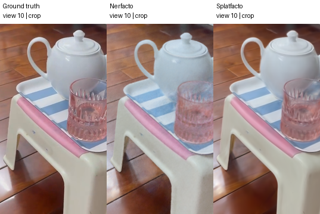
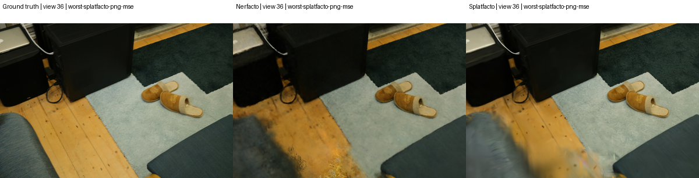
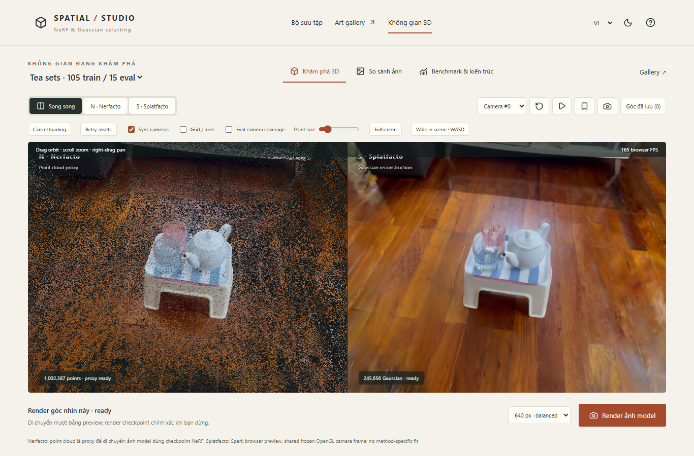

<!-- Conference manuscript source. Eight logical page blocks; references included.
Print target: A4, two columns, Times New Roman 10 pt, margins 18 mm, gap 6 mm.
The Markdown source remains authoritative; generated PDF is a layout preview.
Do not treat an HTML/Markdown page break as proof of physical page count.
-->

<!-- conference-page: 1 -->

# From Photos to 3D: So sánh Nerfacto và Gaussian Splatting trên dữ liệu thực với một GPU laptop

**Khổng Gia Minh¹ · Nguyễn Phú Nam² · Hồ Đức Mạnh³ · Đinh Nam Khánh⁴**<br/>
¹ Member 1 · ² Member 2 · ³ Member 3 · ⁴ Member 4 — Tech Lead<br/>
*Computer Vision — Final Project, Topic 16 · Bản thảo ngày 02/10/2026*

## Tóm tắt

Báo cáo nghiên cứu bài toán tái dựng biểu diễn cảnh và tổng hợp góc nhìn mới từ ảnh đa góc, sử dụng Nerfacto và Splatfacto trong Nerfstudio đã khóa phiên bản. Hệ thống được triển khai native Windows trên RTX A4500 Laptop 16 GB, với dữ liệu pinhole, camera và train/evaluation split dùng chung. Thí nghiệm gồm ba cảnh Mip-NeRF 360, một video bộ trà tự capture và Poster để kiểm tra vận hành; hai phương pháp đều huấn luyện 30.000 bước, seed 42. Trên bốn cảnh được phân tích, Splatfacto đạt PSNR cao hơn 4,7980–10,9122 dB, LPIPS thấp hơn và throughput render đồng bộ cao hơn 74,76–308,46 lần trong protocol đã đo. Riêng bộ trà, thời gian train giảm từ 48,66 xuống 22,96 phút; Garden cho trade-off ngược lại về thời gian và dung lượng checkpoint. Đóng góp kỹ thuật là pipeline có canonical input, exact-checkpoint evaluation, artifact provenance, checkpoint resume và Spatial Studio để đối chiếu ảnh/model tương tác. Báo cáo phân biệt chất lượng ảnh với độ đúng hình học, ghi nhận khác biệt SSIM backend và không suy kết quả một seed/một máy thành kết luận tổng quát. Full artifacts đã hoàn tất; nghiệm thu nghiên cứu độc lập vẫn có trạng thái riêng.

**Từ khóa:** novel-view synthesis; NeRF; 3D Gaussian Splatting; Nerfacto; Splatfacto; reproducible benchmarking; interactive visualization.

## 1. Giới thiệu

Từ nhiều ảnh của một vật thể, cần suy được không gian quan sát và tạo hình ảnh khi camera di chuyển đến góc chưa chụp. Đây là bài toán **novel-view synthesis**: đầu ra chính là appearance tại camera truy vấn, khác mục tiêu tạo CAD mesh có kích thước vật lý chính xác. NeRF biểu diễn cảnh bằng trường mật độ/màu liên tục; Gaussian Splatting biểu diễn bằng các primitive tường minh. Hai cách tiếp cận có thể tạo ảnh tương tự nhưng khác chi phí tối ưu, rendering và lưu trữ.

Topic 16 yêu cầu capture vật thể/cảnh riêng, reconstruct bằng một NeRF variant và Gaussian Splatting, rồi so sánh chất lượng, thời gian train và tốc độ render. Nhóm chọn bộ trà trong phòng làm custom scene và bổ sung cảnh indoor/outdoor công khai để kiểm tra trade-off ngoài một vật thể duy nhất. Mỗi scene được tối ưu riêng; checkpoint của Room không phải model tổng quát có thể reconstruct ngay một vật thể bất kỳ.

Ba câu hỏi nghiên cứu là: **RQ1**, phương pháp nào tái hiện held-out images tốt hơn khi input chung? **RQ2**, ưu thế rendering đi kèm chi phí thời gian, VRAM và checkpoint như thế nào? **RQ3**, cần thiết kế pipeline và UI ra sao để người khác kiểm tra được kết quả thay vì chỉ xem ảnh đẹp?

Nhóm đóng góp một hệ thống thực nghiệm có kiểm soát, không đề xuất thuật toán NeRF/3DGS mới: (i) canonical preprocessing và frozen cameras/GT; (ii) paired training/evaluation, timed rendering và provenance truy vết; (iii) local research UI hỗ trợ cùng camera, single/dual view và exact-checkpoint inference. Nghiên cứu view-count, blur hoặc lighting ablation là extension tương lai; báo cáo không trình bày chúng như thí nghiệm đã làm.

## 2. Công trình liên quan và lựa chọn implementation

NeRF [1] đặt nền tảng volume rendering khả vi từ radiance field. Instant-NGP [2] đưa multiresolution hash encoding để giảm chi phí biểu diễn; Mip-NeRF 360 [3] cung cấp benchmark unbounded scenes và các ý tưởng proposal sampling/contraction. Nerfstudio [4] kết hợp nhiều thành phần vào Nerfacto, với pipeline DataParser–DataManager–Model–Trainer. Do đó **Nerfacto không đồng nhất kiến trúc NeRF 2020**.

3DGS [5] tối ưu Gaussian anisotropic từ SfM và rasterize theo visibility; Splatfacto là implementation trong Nerfstudio, sử dụng gsplat [6]. Nhóm dùng cùng framework để giảm khác biệt hạ tầng, nhưng giữ defaults thực của từng method. Kết quả trong bài là Nerfacto–Splatfacto tại phiên bản đã ghi, không là reproduction toàn bộ published scores hoặc chứng minh mọi Gaussian renderer vượt mọi NeRF.

<!-- conference-page: 2 -->

## 3. Cơ sở lý thuyết và cấu hình model

### 3.1. Camera và radiance field

Một pixel tương ứng ray $\mathbf r(t)=\mathbf o+t\mathbf d$, xác định từ intrinsics và camera pose. NeRF học $F_\theta(\mathbf x,\mathbf d)=(\sigma,\mathbf c)$, với density $\sigma\ge0$ và màu RGB $\mathbf c$. Khi chia ray thành intervals $\delta_i$, màu dự đoán có dạng:

$$
\begin{aligned}
\hat{\mathbf C}(\mathbf r)&=\sum_{i=1}^{K}T_i(1-e^{-\sigma_i\delta_i})\mathbf c_i,\\
T_i&=e^{-\sum_{j<i}\sigma_j\delta_j}.
\end{aligned}\tag{1}
$$

$T_i$ là transmittance trước mẫu thứ $i$: mẫu bị che khuất đóng góp ít dù density cao. Công thức khả vi cho phép gradient từ ảnh quay về tham số scene [1]. Rendering cần nhiều truy vấn trên ray; số samples và số pixels ảnh hưởng trực tiếp thời gian. Một radiance field cho ảnh đẹp chưa chứng minh surface hoặc scale metric đã chính xác.

### 3.2. Nerfacto trong pinned runtime

Nerfacto dùng hash-grid nhiều mức và MLP nhỏ, thay vì MLP/Fourier-only của NeRF nguyên bản. Nội suy feature ở từng mức giúp lưu chi tiết với chi phí tra cứu; scene contraction ánh xạ không gian unbounded về miền hữu hạn. Piecewise initial sampling và **hai proposal density networks** phân bổ samples cho vùng đóng góp màu. Appearance embedding theo ảnh giúp mô hình hóa thay đổi appearance; inference mặc định sử dụng embedding trung bình.

Trong configs thực: ray batch 4.096, proposal samples **256/96**, field samples **48**; hash-grid 16 levels, 2 features/level, resolution 16–2.048, log₂ hashmap size 19. Các giá trị được đọc từ source/config đã pin, không suy từ mô tả paper. Camera optimizer của Nerfacto dùng `SO3xR3`, mixed precision bật. Đây là lựa chọn method-native; input pose khởi đầu vẫn freeze chung nhưng train-time refinement không bị ép giống Splatfacto.

Loss thực gồm RGB MSE, interlevel supervision, distortion regularization và camera regularization:

$$
\begin{aligned}
\mathcal L_N&=\mathcal L_{\rm RGB}^{\rm MSE}+\mathcal L_{\rm interlevel}\\
&\quad+0.002\mathcal L_{\rm distortion}+\mathcal L_{\rm camera}.
\end{aligned}\tag{2}
$$

Interlevel loss làm proposal weights phù hợp phân bố của field; distortion loss khuyến khích weights tập trung hơn dọc ray. Các loss dự đoán normals không được dùng vì `predict_normals=False`. Nhóm không thêm loss mới. Source kiểm tra: [Nerfacto model tại exact commit](https://github.com/nerfstudio-project/nerfstudio/blob/6b60855003011b2ca23c2fe3f8e2ca6314c69924/nerfstudio/models/nerfacto.py).

### 3.3. Gaussian representation và rasterization

Gaussian thứ $i$ gồm mean $\boldsymbol\mu_i$, covariance $\Sigma_i$, opacity $\alpha_i$ và spherical-harmonic coefficients cho view-dependent color. Covariance anisotropic được tham số hóa từ scale và rotation để duy trì positive definiteness:

$$
\begin{aligned}
G_i(\mathbf x)&=e^{-\frac12(\mathbf x-\boldsymbol\mu_i)^T\Sigma_i^{-1}(\mathbf x-\boldsymbol\mu_i)},\\
\Sigma_i&=R_iS_iS_i^TR_i^T.
\end{aligned}\tag{3}
$$

Với camera rotation $W$ và projection Jacobian $J$, screen-space covariance xấp xỉ $\Sigma'_i=JW\Sigma_iW^TJ^T$. Gaussian trở thành footprint ellipse. Rasterizer sắp theo visibility/depth và front-to-back composite:

$$
\begin{aligned}
\hat{\mathbf C}(\mathbf u)&=\sum_i T_i(\mathbf u)\mathbf c_i(\mathbf d)a_i(\mathbf u),\\
T_i(\mathbf u)&=\prod_{j<i}[1-a_j(\mathbf u)].
\end{aligned}\tag{4}
$$

trong đó $a_i(\mathbf u)$ bao gồm opacity và footprint tại pixel; background dùng transmittance còn lại. Khác NeRF, renderer tích lũy primitive đã có thay vì truy vấn field tại nhiều điểm ray. Đây là cơ sở thuật toán cho khả năng render nhanh [5], không tự xác định FPS của laptop.

### 3.4. Splatfacto và density control

Splatfacto khởi tạo từ sparse SfM points, tối ưu means, scales, quaternions, opacity và SH coefficients. Gaussian được densify/clone/split hoặc prune trong quá trình học, nên số primitive và memory thay đổi. Config thực dùng SH degree 3, `warmup_length=500`, `refine_every=100`, opacity cull threshold 0,1 và stop splitting ở 15.000 steps; rasterization mode `classic`, camera optimization `off`, mixed precision tắt.

Loss là $\mathcal L_S=0.8\mathcal L_1+0.2(1-\operatorname{SSIM})$, theo implementation upstream. Full-image training có progressive resolution: `num_downscales=2`, tăng resolution mỗi 3.000 bước, trên **canonical input đã downscale chung**. Đây là lịch train nội bộ, không phải thay held-out GT. Gaussian count tăng có thể giữ chi tiết tốt hơn nhưng làm checkpoint/export lớn; quan hệ nhân quả riêng từng thành phần cần ablation. Source: [Splatfacto model tại exact commit](https://github.com/nerfstudio-project/nerfstudio/blob/6b60855003011b2ca23c2fe3f8e2ca6314c69924/nerfstudio/models/splatfacto.py).

<!-- conference-page: 3 -->

## 4. Capture, canonical input và kiến trúc thực nghiệm

<div class="wide">



**Hình 1.** Pipeline từ ảnh/pose đến validated pairs, analysis và Spatial Studio. Các nhánh model thể hiện hai phương pháp; GPU jobs được thực thi tuần tự. PowerShell/registry, safety và resume là hạ tầng dùng chung.

</div>

### 4.1. Dữ liệu tự capture

Nguồn custom là video cảnh tĩnh `tea_sets_2.mp4`: bộ ấm/cốc và nền phòng giữ nguyên, camera thay đổi góc quan sát. Video dài khoảng **64,07 s**, giải mã được **1.922 frames**. `Extract-Video.ps1` chọn 120 frames theo **nearest-uniform timestamps**, lưu PNG lossless và chia **105 train / 15 eval** trước SfM. Provenance giữ source SHA-256, timestamp/index, filename và image hashes; không lấy tùy ý các frame đẹp sau khi xem kết quả model.

<!-- capture-device-details -->
Video do **Đinh Nam Khánh — Tech Lead** quay bằng **Apple iPhone 14 Pro**, theo xác nhận của nhóm. Source hash đầy đủ có trong `video.json` và runbook; video provenance kiểm chứng nguồn/frame selection, còn thông tin thiết bị và người quay được nhóm cung cấp. Báo cáo không suy thông số sensor, camera mode hoặc exposure settings nếu capture log chưa ghi.

Capture yêu cầu vật thể đứng yên, camera di chuyển liên tục, chi tiết đủ sắc và exposure/lighting tương đối ổn định. Video `tea_sets.mp4` trước đó có tay xoay khay được giữ như attempt khác, không đưa vào primary. Đây là lựa chọn dữ liệu dựa trên static-scene assumption, **không phải motion-blur/capture-pattern ablation** có kiểm soát.

### 4.2. COLMAP và hình học đầu vào

CPU path chạy feature extraction/matching và incremental SfM của COLMAP [7], giới hạn 4 threads. Chấp nhận một connected component register ≥90% train và **mọi eval**; không nối components hoặc bỏ eval để vượt gate. Với bộ trà, model 1 register **120/120 camera**, thay vì component nhỏ model 0; refine/convert dùng SDK đã pin. Attempts cũ được giữ để truy vết recovery.

`Review-Capture` tạo frustums và sparse projections; approval bind reviewer/notes với split/evidence hashes. Capture hiện có visual audit được ghi nhận, nhưng không thay human research endorsement. Pose và sparse structure dùng tất cả viewpoints, kể cả eval; optimizer chỉ nhận train RGB. Do đó đây là **known-camera, transductive SfM protocol**, không là camera estimation chỉ từ train images. Hai methods dùng chung điều kiện này.

### 4.3. Canonical preprocessing để tránh lệch GT

Pinned Splatfacto có thể tự undistort/crop ảnh distorted khác Nerfacto. Chỉ cho cả hai đọc cùng raw folder chưa bảo đảm cùng pixels hoặc intrinsics. `Prepare-Scene` tạo một derived canonical scene: dùng routine undistortion upstream, cập nhật intrinsics/crop, resize LANCZOS một lần cho dataset downscale 2, chuẩn hóa poses/sparse points trong cùng model frame và lưu **explicit filename lists** cho train/val/test. Distortion của pinhole input được đặt zero.

Frozen split lưu từng filename, image SHA-256, camera-to-world matrix, intrinsics, resolution/type và pose/sparse checksums. Eval loader được kiểm lại actual image/camera identities và GT pixels giữa methods. Raw không đổi; partial hoặc modified output không trở thành successful preparation. “Same input” ở đây có nghĩa cùng canonical observations, không có nghĩa optimizer/model internals giống nhau.

### 4.4. Lifecycle và provenance

Public entrypoints là PowerShell, root suy từ script location; runtime qua Conda wrappers, không yêu cầu activated shell. `runtime.py` tách train, evaluate, render, export; `experiments.py` tạo matrices tuần tự; `analysis.py` chỉ đọc validated artifacts, không load model. Mỗi run có immutable key scene/method/time, exact config, final checkpoint và source/runtime/data provenance.

Training chỉ succeeded khi checkpoint đạt **step 29.999** tương ứng 30.000 iterations, log không có nonfinite/OOM và safety hoàn tất. Evaluation có sidecar riêng, không sửa completed training manifest. Matrix giữ exact config của từng method, không tìm “latest”. Hai methods chỉ thành pair hợp lệ khi scene, split, protocol, source/runtime/settings và hardware khớp; failed hoặc half-pair bị loại khỏi bảng.

<!-- conference-page: 4 -->

## 5. Thiết kế thí nghiệm và phép đo

<div class="wide">

**Bảng 1. Datasets và kích thước held-out thực tế.** Resolution đọc từ audited artifacts sau canonical preprocessing. Custom là nhóm riêng; Poster là vận hành, không aggregate primary.

| Scene | Nguồn / vai trò | Tổng ảnh | Train | Eval | Eval resolution (W × H) |
|---|---|---:|---:|---:|---:|
| Poster | Nerfstudio / smoke gate | 100 | 87 | 13 | 539 × 959 |
| Bonsai | Mip-NeRF 360 / calibration + benchmark | 292 | 255 | 37 | 1559 × 1039 |
| Garden | Mip-NeRF 360 / outdoor benchmark | 185 | 161 | 24 | 2593 × 1680 |
| Room | Mip-NeRF 360 / indoor benchmark | 311 | 272 | 39 | 1557 × 1037 |
| Tea sets 2 | Video custom / static scene | 120 | 105 | 15 | 359 × 639 |

</div>

### 5.1. Runtime, budget và fairness

Baseline là **RTX A4500 Laptop 16.384 MiB**, driver **597.06**, native Windows; Python 3.10, PyTorch 2.1.2+cu118, CUDA toolkit 11.8, Nerfstudio v1.1.5 exact commit `6b60855003011b2ca23c2fe3f8e2ca6314c69924`, gsplat 1.4.0+pt21cu118, pinned tiny-cuda-nn. Registry `configs/project.psd1` là nguồn executable pins; mỗi run giữ full dependency inventory và source archive. Tiny-cuda-nn build cho compute capability 8.6.

Primary dùng 30.000 iterations, seed 42, downscale 2 và official eval interval 8, nhưng explicit canonical lists quyết định membership cuối cùng. Hai GPU jobs không đồng thời; không mở viewer trong timed benchmark. Năm scenes × hai methods tạo **10 runs**, trong đó tám runs trên bốn scenes vào phân tích. Không dùng diagnostic 100 bước hoặc GPU 6 GB làm primary evidence.

Nerfacto tối ưu ray batches, Splatfacto tối ưu full images và có progressive resolution, loss/precision/pose-optimizer khác nhau. **Equal iterations không là equal FLOPs, equal pixels hoặc equal wall-clock budget.** Nhóm so sánh hai cấu hình ứng dụng method-native với common input; chưa đo best-tuned performance hoặc ablation riêng thành phần.

### 5.2. Image quality metrics

Với RGB trong [0,1], pixel MSE và PSNR có quan hệ $\operatorname{PSNR}=-10\log_{10}\operatorname{MSE}$; PSNR tính dB, không là phần trăm accuracy. SSIM đo tương đồng cấu trúc [8]; LPIPS dùng khoảng cách deep features [9]. Mỗi metric được evaluator upstream tính trên final checkpoint rồi trung bình theo held-out views của scene. PSNR/SSIM càng cao và LPIPS càng thấp được diễn giải là image agreement tốt hơn, không là geometric accuracy.

**Giới hạn evaluator quan trọng:** pinned Nerfacto dùng `torchmetrics` SSIM, còn Splatfacto dùng `pytorch_msssim.SSIM`; runtime ghi `torchmetrics==1.9.0` và `pytorch-msssim==1.0.0`. Source cho thấy N mặc định suy `data_range` từ tensor và mean trên reflection-padded result, còn S đặt `data_range=1.0` và mean trên valid-convolution result. Đây là khác biệt evaluator thực, không chỉ khác tên thư viện; mức ảnh hưởng định lượng chưa được đo. Bài giữ nguyên measured method-native SSIM, không gọi đây là một shared SSIM implementation. PSNR và LPIPS dùng cùng classes upstream; kết luận chất lượng được đối chiếu với chúng và ảnh. Cần unified float-image SSIM re-evaluation để loại bỏ confound này, chưa thực hiện trong báo cáo. Không tự sửa số đã đo.

### 5.3. Time, memory, storage và throughput

Train time là wall time của executions trong manifest, cộng segments resume, **không tính thời gian pause/tắt máy**; vẫn gồm method-native periodic evaluation và startup/restore overhead. Bonsai/custom Nerfacto có resume ancestry. VRAM là maximum của samples 10 s trong training, không phải allocator peak liên tục. Checkpoint MiB = bytes / $2^{20}$; checkpoint chứa training state và có thể khác deploy-only weights, Gaussian PLY hoặc browser memory.

Renderer dùng cùng held-out cameras, resolution, camera hash và frame count cho một pair. Warm-up 3 frames, CUDA synchronize, đo 3 repetitions; throughput:

$$
\operatorname{FPS}=\frac{3n}{\sum_{k=1}^{3}t_k}. \tag{5}
$$

$t_k$ bao gồm model camera calls, loop/check overhead và synchronization; không là kernel-only time. Model loading, PNG saving và video encoding nằm ngoài timed loop. Browser FPS và interactive request latency có định nghĩa khác. Không so FPS giữa Garden và Tea sets như thể cùng resolution.

### 5.4. Laptop guard và audit

Mỗi CUDA stage reapply clock cap **300–800 MHz**, chỉ start dưới 65°C. Watchdog 2 s dừng ở ≥78°C, ≥80 W, ≥95% VRAM, clock vượt ceiling/tolerance hoặc telemetry mất. Đây là policy project, không là giới hạn nhà sản xuất. OS lock bảo đảm một GPU operation. Các điều kiện làm FPS/time đặc thù baseline đã đo; không chuyển thành lời hứa trên GPU/clock khác.

<!-- conference-page: 5 -->

## 6. Kết quả định lượng và trade-off

<div class="wide">

**Bảng 2. Chất lượng trên cùng held-out observations.** N = Nerfacto; S = Splatfacto. *Custom báo cáo riêng; †SSIM giữ backend method-native, theo giới hạn mục 5.2. Không có repeated-seed confidence intervals.*

| Scene | Method | PSNR ↑ (dB) | SSIM ↑† | LPIPS ↓ |
|---|---|---:|---:|---:|
| Bonsai | N | 20.5936 | 0.6183 | 0.2103 |
| Bonsai | S | 31.5059 | 0.9381 | 0.1324 |
| Garden | N | 21.4435 | 0.4994 | 0.4255 |
| Garden | S | 26.2415 | 0.7937 | 0.1848 |
| Room | N | 22.9068 | 0.7385 | 0.2821 |
| Room | S | 31.6652 | 0.9224 | 0.1627 |
| Tea sets 2* | N | 21.7555 | 0.6255 | 0.1268 |
| Tea sets 2* | S | 30.4557 | 0.9013 | 0.0737 |

**Bảng 3. Chi phí và synchronized offline rendering.** VRAM là sampled training maximum; CKPT là full checkpoint. Các con số FPS chỉ so trực tiếp **trong cùng scene**.

| Scene | Method | Train (phút) ↓ | VRAM (MiB) ↓ | CKPT (MiB) | Offline FPS ↑ |
|---|---|---:|---:|---:|---:|
| Bonsai | N | 48.08 | 6022 | 167.92 | 0.180 |
| Bonsai | S | 55.19 | 5572 | 306.60 | 47.359 |
| Garden | N | 74.32 | 6975 | 167.88 | 0.067 |
| Garden | S | 143.85 | 10520 | 1149.81 | 20.598 |
| Room | N | 56.95 | 7826 | 167.93 | 0.188 |
| Room | S | 60.52 | 6123 | 380.39 | 44.063 |
| Tea sets 2* | N | 48.66 | 5904 | 167.85 | 1.607 |
| Tea sets 2* | S | 22.96 | 3410 | 179.13 | 120.155 |

**Bảng 4. Chênh lệch và tỷ lệ từ số gốc.** ΔPSNR = S − N; S/N > 1 là S có giá trị lớn hơn, không tự mang nghĩa tốt hơn cho train/VRAM/size.

| Scene | ΔPSNR (dB) | FPS S/N | Train S/N | VRAM S/N | CKPT S/N |
|---|---:|---:|---:|---:|---:|
| Bonsai | +10.9122 | 263.16× | 1.148 | 0.925 | 1.826 |
| Garden | +4.7980 | 308.46× | 1.936 | 1.508 | 6.849 |
| Room | +8.7585 | 234.18× | 1.063 | 0.782 | 2.265 |
| Tea sets 2* | +8.7002 | 74.76× | 0.472 | 0.578 | 1.067 |

</div>

### 6.1. Quality và rendering

Splatfacto có PSNR cao hơn, LPIPS thấp hơn ở cả bốn scenes; SSIM upstream cũng cao hơn nhưng phải giữ caveat khác backend. Mức tăng PSNR lớn nhất ở Bonsai (**+10,9122 dB**) và nhỏ nhất ở Garden (**+4,7980 dB**). Đây là kết quả một primary seed trên các scenes đã chọn, không là statistical superiority across populations.

FPS S/N là **263,16×** trên Bonsai, **308,46×** trên Garden, **234,18×** trên Room và **74,76×** trên custom. Ưu thế phù hợp khác biệt truy vấn neural field so với Gaussian rasterization, nhưng không có ablation để tách representation khỏi renderer/CUDA/config. Splatfacto đạt 120,155 FPS trên bộ trà **359 × 639**, không suy ra 120 FPS ở 1080p hoặc trong browser.

### 6.2. Không có một chi phí thắng cho mọi scene

Garden cần **143,85 phút** Splatfacto so với **74,32 phút** Nerfacto, sampled VRAM **10.520 / 6.975 MiB**, checkpoint **1.149,81 / 167,88 MiB**. Splatfacto render nhanh hơn nhưng checkpoint lớn **6,849×**, phù hợp một biểu diễn explicit có nhiều primitives; không quy toàn bộ chênh lệch dung lượng cho Gaussian count vì optimizer/state cũng được lưu.

Custom có trade-off thuận lợi hơn: Splatfacto train **22,96** so với **48,66 phút**, sampled VRAM **3.410** so với **5.904 MiB**, checkpoint **179,13** so với **167,85 MiB**. Bonsai và Room cho time ratios 1,148 và 1,063, nhưng sampled VRAM của Splatfacto thấp hơn. Không có cơ sở gọi một method luôn train nhanh hơn hoặc luôn dùng ít memory hơn.

Các bảng được tạo từ [results.json](reports/topic16-full/results.json), cùng [paired comparisons](reports/topic16-full/review/paired-comparisons.csv); rounding chỉ áp dụng hiển thị. Poster không đưa vào bảng; không gộp custom và official thành một overall score. Toàn bộ run keys nằm trong results/gate, cho phép truy tới configs/checkpoints thay vì chỉ kiểm bảng viết tay.

<!-- conference-page: 6 -->

## 7. Phân tích định tính, failure cases và capture guide

<div class="wide">

<table class="figure-grid">
<tr>
<td><strong>(a) Bonsai · eval 0</strong><br/></td>
<td><strong>(b) Garden · eval 4</strong><br/></td>
</tr>
<tr>
<td><strong>(c) Tea sets 2 · eval 10</strong><br/></td>
<td><strong>(d) Room · eval 36</strong><br/></td>
</tr>
</table>

**Hình 2.** Mỗi panel, từ trái sang phải: **GT / Nerfacto / Splatfacto**. (a–c) cùng source-pixel crop; (d) toàn frame để giữ lỗi ở biên ảnh. PNG là outputs thật, không tạo bằng AI. Xem ảnh gốc qua links/case gallery để đánh giá ở source resolution.

</div>

### 7.1. Quy tắc chọn case và tránh cherry-picking

Nghiên cứu kiểm tra **115 held-out views** của bốn scenes (không Poster), chọn first view, largest PNG-MSE của từng method và upper-median PNG-MSE của Nerfacto; deduplicate thành **14 cases**. Selection reasons, crop XYXY và hashes lưu trong [case-selection.json](reports/topic16-full/review/case-selection.json). PNG-MSE/PNG-PSNR dùng ảnh 8-bit chỉ để chọn/diagnose; quantization khiến chúng khác official float-render metrics.

Heatmap nghiên cứu dùng mean absolute RGB difference cùng fixed range 0–0,15 cho cả hai model; không normalize riêng từng bên. UI absolute error ×4 là một cách trình bày khác và được ghi nhãn, không phải metric thay thế. Worst theo whole-image MSE không nhất thiết là region-of-interest lỗi nhất: background sáng hoặc vùng rộng có thể chi phối.

### 7.2. Chi tiết mảnh, foliage và reflected appearance

**Bonsai:** ở eval 0, Nerfacto làm mềm texture khăn tím, đường nối đế gỗ và các cạnh xe đạp; Splatfacto giữ chi tiết gần GT hơn. Camera 9 là worst PNG-MSE của Nerfacto, cho khác biệt cả background/bàn, nên không suy sai số toàn ảnh thành sai số riêng cây. Quan sát supporting PSNR/LPIPS nhưng không xác định thành phần mạng gây blur.

**Garden:** eval 4 là worst PNG-MSE của cả hai. Nerfacto làm mềm khe bàn, cụm lá và hoa khô; Splatfacto giữ cấu trúc rõ hơn, nhưng đĩa dưới bình và foliage vẫn khác GT. Đây là appearance evidence của vùng nhiều occlusion/fine texture, chưa có ground-truth leaf geometry. “Low overlap” chỉ là hypothesis nếu chưa đo visibility/coverage của vùng cụ thể.

**Room:** eval 36 là worst PNG-MSE của Splatfacto; ngay method dẫn bảng vẫn có vùng mềm ở mép sàn và tiền cảnh. Nerfacto sai texture/độ sắc rõ ở thảm và sàn. Kính, kim loại và texture nhỏ còn sai khác theo góc; image agreement tốt không chứng minh recovered optical materials. Không báo cáo depth/Chamfer vì không có GT geometry.

### 7.3. Cảnh tự capture và hướng dẫn thực hành

**Tea sets:** eval 10 là worst PNG-MSE của Nerfacto. Viền/nắp ấm và rãnh cốc bị làm mềm rõ; Splatfacto gần GT hơn nhưng cạnh cốc chưa hoàn toàn khớp. Eval 13, worst của Splatfacto, vẫn có khác biệt ở vùng sáng/background. Kết quả không có nghĩa vật thể được tái tạo 100% hoặc backside chưa quan sát đã đúng.

Từ static-scene assumption và pipeline đã kiểm, hướng dẫn vận hành hợp lý là giữ vật thể cố định, di chuyển camera quanh scene với overlap, hạn chế blur/exposure changes và xem frustums/sparse projections trước train. Capture nên quan sát cả độ cao và vùng dễ che khuất; một trajectory đều quanh vật không bảo đảm bao phủ mọi surface. Các khuyến nghị này **không phải capture guide đã có ablation định lượng**.

Hiện mới có một custom video. Chưa trả lời “ít nhất bao nhiêu views”, “blur tăng đến mức nào thì fail” hoặc “lighting change chịu được bao nhiêu”. Các thí nghiệm cần thiết là paired subsets cùng split/poses với nhiều view counts, measured blur và controlled exposure; giữ protocol và báo cáo riêng, không dùng một attempt cũ khác scene để quy nguyên nhân.

<!-- conference-page: 7 -->

## 8. Spatial Studio và kỹ thuật triển khai hệ thống

<div class="wide">



**Hình 3.** Screenshot UI thực: N là point-cloud proxy để điều hướng, S là full Gaussian export. Image comparison và exact-checkpoint render cung cấp ảnh model thật; browser viewport không được gọi là cùng phép đo offline FPS.

</div>

### 8.1. Kiến trúc browser–HTTP–CUDA worker

Frontend React/TypeScript sử dụng Three.js và Spark cho Gaussian; gallery dựng phòng/khung ảnh, labels, navigation speed và map/tour. Workspace hỗ trợ N-only, S-only, dual view, orbit/pan/zoom, presets và synchronized cameras. Hai adapters dùng **cùng frozen OpenGL model frame**, không fit/căn riêng để che lệch reconstruction. Camera coverage và image comparison giúp liên hệ góc đang xem với observations.

Backend HTTP local không import Torch. Catalog builder đọc đúng matrices `topic16-full-{custom,calibration,benchmark,poster}`, kiểm configs/checkpoints/split, eval/render/export hashes rồi publish catalog/asset index atomically. Covers lấy từ GT thật; YAML config được đọc bằng BaseLoader và allowlist fields. Browser nhận asset IDs, không tùy ý đọc mọi đường dẫn server. Gallery tải covers, không load tất cả model đồng thời.

Profile `artifacts` chỉ xem exports, saved images và research; `inference` mở worker native Windows có guard. Nerfacto proxy là point cloud dẫn xuất, không phải neural rendering. Splatfacto rasterizes Gaussian export trong browser; ảnh chính xác từ cả checkpoints được tạo khi người dùng yêu cầu camera mới. Camera novel chưa có GT nên **không gán PSNR/SSIM/LPIPS** cho nó.

### 8.2. Inference jobs và tài nguyên

Job manager có owner lease, heartbeat, one active + latest pending camera; request bind scene, selected methods, camera hash và catalog revision. Worker nạp N/S tuần tự với shared GPU lock; pair chỉ publish sau hai kết quả và final safety success. Khi camera/scene đổi, stale result bị bỏ, không ghép prediction cũ với camera mới. Preview tạm dừng vẽ khi CUDA chạy để hạn chế cạnh tranh GPU.

Cancel là cooperative: không giả preempt giữa CUDA kernel. Cache eviction giới hạn **2 GiB** tại UI jobs, bảo vệ active/pending/latest success, không xóa original checkpoints/data/exports. Point decoding dùng Web Worker và transferable arrays; scene changes dispose workers/buffers/contexts. Full Gaussian Garden có **1.656.903 primitives**; không âm thầm đổi sang reduced model để báo load thành công.

### 8.3. Checkpoint resume và native path handling

Managed session dùng worker Windows, tmux chỉ là log console. Stop commit model, optimizer/scheduler/scaler, RNG và sampler/strategy state ở safe boundary; resume giữ total budget và ancestry. Với Gaussian parameters có size thay đổi do densification, optimizer bindings/state phải restore tương ứng, không chỉ load tensor weights. Partial eval/render không được cộng thành completed metrics/FPS.

Windows Unicode paths được giữ ở manifests bằng repo-relative identity; Open3D nhận ASCII junction dưới TEMP trỏ tới repo, không copy dataset. UI-only registry delta được validate riêng và loại khỏi experiment digest; training/data/runtime/safety drift vẫn bị reject. Source của experiment gốc và source adapter sau compatibility fixes được lưu riêng.

### 8.4. QA có phạm vi cụ thể

Evidence hiện có: **75 core Python**, **10 UI backend**, **7 frontend unit** và **5 fixture E2E tests** PASS; native browser checks trên Brave/Chrome/Edge. Actual UI đã render custom pair và từng model ở **320 × 570**; translated-camera API pair thành công, không có GT metric cho camera mới. QA chứng minh flow/model identities, không đo hardware performance từ fixtures.

Touch-device ergonomics, NVDA/manual contrast, long memory soak và một số sync/failure races vẫn PARTIAL/NOT TESTED. [UI acceptance](UI_design/ACCEPTANCE.md) công bố từng trường hợp. GUI đẹp/QA PASS không thay nghiên cứu model quality hoặc human review.

<!-- conference-page: 8 -->

## 9. Tái lập, giới hạn và mức hoàn thành deliverable

### 9.1. Reproducible repository và evidence

[README](README.md) và [runbook](setup_full_command.md) cung cấp clone, host setup, pinned runtime/data, capture review, research và UI. Máy mới dùng `Setup-Project.ps1`; `artifacts/logs/runtime/requirements.txt` là audit freeze có local URLs, **không phải portable pip installer**. Video custom, data/checkpoints/exports không nằm trong Git; người tái lập phải nhận video gốc hoặc đủ artifact graph với checksums. Lệnh trọng tâm sau setup/capture approval:

```powershell
.\scripts\Run-Research.ps1 `
    -SessionDirectory '.\artifacts\logs\research\topic16-full' `
    -CustomScene tea_sets_2
.\UI_design\scripts\Prepare-UIAssets.ps1
.\UI_design\scripts\Build-UI.ps1
.\UI_design\scripts\Start-UI.ps1 -Profile artifacts
```

Một venv Python sạch, không third-party packages, đã audit **10 runs**, **1.008 input images** và pose/sparse files, recompute bảng khớp records. Đây là integrity/re-analysis trên artifacts cũ; không là fresh dataset preparation, fresh training hoặc independent GPU replay. [Artifact audit](reports/topic16-full/review/artifact-audit.json) ghi rõ scope.

Full training/eval/render/export đã hoàn tất. `g-core.json` vẫn **BLOCKED**, với artifact checks true nhưng `research_review` và `clean_machine_replay` false; research state `awaiting-evidence`. Điều này không yêu cầu train lại để mở UI, nhưng không được ký certified release từ pending endorsement. Runs mới tạo evidence/run IDs mới; cùng recipe/seed không bảo đảm bitwise-identical outputs.

### 9.2. Threats to validity và hướng mở rộng

Kết quả giới hạn ở một laptop/driver/OS, một primary seed, GPU cap và defaults khác nhau. Sampled VRAM có thể bỏ lỡ spike; resumed executions thêm overhead; checkpoint chứa optimizer state; SSIM backend chưa thống nhất. Các `_std` nếu dùng là across-view variation, không là uncertainty giữa repeated seeds. Không có statistical significance test từ nhiều lần train.

Custom eval nằm trong cùng video, có tương quan với train và geometry dùng transductive SfM. Chưa thử independent capture, relighting, dynamic objects hoặc extrapolation ngoài coverage. Không có metric ground-truth 3D, watertight mesh hay metric-scale accuracy. Extensions hợp lý: repeated seeds, matched-time/pixel budget, unified SSIM, view-count/blur/lighting ablations và cùng resolution cho cross-scene throughput.

### 9.3. Đối chiếu Topic 16 và phân công

Đã có custom capture/preprocessing, hai reconstructions, quality/time/speed tables, failure cases, repository runbook và UI. Phone capture bằng iPhone 14 Pro đã được nhóm xác nhận như mục 4.1; independent endorsement và extensions không được đánh dấu hoàn tất. Báo cáo dùng cấu trúc conference: abstract, related work, formulation, protocol, results, discussion, limitations và references; nguồn Markdown chứa tám logical page blocks để kiểm layout khi xuất bản in.

Phân công theo project: **Khổng Gia Minh** phụ trách setup/contracts/data; **Nguyễn Phú Nam** capture/canonical/training; **Hồ Đức Mạnh** evaluation/render/benchmark/analysis; **Đinh Nam Khánh**, Tech Lead, quay video bằng iPhone 14 Pro, tích hợp, QA và GPU acceptance coordination. Tên vai trò không được dùng làm reviewer signature khi chưa endorsement.

## 10. Kết luận

Với common canonical observations và protocol 30k đã đo, Splatfacto cho image agreement và synchronized rendering tốt hơn Nerfacto trên các scenes chọn, nhưng chi phí train, sampled VRAM và checkpoint phụ thuộc cảnh. Bộ trà cho lợi ích thực tế rõ; Garden cho thấy throughput cao có thể đi kèm storage/memory đáng kể. Đóng góp của project là một comparison system truy vết được, nối capture–reconstruction–measurement với Spatial Studio. Kết luận giữ phạm vi implementation/hardware hiện tại; xác nhận độc lập và controlled capture ablations là bước tiếp theo.

## Tài liệu tham khảo

[1] B. Mildenhall, P. P. Srinivasan, M. Tancik, J. T. Barron, R. Ramamoorthi, R. Ng. **NeRF: Representing Scenes as Neural Radiance Fields for View Synthesis.** ECCV, 2020. [Paper](https://arxiv.org/abs/2003.08934).

[2] T. Müller, A. Evans, C. Schied, A. Keller. **Instant Neural Graphics Primitives with a Multiresolution Hash Encoding.** ACM TOG / SIGGRAPH, 2022. [Project/paper](https://nvlabs.github.io/instant-ngp/).

[3] J. T. Barron, B. Mildenhall, D. Verbin, P. P. Srinivasan, P. Hedman. **Mip-NeRF 360: Unbounded Anti-Aliased Neural Radiance Fields.** CVPR, 2022. [Project/data](https://jonbarron.info/mipnerf360/).

[4] M. Tancik et al. **Nerfstudio: A Modular Framework for Neural Radiance Field Development.** SIGGRAPH, 2023. [Paper](https://arxiv.org/abs/2302.04264).

[5] B. Kerbl, G. Kopanas, T. Leimkühler, G. Drettakis. **3D Gaussian Splatting for Real-Time Radiance Field Rendering.** ACM TOG / SIGGRAPH, 2023. [Project/paper](https://repo-sam.inria.fr/fungraph/3d-gaussian-splatting/).

[6] V. Ye et al. **gsplat: An Open-Source Library for Gaussian Splatting.** JMLR, 2025. [Paper](https://jmlr.org/papers/v26/24-1476.html).

[7] J. L. Schönberger, J.-M. Frahm. **Structure-from-Motion Revisited.** CVPR, 2016. [Paper](https://openaccess.thecvf.com/content_cvpr_2016/html/Schonberger_Structure-From-Motion_Revisited_CVPR_2016_paper.html).

[8] Z. Wang, A. C. Bovik, H. R. Sheikh, E. P. Simoncelli. **Image Quality Assessment: From Error Visibility to Structural Similarity.** IEEE TIP 13(4), 2004. [Paper](https://www.cns.nyu.edu/pub/eero/wang03-reprint.pdf).

[9] R. Zhang, P. Isola, A. A. Efros, E. Shechtman, O. Wang. **The Unreasonable Effectiveness of Deep Features as a Perceptual Metric.** CVPR, 2018. [Paper](https://arxiv.org/abs/1801.03924).

<!-- End of eight-page conference manuscript. The task specifies conference format,
not a named venue template; this manuscript does not claim official IEEE/CVF compliance.
-->
