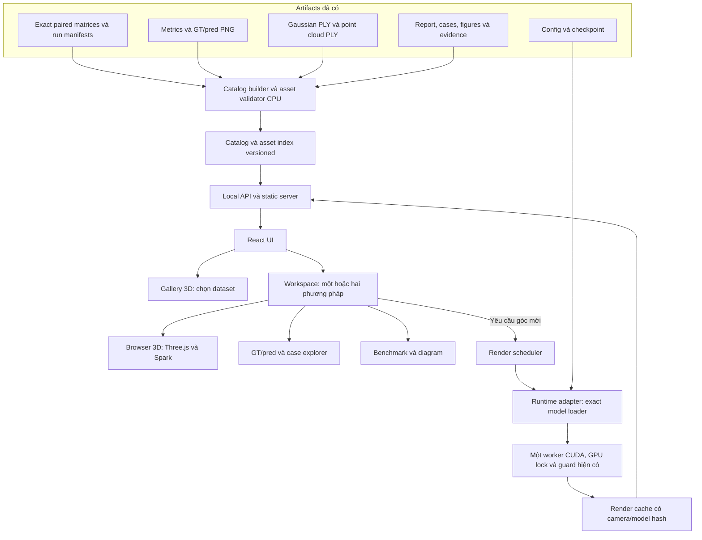
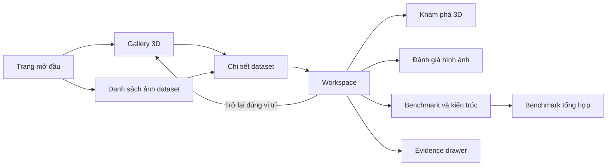
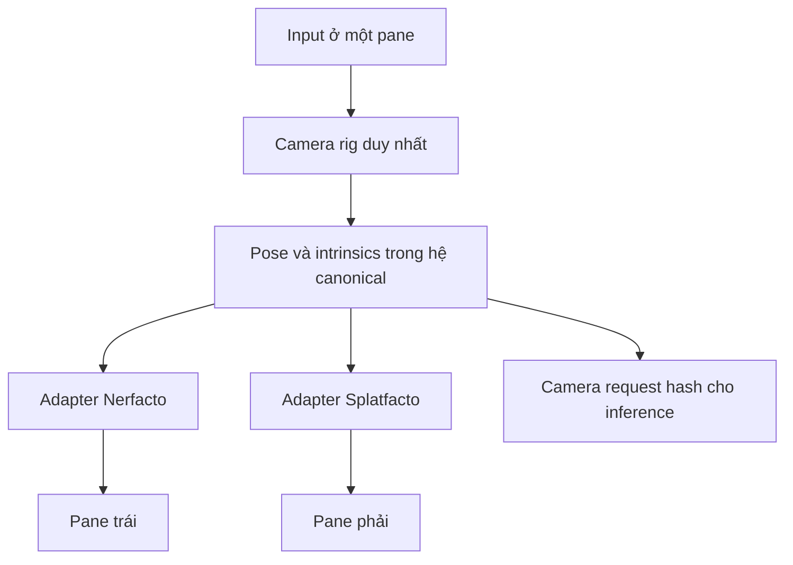
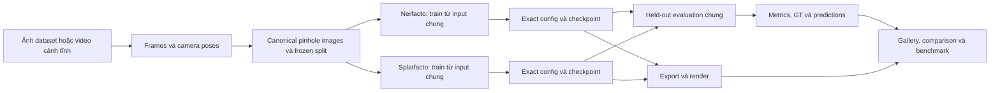
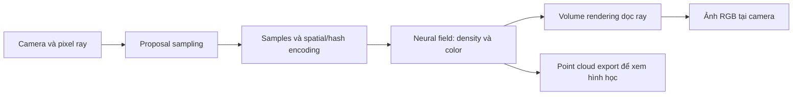
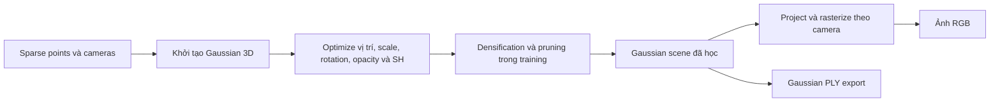
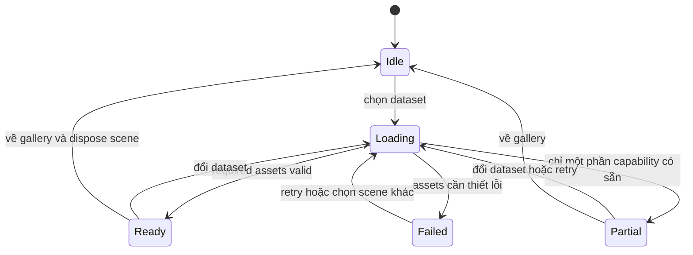
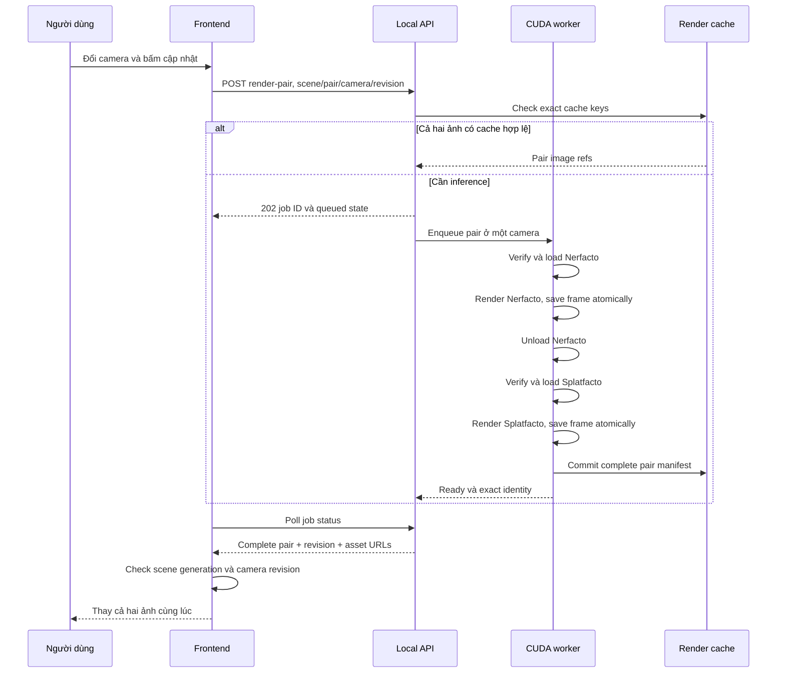

# UI Designs — Topic 16: Interactive 3D Research Gallery

> Bản thiết kế để duyệt trước khi triển khai. Ngày đối chiếu repository: **02/10/2026**.
> Revision thiết kế **1.1**: đã xử lý toàn bộ 20 vấn đề và 6 câu hỏi vận hành trong [Problem_UI.md](Problem_UI.md); xem mục 31 để truy vết từng vấn đề.
> Ngôn ngữ giao diện mặc định: tiếng Việt; giữ tên Nerfacto, Splatfacto và ký hiệu metric.
> Tài liệu này mô tả kiến trúc, trải nghiệm, hợp đồng dữ liệu, cách triển khai và nghiệm thu. Các module, endpoint và lệnh mang nhãn **đề xuất** chưa được tạo bởi việc viết tài liệu này.

**Bản đồ đọc tài liệu:**

- [Mục 1–3: phạm vi, artifacts hiện có và cách xem hai model](#design-scope).
- [Mục 4–9: kiến trúc UI, gallery, camera và so sánh](#design-experience).
- [Mục 10–12: benchmark, phong cách và diagrams](#design-research).
- [Mục 13–16: catalog, assets, tọa độ và frontend lifecycle](#design-contracts).
- [Mục 17–21: inference, API, hiệu năng và xử lý lỗi](#design-runtime).
- [Mục 22–25: cấu trúc code, commands mục tiêu, lộ trình và nghiệm thu](#design-delivery).
- [Mục 26–30: các quyết định mặc định, rủi ro, mở rộng và kịch bản trình bày](#design-decisions).
- [Mục 31: Practical Details — các quyết định bổ sung từ Problem_UI](#design-practical).

<a id="design-scope"></a>

## 1. Quyết định thiết kế chính

Xây dựng một ứng dụng web chạy localhost gồm **gallery 3D để chọn cảnh** và **workspace để khám phá, so sánh kết quả tái dựng**. Gallery giống một phòng triển lãm có các khung ảnh dataset, nhãn bên dưới, đi bộ bằng phím/chuột và điều chỉnh tốc độ. Khi chọn khung ảnh, người dùng mở cảnh 3D trong workspace, có thể xoay quanh vật, zoom, pan, chọn một phương pháp hoặc xem hai phương pháp cạnh nhau với camera đồng bộ.

Workspace có ba tab nội dung luôn truy cập được: **Khám phá 3D**, **Đánh giá hình ảnh**, **Benchmark & kiến trúc**. Một màn hình không phải chứa đồng thời mọi bảng, sơ đồ và công cụ. Dataset đang chọn được giữ xuyên suốt các tab; người dùng luôn biết mình đang xem cảnh nào và phương pháp nào.

**Cấu hình đề xuất để bắt đầu:** gallery sáng, phong cách bảo tàng hiện đại; workspace có canvas nền tối và panel thông tin sáng; dataset nổi bật là **Bộ trà — Tea sets 2**. Bước vào workspace lần đầu mở Splatfacto vì đây là biểu diễn có khả năng khám phá trực tiếp trong browser. Nút **So sánh 2 phương pháp** nằm ngay trên viewer, không bị giấu trong settings. Tab đánh giá mở ảnh GT/Nerfacto/Splatfacto đã lưu cùng camera, nên có kết quả chính xác và nhanh ngay cả khi chưa bật inference.

### 1.1 Phạm vi đã được người dùng xác nhận

| Quyết định | Cách áp dụng |
|---|---|
| Full training trên laptop đã xong | UI sử dụng artifacts hiện có; mở UI hoặc chọn dataset không phát sinh training |
| Giữ replay runbook làm command/tài liệu tái lập full project | Giữ [replay_runbook.md](reports/topic16-full/review/replay_runbook.md) làm tài liệu tham chiếu; file Markdown phải đọc và chạy từng block PowerShell phù hợp, không gọi `&` lên `.md` để chạy như script |
| Không yêu cầu nhắc/chạy lại replay GPU trên laptop | Luồng mở gallery, xem artifacts và phát triển UI không có bước replay GPU |
| Muốn cân nhắc kiến trúc trước khi thực hiện | Lượt này chỉ viết bản thiết kế; triển khai và chạy UI là bước sau khi đánh giá tài liệu |
| Chọn dataset, một model hoặc hai model | Có selector bằng ảnh, gallery và switch một/hai phương pháp |
| Muốn thấy benchmark, diagram đầy đủ như HTML đã có | Chuyển nội dung nghiên cứu hiện tại thành panel, chart, diagram và case explorer có liên kết về evidence |

Chấp thuận giữ runbook là quyết định về tài liệu và vận hành UI. Không sửa lịch sử evidence thành một phép đo chưa được chạy. Những trường trạng thái nghiên cứu cũ được giữ trong trang Evidence; chúng không trở thành yêu cầu để người dùng chạy lại project khi mở gallery.

### 1.2 Mục tiêu nghiệm thu trải nghiệm

1. Chọn cảnh bằng ảnh và bằng một gallery 3D có thể đi lại.
2. Xoay, zoom, pan quanh cảnh tái dựng; reset để không bị lạc.
3. Chỉ hiện Nerfacto, chỉ hiện Splatfacto hoặc hiện cả hai.
4. Khi so sánh, hai pane dùng cùng camera; có cách nhìn ảnh thật và hai ảnh dự đoán tại cùng held-out view.
5. Benchmark có đơn vị, ý nghĩa và nguồn thật; diagram giải thích được pipeline và hai phương pháp.
6. Chuyển cảnh không để ảnh, model hoặc số liệu của cảnh trước lẫn sang cảnh mới.
7. Giao diện khởi động trên Windows PowerShell trong repo có đường dẫn tiếng Việt, có thể dùng sau khi build mà không cần Internet.
8. Cảnh nặng hoặc inference chậm vẫn có tiến độ, preview và lựa chọn thay thế rõ ràng.

## 2. Hiện trạng thực tế: tận dụng được gì, cần bổ sung gì

### 2.1 Những thành phần đã có

| Thành phần | Nguồn trong repo | Giá trị cho UI |
|---|---|---|
| Pipeline và data contracts | [Construction_architect.md](Construction_architect.md), [Modular_construct.md](Modular_construct.md) | Dùng lại identity, frozen split, kiểm tra provenance và GPU lock |
| Runtime/evaluate/render/export | [runtime.py](src/topic16/runtime.py) | Nạp exact config/checkpoint và render góc mới khi bật inference |
| Demo hiện tại | [demo.py](src/topic16/demo.py), [Start-Demo.ps1](scripts/Start-Demo.ps1) | Một model, camera index trên trajectory cố định; chưa có orbit tự do, selector nhiều cảnh hoặc dual viewer |
| Bảng chính | [results.json](reports/topic16-full/results.json) | 8 dòng cho bonsai, garden, room và custom:tea_sets_2 × 2 phương pháp |
| Cặp run được lựa chọn | `artifacts/logs/matrices/topic16-full-*.json` | Chọn exact runs; không lấy folder mới nhất |
| Báo cáo HTML | [research_review.html](reports/topic16-full/review/research_review.html) | Nội dung phương pháp, công bằng, bảng, case studies và limitations |
| Gallery lỗi hình ảnh | [case-gallery.html](reports/topic16-full/review/case-gallery.html) | Cases cùng camera, crop tọa độ thật, RGB error và lý do chọn case |
| Case index | [case-selection.json](reports/topic16-full/review/case-selection.json) | Ánh xạ eval index → GT/pred/crop/error và hashes |
| So sánh định lượng | [paired-comparisons.json](reports/topic16-full/review/paired-comparisons.json) | Delta metric, ratio FPS/time/VRAM/checkpoint |
| Checkpoint và config | `artifacts/runs/<run_key>/` | Nerfacto/Splatfacto model đã học |
| Gaussian/point cloud | `artifacts/exports/<run_key>/export.json` và `.ply` | Cảnh 3D để tải trong browser |
| Đánh giá và ảnh | `artifacts/metrics/<run_key>/`, `artifacts/renders/<run_key>/` | GT/pred đã lưu; không cần model inference để xem |
| Throughput đã đo | `artifacts/videos/<run_key>/<camera_hash_prefix>/render.json` | FPS cùng camera, warm-up/synchronize, resolution thực |

### 2.2 Tình trạng cổng demo cũ và hướng tích hợp

File `reports/topic16-full/g-core.json` đang ghi `BLOCKED`; các checks pair, artifact contracts, paired render và exports đều `true`, còn các checks review cũ chưa hoàn tất. Demo cũ gọi gate chung nên không thể chỉ thay HTML là có ngay ứng dụng mong muốn.

**Thiết kế đề xuất:** thêm một entrypoint **local research gallery** dùng các artifacts đã kiểm chứng và ghi nhận phạm vi sử dụng local được người dùng chấp thuận. Điều kiện mở gallery là catalog hợp lệ và asset đúng identity; điều kiện bật inference thêm checkpoint/runtime/GPU health hợp lệ. Giữ đường `Select-Model → Start-Demo → Write-Release` cũ cho lifecycle release đang có. Không giả lập `G-Core PASS`, không sửa các trường evidence gốc và không thêm yêu cầu replay vào luồng UI.

Khi triển khai, cập nhật docs kiến trúc về entrypoint local này để code và tài liệu thống nhất. Bản thiết kế này không tự sửa gate hay tự ký review. Đây là mở rộng công cụ khám phá nghiên cứu trên máy đang có dữ liệu, không phải tự công bố một release đã được chứng nhận độc lập.

### 2.3 Dataset hiển thị

| ID chuẩn | Tên UI | Vai trò | Metadata hiện có | Thiết kế xem |
|---|---|---|---|---|
| `custom:tea_sets_2` | Bộ trà / Tea sets 2 | Cảnh tự quay, nhóm Custom | 105 train + 15 eval; ảnh eval 359 × 639 | Orbit quanh cụm bộ trà, giữ ảnh dọc đúng tỉ lệ |
| `bonsai` | Bonsai | Benchmark + calibration | 292 ảnh nguồn, 37 eval | Orbit vật thể trung tâm, quan sát cành/lá và chi tiết mảnh |
| `garden` | Garden | Benchmark ngoài trời | 185 ảnh nguồn, 24 eval | Orbit + explore có giới hạn, chú ý cảnh tải lớn |
| `room` | Room | Benchmark trong nhà | 311 ảnh nguồn, 39 eval | Explore trong không gian, presets vào các vùng quan tâm |
| `poster` | Poster | Smoke / kiểm tra pipeline | 100 matched images, 13 eval | Có thể mở xem, đặt trong mục Pipeline demo; không trộn vào bảng benchmark chính |

Các số train/eval cuối cùng phải lấy từ split manifest. Tổng ảnh nguồn không mặc định bằng tổng split trong mọi nguồn dữ liệu. Các nhãn vai trò quyết định nhóm trong bảng, không quyết định dataset có được xem 3D hay không.

## 3. Ba loại hiển thị cần phân biệt để thiết kế đúng

### 3.1 Splatfacto: Gaussian scene chạy trong browser

Export hiện tại là `splat.ply` với vị trí, rotation, scale, opacity, `f_dc_*` và `f_rest_*`. Header có nhãn trục đứng **z**. Đây là Gaussian PLY, không phải triangle mesh. UI dùng renderer Gaussian chuyên dụng để tạo hình ảnh khi camera đổi.

Chọn **Three.js + Spark** làm hướng ưu tiên. Spark cung cấp `SplatMesh` tích hợp trong scene Three.js và hỗ trợ Gaussian PLY cùng spherical harmonics. Khả năng đọc format được tài liệu xác nhận; độ tương thích với đúng PLY Nerfstudio v1.1.5 của repo vẫn phải được kiểm tra bằng assets thật ở bước đầu triển khai. [Spark SplatMesh](https://sparkjs.dev/docs/splat-mesh/).

Chế độ browser có thể nhanh, nhưng màu sắc/packing/cách rasterize không bảo đảm pixel giống ảnh gsplat trong benchmark. Nhãn pane là **Splatfacto · Gaussian 3D**. Chỉ ảnh xuất từ renderer đánh giá hiện có hoặc inference đúng checkpoint mới dùng để đối chiếu chính xác kết quả benchmark.

### 3.2 Nerfacto: point cloud để khám phá hình học

Export hiện tại là `point_cloud.ply`, khoảng một triệu điểm mỗi cảnh; có XYZ, normals và RGB. Three.js `PLYLoader` đọc hình học này, UI hiển thị bằng `Points`, material có vertex colors và thanh chỉnh kích thước điểm. [Three.js PLYLoader](https://threejs.org/docs/pages/PLYLoader.html).

Đây là một mẫu hình học/màu từ model, hữu ích để nhìn cấu trúc và di chuyển tự do. Nó không tái hiện đầy đủ radiance field, phần nền và màu phụ thuộc góc nhìn của Nerfacto. Nhãn luôn hiện **Nerfacto · Đám mây điểm**; không dùng ảnh chụp point cloud để tuyên bố chất lượng ảnh Nerfacto tương ứng PSNR/SSIM/LPIPS.

### 3.3 Nerfacto/Splatfacto: ảnh từ checkpoint tại camera được chọn

Để xem Nerfacto đúng như model sinh ảnh ở một góc mới, backend nạp checkpoint và chạy inference. Hai phương pháp đều có adapter inference, nhưng giữ **một CUDA worker, một model resident tại một thời điểm** mặc định trên laptop. UI có hai ảnh cạnh nhau dù backend render tuần tự.

Trong bản đầy đủ, người dùng xoay camera bằng proxy mượt; dừng chuột hoặc bấm **Cập nhật ảnh từ model** để nhận ảnh đúng model. Hai ảnh của cùng request/camera được commit vào màn hình cùng lúc. Tab đánh giá có thể dùng ngay ảnh GT/pred đã có, không đợi worker.

### 3.4 Ma trận chế độ hiển thị

| Chế độ | Nerfacto pane | Splatfacto pane | Camera tự do | Đánh giá chất lượng ảnh |
|---|---|---|---|---|
| **Khám phá 3D** | Point cloud export | Gaussian export | Có, trên các exports | Quan sát hình học; không gán metric ảnh vào proxy |
| **Ảnh đánh giá đã lưu** | PNG prediction | PNG prediction | Chọn held-out camera có sẵn | Có GT và cùng camera; đường chính để đọc kết quả đã đo |
| **Ảnh từ model tại góc mới** | Checkpoint inference | Checkpoint inference | Có, cập nhật sau thao tác | So sánh hai outputs cùng camera; chỉ có GT khi camera trùng view thật |
| **Tour đã render** | Video/frame sequence nếu có | Video/frame sequence nếu có | Đi theo path định sẵn | Trình chiếu; không coi video playback FPS là throughput |

Hai switch độc lập: **Số phương pháp: Nerfacto / Splatfacto / Cả hai** và **Cách xem: 3D / Ảnh đánh giá / Ảnh từ model / Tour**. Chuyển từ xem một method sang hai methods giữ nguyên scene và camera hiện tại.

**Không đặt mục tiêu 60 FPS Nerfacto full resolution.** FPS held-out hiện có: bonsai ≈ 0,180; garden ≈ 0,067; room ≈ 0,188; bộ trà ≈ 1,607. Đây là bằng chứng cần thiết cho cơ chế proxy + cập nhật ảnh, không phải lý do bỏ Nerfacto khỏi UI. Preview resolution thấp có thể nhanh hơn nhưng phải đo thật, không suy tốc độ tỉ lệ tuyến tính từ resolution.

<a id="design-experience"></a>

## 4. Kiến trúc hệ thống đề xuất



### 4.1 Stack chốt cho bản đầu

| Lớp | Lựa chọn | Trách nhiệm và lý do |
|---|---|---|
| UI shell | React + TypeScript | Component cho dataset cards, panels, settings, trạng thái request và so sánh |
| Build | Vite | Dev build/HMR; build static để Python phục vụ ở chế độ dùng thường |
| Styling | CSS Modules + global CSS tokens | Scoped component styles, theme/print/forced-colors rules chung; không thêm CSS-in-JS runtime hoặc Tailwind ở bản đầu |
| Gallery/camera/geometry | Three.js trực tiếp | Scene graph, texture khung ảnh, camera, orbit và walk; kiểm soát lifecycle GPU rõ |
| Decode assets lớn | Dedicated Web Worker + transferable buffers | Fetch/decode PLY và tạo attributes ngoài main thread; kiểm tra Spark decode path trong compatibility spike |
| Gaussian viewer | Spark, sau kiểm tra compatibility | Tái sử dụng scene Three.js; hỗ trợ Gaussian PLY và có hướng LoD khi cần |
| Point cloud | Three.js PLYLoader + Points | Load export Nerfacto, thay point size/visibility mà không gọi CUDA |
| Charts | SVG/HTML trong React ở bản đầu | Số dataset ít; tooltip, keyboard và export dễ; chưa cần chart framework lớn |
| Diagram | Mermaid local bundle + SVG đã render | Diagram đọc được offline, zoom/download; không gọi CDN |
| Backend | Python trong package `topic16`, stdlib HTTP server có luồng phục vụ I/O riêng | Đọc contracts, serve assets, hàng đợi render; tránh thêm web framework ở bản đầu |
| Inference | Adapter gọi loader hiện có | Giữ exact configs, split validation, runtime snapshot và safety |
| Entry points | PowerShell `.ps1` | Setup/build/start/prepare assets theo chuẩn repo và Unicode paths |
| Storage | JSON index + files hiện có + cache dẫn xuất | Không cần database, login hoặc dịch vụ cloud cho scope localhost |

React dùng cho component và state; Three.js giữ vòng render riêng, không đưa camera position lên React state mỗi animation frame. Điều này giảm re-render và giúp responsive UI khi camera di chuyển. React và Vite là lựa chọn kiến trúc cho dự án này; thông tin build dựa trên [React Quick Start](https://react.dev/learn) và [Vite Getting Started](https://vite.dev/guide/).

Không thêm React Three Fiber ở bản đầu để tránh duy trì thêm một abstraction khi cần kiểm soát Spark, camera conversion và capture ảnh. Renderer nằm sau interface adapter, nên có thể thay Spark nếu compatibility spike cho kết quả không đạt. Không thay pipeline training để hợp với renderer web.

### 4.2 Ranh giới các module

| Module đề xuất | Công việc | Dependency được phép |
|---|---|---|
| `ui_catalog.py` | Chọn exact pairs, validate assets, metric mapping, build catalog | contracts/analysis helpers, stdlib; không import Torch |
| `ui_assets.py` | Thumbnail, PLY inspection, proxy tiers, alignment metadata | CPU tooling; không tự export lại checkpoint |
| `ui_server.py` | Static files, read API, asset streaming, render job API | catalog + scheduler; lazy import inference |
| `ui_render.py` | Bounded scheduler, load/unload model, inference, cache, stale requests | runtime/safety/sessions |
| Frontend `data/` | Types, fetch client, validation phản hồi | Không đọc đường dẫn filesystem tuyệt đối |
| Frontend `viewer/` | Scene adapters, camera rig, render surfaces, disposal | Three.js/Spark |
| Frontend `gallery/` | Phòng, frames, navigation, chọn scene | Dataset summaries và thumbnail URLs |
| Frontend `research/` | Metrics, charts, GT/pred/crops, diagram | Catalog + case index |

Server có thể phục vụ nhiều request assets/health song song để không bị inference chặn. GPU worker vẫn chỉ thực hiện một workload tại một thời điểm. Không dùng `HTTPServer` serial hiện tại để vừa chờ một frame Nerfacto hàng chục giây vừa phục vụ cả gallery.

### 4.3 Hai profile chạy

**Artifact profile — mặc định:** gallery, Gaussian, point cloud, saved-image comparison, benchmark và diagram. Không nạp Torch/CUDA pipeline; không cần quyền Administrator để chỉ đọc artifacts. Browser 3D vẫn có thể dùng GPU qua WebGL, nên đây không phải chế độ CPU-only.

**Inference profile — tùy chọn:** thêm ảnh từ checkpoint ở camera mới. Có worker riêng, giữ GPU lock/guard và quyền phù hợp với policy hiện có. Người dùng chọn bật profile này khi muốn xem ảnh model tự do. Gallery vẫn hoạt động nếu worker không available.

Từ profile mặc định chuyển sang inference phải kiểm tra readiness và trả trạng thái cụ thể; không tự mở một terminal elevated liên tục mỗi lần click camera. Nếu thiếu worker, UI có nút mở hướng dẫn start đúng profile và vẫn xem được saved results.

## 5. Cấu trúc thông tin và luồng người dùng



### 5.1 Trang mở đầu

- Tên sản phẩm: **Topic 16 · 3D Research Gallery**.
- Dòng giới thiệu: “Khám phá cảnh 3D và so sánh Nerfacto với Splatfacto”.
- Hai hành động rõ: **Vào gallery 3D** và **Chọn cảnh bằng ảnh**.
- Featured card bộ trà, dùng ảnh thật đại diện, có nút **Mở Bộ trà**.
- Dải nhỏ cho biết 4 cảnh nghiên cứu + 1 cảnh kiểm tra; readiness lấy từ catalog, không hard-code thành công.
- Không chặn người mới bằng bảng logs hoặc gate kỹ thuật.

Mở lần đầu mặc định vào trang này. Lần sau có nút **Tiếp tục cảnh gần nhất**, nhưng không auto-load toàn bộ Gaussian lớn trước khi người dùng chọn.

### 5.2 Chọn dataset bằng ảnh

Mỗi card có ảnh thật, tên Việt/ID dataset, loại cảnh, nhãn Benchmark/Custom/Smoke, số ảnh train/eval và các capability đang có. Các chips khả năng: **Gaussian 3D**, **Đám mây điểm**, **Ảnh đánh giá**; availability inference được hiển thị qua trạng thái chung.

Hover card hiển thị ba thumbnails thật khác góc đã có; không phát video tất cả card cùng lúc. Click mở detail sheet với ảnh lớn, mô tả scene, hai nút **Khám phá 3D** và **Đánh giá 2 phương pháp**. Secondary action **Xem benchmark** mở đúng tab của cảnh này.

Card dùng một ảnh GT cho cả hai methods để tránh selector vô tình ưu ái phương pháp có render đẹp hơn. Có alt text và tên dataset dạng DOM thật. Thumbnail được làm từ ảnh nguồn/GT có provenance, không dùng ảnh AI để đại diện dataset.

Filter gồm All / Benchmark / Custom / Pipeline demo và ô tìm kiếm. Với 5 cảnh, filter không chiếm nhiều diện tích; mục Poster thu gọn ở cuối. Thêm scene mới bằng catalog, không phải sửa component.

### 5.3 Workspace

Thanh trên: Back to Gallery, ảnh nhỏ + tên dataset, dropdown chọn dataset, method switch và chế độ viewer. Bên dưới là canvas/panes chính. Bên phải có inspector collapsible; phía dưới có tabs hoặc drawer cho metrics/cases. Trên màn hình laptop 1366 × 768, viewer chiếm phần lớn diện tích, panel phụ không ép canvas thành một ô nhỏ.

Inspector mặc định cho biết representation và công cụ camera. Metrics quick strip chỉ có PSNR/SSIM/LPIPS cùng nhãn “Kết quả held-out”; details nằm ở tab Benchmark. Khi đang xem point cloud, strip thêm “Điểm đánh giá thuộc ảnh model trong tập eval” để không nhập nhằng.

## 6. Gallery 3D: thiết kế cụ thể

### 6.1 Không gian và bố cục

Gallery là một phòng được dựng bằng mesh/code Three.js, tường trắng ấm, sàn đá nhạt, viền khung màu đen/gỗ tối, ánh sáng mềm. Tranh là texture từ dataset thumbnail. Dùng geometry đơn giản, baked shading hoặc lights ít; không cần tải một gallery model nặng từ bên ngoài.

```text
                         TƯỜNG CUỐI
              [Bộ trà — cảnh nổi bật]  [Pipeline diagram]

        [Bonsai]                              [Garden]

        [Room]                                [Poster: Smoke]

                   ĐIỂM VÀO / BẢN ĐỒ NHỎ
              [Danh sách ảnh] [Đi tour tự động]
```

Phòng gợi ý 14 × 18 **gallery units**, lối đi giữa rộng khoảng 4 units, camera height 1,65 units. Gallery units là đơn vị của không gian thiết kế, không phải thước đo kích thước vật thật của dataset. Room có thể scale theo số exhibits khi catalog tăng.

Mỗi exhibit có frame 3D, ảnh đúng aspect ratio, plaque ở dưới gồm tên scene, vai trò và một câu mô tả. Một bảng sơ đồ ở cuối phòng mở tab Architecture; không biến mọi bảng metric thành texture chữ nhỏ khó đọc.

### 6.2 Cách di chuyển

| Điều khiển | Hành vi |
|---|---|
| `W A S D` hoặc phím mũi tên | Đi trước/trái/sau/phải theo hướng đang nhìn, khóa độ cao |
| Chuột sau khi bấm “Bắt đầu đi” | Nhìn quanh bằng pointer lock |
| `Esc` | Thoát pointer lock, mở con trỏ và tạm dừng chuyển động |
| `Shift` khi giữ phím đi | Đi nhanh tạm thời, có clamp tốc độ |
| `E` hoặc click khung được highlight | Mở detail dataset đang focus |
| `Home` | Trở về điểm vào gallery |
| `Space` | Pause/resume auto tour; không nhảy trong phòng |
| Nút `Trước / Sau` | Teleport có transition ngắn đến exhibit kế tiếp, dùng được khi không muốn WASD |
| Bản đồ nhỏ / danh sách DOM | Chọn exhibit, di chuyển đến điểm đứng đối diện khung |

Pointer lock chỉ bắt đầu sau một click chủ động. `PointerLockControls` cung cấp điều khiển hướng nhìn; movement, acceleration, collision và dataset selection do ứng dụng triển khai. [Three.js PointerLockControls](https://threejs.org/docs/pages/PointerLockControls.html).

Thanh **Tốc độ đi** có Chậm / Vừa / Nhanh và slider 0,4–3,0 gallery units/s, mặc định 1,2. Đây là speed đi trong gallery; khác tốc độ auto orbit cảnh, tốc độ tour và thời gian render model. Damping tăng/giảm tốc nhẹ, tốc độ tính theo delta-time; cap delta-time khi tab quay lại để camera không nhảy xuyên phòng.

### 6.3 Chọn tranh

Raycast chỉ vào frame/hitbox exhibit, không vào mọi pixel texture hoặc point cloud. Exhibit ở trong khoảng tương tác 3 units và gần tâm nhìn được viền sáng; hiện “Bộ trà · Nhấn E để mở”. Click tranh từ chế độ con trỏ cũng được.

Detail sheet mở dưới dạng DOM có ảnh lớn và nút; pointer lock được giải phóng, camera gallery dừng. Khi đóng sheet, không tự bắt pointer lock trở lại. Khi mở workspace, lưu position/quaternion gallery vào state; quay lại sẽ đứng ở đúng exhibit vừa chọn.

### 6.4 Auto tour và thoải mái khi sử dụng

Auto tour đưa camera theo các điểm đứng đã định sẵn, không lao qua giữa tường. Có Start/Pause/Next và speed 0,5× / 1× / 1,5×; mỗi khung dừng vài giây theo config. Tự pause khi người dùng mở dataset hoặc input di chuyển.

Collision dùng biên phòng và vài box cố định, không cần physics engine. Không head bob, không âm thanh autoplay, không motion blur. Chọn Reduce motion bỏ transition bay; teleport đổi vị trí trực tiếp. Mobile hoặc WebGL unavailable luôn có danh sách ảnh tương đương.

### 6.5 Tối ưu gallery

Gallery chỉ load frame textures, chữ, geometry phòng và thumbnails. **Không load 5 Gaussian scenes và 5 point clouds vào phòng.** Mỗi tranh là một portal mở workspace. Nhờ vậy phòng đi lại nhẹ ngay cả khi Garden có export lớn.

Không thêm live render trong từng bức tranh ở bản đầu. Bản mở rộng có thể thay ảnh exhibit được focus bằng preview frame sequence đã có, nhưng chỉ một exhibit chạy preview mỗi lúc.

## 7. Workspace 3D và điều khiển camera

### 7.1 Xoay quanh vật thể

Default của Bonsai và Bộ trà là orbit quanh target có preset. Drag trái xoay camera, wheel zoom, drag phải pan; trackpad/touch dùng thao tác tương đương. Dùng `OrbitControls` với damping và giới hạn distance/polar angle theo scene. [Three.js OrbitControls](https://threejs.org/docs/pages/OrbitControls.html).

Hiển thị nút **Reset góc nhìn**, **Về vật thể**, **Toàn màn hình**, **Tự xoay**, **Lưu góc nhìn**. Auto orbit speed 3–30 độ/s, mặc định 10 độ/s; dừng khi người dùng kéo camera. “Về vật thể” trở lại target, không chuyển sang dataset khác.

Orbit target không lấy mean toàn bộ points một cách mù quáng vì outliers/nền xa có thể kéo tâm đi. Builder gợi ý robust bounds; người triển khai review một lần và lưu `scene-presets.json` với pivot, radius, up, camera và bounds. Bounds/crop dùng chung cho hai methods khi compare.

### 7.2 Di chuyển trong cảnh

Room và Garden có nút **Đi trong cảnh**. Có WASD, mouse look sau click, speed tính bằng normalized scene units/s, clamp theo scene bounds. Thêm nút Reset/Preset vì Gaussian không cung cấp collision mesh đáng tin cho toàn bộ vật thể.

Không hứa không thể đi xuyên đồ vật trong scene reconstruction. Bản đầu giới hạn bằng bounding volume và safe presets; collision vật thể chính xác chỉ bổ sung khi có mesh/proxy collision được review. Gallery có walls thật do app dựng nên collision ở gallery dễ và độc lập.

### 7.3 “Xem kiến trúc 3D” theo hai nghĩa

**Cấu trúc cảnh tái dựng:** toggle hệ trục, ground grid, bounds, point cloud, Gaussian centers nếu renderer hỗ trợ, sparse SfM cloud và camera frustums train/eval. Màu train/eval và selected camera khác nhau, chú giải rõ. Xem full Gaussian vẫn là default khi chỉ chọn Splatfacto; overlays mặc định off để cảnh không rối.

**Kiến trúc phương pháp/hệ thống:** tab riêng có diagram pipeline, Nerfacto và Splatfacto. Click node mở giải thích và liên kết source; nội dung chi tiết ở mục 12.

Không cung cấp nút wireframe giả cho Gaussian hoặc point cloud: chúng không có mặt tam giác để wireframe như mesh. Có thể chọn “Hiện điểm/tâm Gaussian” làm structural view, với đúng nhãn.

### 7.4 Presets và coverage

Presets gồm Tổng quan, Gần vật thể, Chi tiết A/B và Góc eval đã chọn. “Mặt sau” chỉ có nếu actual reconstruction và camera coverage đủ để review. Orbit đủ 360° là khả năng camera, không bảo đảm mặt chưa chụp được tái dựng chính xác.

Nếu ra xa vùng quan sát, hiện hint “Góc này xa vùng camera đã ghi nhận”; hint dựa trên camera hull/distance heuristic, không gọi đó là uncertainty định lượng. Người dùng vẫn có thể khám phá trong bounds. Không dùng AI inpaint để lấp phần thiếu của model trong viewer nghiên cứu.

## 8. So sánh song song: hành vi và tính công bằng

### 8.1 Bố cục

Desktop: trái Nerfacto, phải Splatfacto; màu nhận diện Nerfacto xanh lam, Splatfacto xanh ngọc. Method name/representation/status được in bằng chữ, không dựa vào màu. Hai panes bằng kích thước, cùng clear background và controls.

Modes: **Cạnh nhau**, **Thanh kéo** và **Luân phiên A/B**. Thanh kéo chỉ kích hoạt cho hai ảnh cùng camera/resolution hoặc hai render targets đồng bộ đã kiểm tra. Ở bản đầu, structural point cloud vs Gaussian dùng side-by-side; không đặt wipe giữa hai representation rồi gắn metric như một image comparison chính xác.

### 8.2 Camera chung



Không đồng bộ bằng hai OrbitControls tự phát events qua lại. Một rig xử lý input, rồi phát snapshot cho cả hai adapters. Khi khóa sync bật, camera pose, pivot, projection, near/far và output pixel size dùng chung. Nếu click vào pane phải rồi kéo, vẫn cập nhật rig chung.

Có toggle **Khóa camera** bật mặc định; khi tắt, header hiện **Hai góc nhìn độc lập** và không cho wipe hoặc ảnh “same-camera”. Bật lại lấy camera của pane đang active làm camera chung. Switch single/dual không thay pose hoặc reset zoom tự động.

### 8.3 Điều kiện để nói cùng camera

- Camera-to-world trong hệ canonical trùng nhau.
- Intrinsics `fx, fy, cx, cy`, image width/height và camera convention trùng nhau.
- Với browser scene, transform model → canonical → browser được ghi nhận, không auto-fit hai exports riêng rẽ.
- Với image panes, letterbox/zoom/pan cùng cách; không crop ảnh dọc bộ trà để ép thành landscape.
- Chất lượng hiển thị, gamma và exposure không chỉnh riêng một phương pháp mặc định.
- Metrics lấy từ correct paired run; việc đổi camera tự do không đổi aggregate metric và không tạo GT mới.

### 8.4 Pair commit khi inference

Khi pose thay đổi, UI tăng `camera_revision`; worker trả frame kèm revision, run key, checkpoint hash và camera hash. Pair chưa đủ thì giữ pair trước có nhãn “Góc trước” hoặc hiển thị proxy của góc mới. Không đưa một ảnh cũ và một ảnh mới vào trạng thái “đồng bộ”.

Đổi dataset tăng `scene_generation`. Tất cả response từ generation cũ bị bỏ; GPU inference đang thực thi có thể chưa dừng tức thì, nhưng không được hiển thị lên scene mới. Khi cả hai frames đúng revision đến, UI thay pair trong cùng lượt cập nhật.

## 9. Đánh giá hình ảnh: dùng chính evidence đã có

### 9.1 Các layout

- **Bộ ba GT / Nerfacto / Splatfacto:** cả ba ảnh cùng camera; giữ pixel aspect, labels và full-resolution viewer.
- **Wipe:** GT–Nerfacto, GT–Splatfacto hoặc Nerfacto–Splatfacto; drag handle có keyboard support.
- **Crop lens:** chọn ROI chung trên ảnh lớn; cả ba pane hiển thị cùng XYXY trong pixel nguồn.
- **Error map:** giữ scale chung giữa hai methods trên cùng case; legend định nghĩa RGB absolute error/MSE theo asset đang có.
- **Case list:** first view, median PNG-MSE, worst Nerfacto PNG-MSE, worst Splatfacto PNG-MSE và cases có review notes.

Case-selection hiện tại chọn worst/median theo **PNG-MSE**, không theo LPIPS hoặc PSNR per-view. UI phải hiển thị đúng lý do, không đổi nhãn thành “worst LPIPS”. PNG diagnostics là dẫn xuất 8-bit, khác metric aggregate upstream đã đo từ model.

### 9.2 Chọn camera

Filmstrip thumbnails của eval views, có số index và marker cases. Click thumbnail nạp GT/pred tương ứng. Nút Previous/Next đi theo eval order đã lưu, không theo sort tên ảnh bất kỳ.

Nếu có per-view metrics hợp lệ, hiện ở view đang chọn với nhãn **Tại góc này**; nếu chỉ có aggregate và PNG-MSE thì chỉ hiện những trường thật sự có. Không nhân bản điểm aggregate thành metric của mọi view.

### 9.3 Notes và bookmarks

Người dùng lưu bookmark gồm scene, pair identity, eval index hoặc free-camera pose, ROI, display mode và ghi chú. Bản đầu chốt localStorage với export/import backup theo mục 31.15; lưu server ở `reports/ui/notes/` là nâng cấp tùy chọn. Không ghi vào human review evidence gốc tự động.

Bookmark ở free view không gắn ảnh GT nếu không có exact matching camera. Export screenshot kèm labels và sidecar JSON để người khác biết representation, run, camera và resolution đang được chụp.

<a id="design-research"></a>

## 10. Benchmark: nội dung, nguồn và cách trình bày

### 10.1 Metric cards

| Metric | Chiều tốt hơn | Hiển thị | Nguồn và ý nghĩa |
|---|---|---|---|
| PSNR | ↑ | 2 decimals, dB | Aggregate held-out từ upstream evaluator |
| SSIM | ↑ | 4 decimals | Structural similarity trên eval images |
| LPIPS | ↓ | 4 decimals | Perceptual difference; giữ metric backbone/protocol metadata nếu có |
| Train time | ↓ theo tiêu chí tốc độ | Phút, 1 decimal | `train_seconds`; không bao gồm setup/download |
| Peak train VRAM | ↓ theo tiêu chí tài nguyên | Giá trị MB nguồn và cách quy đổi rõ | Max telemetry sample; sampling có thể bỏ qua spike |
| Offline render FPS | ↑ | 3 decimals khi <1; 2 khi ≥1 | Renderer warm-up/synchronize, cùng held-out cameras/resolution, không tính IO/encoding |
| Checkpoint size | Theo nhu cầu lưu trữ | MiB / GiB | `checkpoint_bytes`; khác export/download bytes |
| Browser FPS | Thông tin trải nghiệm | Số live riêng | Không nhập vào bảng offline FPS; measurement trong UI có renderer/resolution/device |
| Export size | Thông tin tải model | MiB | File bytes trong `export.json`, chưa gồm decoded memory |

Tooltip giải thích mỗi metric, đơn vị, số view và evaluation protocol. Không gán nhãn phương pháp “tốt nhất” chỉ dựa một metric. Có thể highlight từng ô theo chiều metric, luôn kèm giá trị và delta.

### 10.2 Snapshot số thật đã đối chiếu

Bảng sau làm fixture tham chiếu cho kiểm tra UI, **không hard-code vào frontend**. Dữ liệu runtime lấy từ `reports/topic16-full/results.json`; giá trị ở đây làm tròn để đọc.

| Scene | Method | PSNR dB | SSIM | LPIPS | Train phút | Peak VRAM MB nguồn | Offline FPS | Checkpoint MiB |
|---|---|---:|---:|---:|---:|---:|---:|---:|
| Bonsai | Nerfacto | 20,59 | 0,6183 | 0,2103 | 48,1 | 6022 | 0,180 | 167,92 |
| Bonsai | Splatfacto | 31,51 | 0,9381 | 0,1324 | 55,2 | 5572 | 47,36 | 306,60 |
| Garden | Nerfacto | 21,44 | 0,4994 | 0,4255 | 74,3 | 6975 | 0,067 | 167,88 |
| Garden | Splatfacto | 26,24 | 0,7937 | 0,1848 | 143,9 | 10520 | 20,60 | 1149,81 |
| Room | Nerfacto | 22,91 | 0,7385 | 0,2821 | 57,0 | 7826 | 0,188 | 167,93 |
| Room | Splatfacto | 31,67 | 0,9224 | 0,1627 | 60,5 | 6123 | 44,06 | 380,39 |
| Bộ trà | Nerfacto | 21,76 | 0,6255 | 0,1268 | 48,7 | 5904 | 1,607 | 167,85 |
| Bộ trà | Splatfacto | 30,46 | 0,9013 | 0,0737 | 23,0 | 3410 | 120,16 | 179,13 |

### 10.3 Charts và so sánh

1. Bar chart PSNR/SSIM/LPIPS theo scene, dùng từng chart riêng vì khác đơn vị.
2. Chart training time và peak VRAM, kèm tooltip protocol/hardware.
3. Render FPS theo scene, cho chọn trục log khi cần nhìn giá trị chênh nhiều; ghi rõ trục log.
4. Scatter quality vs speed hoặc quality vs model bytes, legend method và scene.
5. Pair summary: `ΔPSNR = Splatfacto − Nerfacto`, `ΔLPIPS = Splatfacto − Nerfacto`, ratios thời gian/FPS. Với LPIPS, delta âm nghĩa Splatfacto ít perceptual error hơn ở metric này.
6. Bảng đầy đủ sortable, tải CSV/JSON; chart tải SVG/PNG.

Chia **Benchmark: Bonsai/Garden/Room** và **Custom: Bộ trà**. Không trung bình chung custom với official rồi kết luận tổng quát. Poster ở bảng Smoke riêng. Một seed và một laptop không đủ để thêm error bars hoặc statistical significance; UI không tự bịa confidence interval.

### 10.4 Giải thích fairness và giới hạn

Panel “Điều kiện so sánh” hiển thị shared canonical images/poses/split, 30k iterations, seed 42, downscale 2, pinned Nerfstudio và GPU A4500 Laptop. Iterations bằng nhau không có nghĩa FLOPs hoặc batch semantics bằng nhau. Resolution held-out khác giữa scenes nên FPS các scenes không phải phép so sánh chỉ phụ thuộc nội dung scene.

Bộ trà đến từ một video, test viewpoints có tương quan và đo interpolation. Kết quả này là kết quả project trên pipeline hiện tại, không tự đổi tên thành reproduction điểm paper NeRF/3DGS gốc. Các nội dung này ở research details với giải thích dễ đọc, không chiếm canvas chính.

## 11. Phong cách hình ảnh, layout và responsive

### 11.1 Design tokens

| Token | Giá trị gợi ý | Dùng cho |
|---|---|---|
| Page background | `#F2F5F9` | Nối với phong cách HTML review hiện có |
| Panel | `#FFFFFF` | Cards, tables, inspector |
| Text | `#172539` | Nội dung chính |
| Secondary text | `#50637B` | Metadata, caption |
| Border | `#DCE4EF` | Chia panel, card |
| Brand/action | `#1659A4` | Primary CTA và Nerfacto |
| Splatfacto | `#0F766E` | Method accent và labels |
| Canvas | `#121923` | Viewer scene nền tối |
| Warning/hint | `#A16207` trên `#FFF8E9` | Chậm, thiếu capability hoặc góc ngoài coverage |
| Spacing | 4/8/12/16/24/32 px | Nhịp layout nhất quán |
| Radius | 12 px cards, 8 px controls | Gọn, phù hợp panels nghiên cứu |

Font `Segoe UI` / system sans-serif hỗ trợ tiếng Việt offline; monospace cho run key/hash trong Evidence drawer. Body 15–16 px, labels tối thiểu 13 px, heading 24–32 px. Text trên plaque gallery có DOM tương đương; không trông chờ chữ texture đọc được ở mọi khoảng cách.

Gallery sáng tạo cảm giác triển lãm; canvas tối làm tái dựng nổi bật. Có Light/Dark UI theme nếu cần, nhưng theme không tự đổi exposure của model, image gamma hoặc benchmark colors.

### 11.2 Wireframe workspace

```text
┌────────────────────────────────────────────────────────────────────────────┐
│ ← Gallery   [ảnh] Bộ trà ▼    Nerfacto | Splatfacto | Cả hai     Settings   │
├────────────────────────────────────────────────────────────────────────────┤
│ Khám phá 3D       Đánh giá hình ảnh       Benchmark & kiến trúc            │
├─────────────────────────────┬─────────────────────────────┬───────────────┤
│ Nerfacto                    │ Splatfacto                  │ Góc nhìn      │
│ Đám mây điểm / Ảnh model    │ Gaussian 3D / Ảnh model     │ Orbit / Walk  │
│                             │                             │ Presets       │
│         VIEWER A            │         VIEWER B            │ Overlays      │
│                             │                             │ Chi tiết      │
│                             │                             │ Thu gọn ›     │
├─────────────────────────────┴─────────────────────────────┴───────────────┤
│ 🔗 Khóa camera    Reset    Tự xoay    Fullscreen    Lưu góc / chụp ảnh      │
├────────────────────────────────────────────────────────────────────────────┤
│ Kết quả held-out: PSNR / SSIM / LPIPS    Xem bảng và nguồn →               │
└────────────────────────────────────────────────────────────────────────────┘
```

### 11.3 Kích thước màn hình

| Viewport | Layout |
|---|---|
| ≥1440 px | Dual panes + inspector 280–320 px; tab research dưới hoặc màn riêng |
| 1024–1439 px | Dual panes; inspector đóng mặc định, mở drawer overlay |
| 768–1023 px | Side-by-side nhỏ hoặc stack; selector gọn, filmstrip ngang |
| <768 px | Single viewer mặc định; A/B switch giữ camera hoặc stack images; gallery dùng ảnh/teleport thay walk |

Ở ảnh eval dọc Bộ trà, dùng contain/letterbox, không kéo méo hoặc cắt mất phần trên/dưới. Wipe/crop tools dùng tọa độ ảnh thực, không lấy CSS size làm pixel index nguồn.

### 11.4 Accessibility

Tất cả hành động chọn scene, đổi method, xem metric và mở case có đường DOM/keyboard. Focus visible, contrast đủ, slider có label/value, tooltips có thể mở bằng keyboard. Canvas có mô tả và link “Chọn cảnh bằng ảnh”. Reduce motion theo setting và OS preference.

WASD không hoạt động khi focus ở textbox; `Esc` luôn có lối thoát pointer lock/modal. Button click target tối thiểu khoảng 44 × 44 px cho touch. Không dùng thắng/thua bằng màu đỏ/xanh duy nhất.

## 12. Diagram và giải thích kiến trúc đầy đủ

### 12.1 Tab Pipeline của project



Các nodes input/preprocessing/train/evaluate/export/UI có nhãn **đã có artifact** hoặc **đang xem** tùy catalog. Training nodes giải thích nguồn kết quả, không phải nút tự chạy lại training. Click node mở evidence/source links phù hợp scene đang chọn.

### 12.2 Tab Nerfacto



Đây là diagram giải thích mức khái niệm; không nhận là toàn bộ mọi lớp/loss trong implementation. Panel chi tiết trỏ vào pinned code/config để người đọc xem proposal iterations, sample counts, field settings và appearance handling thật. Tránh tự vẽ một MLP generic rồi gắn là kiến trúc đầy đủ của exact run.

### 12.3 Tab Splatfacto



Màu phụ thuộc góc nhìn được giải thích bằng spherical harmonics. Diagram có ví dụ trực quan ray vs splats và bảng representation: field liên tục / Gaussian primitives / exports / cách đổi góc nhìn. Không trình bày Splatfacto là mesh kín.

### 12.4 Tab UI/runtime

Hiển thị sơ đồ ở mục 4 và sequence ở mục 17. Người dùng muốn hiểu vì sao camera di chuyển mượt nhưng ảnh Nerfacto đến sau sẽ thấy browser proxy, request camera và serial CUDA render.

### 12.5 Tương tác và export diagram

Tabs Project pipeline / Nerfacto / Splatfacto / UI runtime. Diagram có zoom/reset, fullscreen, text explanation và tải SVG. Mermaid được build/serve local; SVG export có tên phiên bản/catalog. Không phụ thuộc script CDN lúc trình bày offline. Đối chiếu node method với pinned source và [Nerfacto docs](https://docs.nerf.studio/nerfology/methods/nerfacto.html), [Splatfacto docs](https://docs.nerf.studio/nerfology/methods/splat.html) khi triển khai.

### 12.6 Panel cấu hình phương pháp: giải thích exact run

UI nên có thêm bảng **Cấu hình run đang xem** dưới diagram, để nối sơ đồ khái niệm với model thực tế. Các giá trị sau đã đọc từ configs của cặp Bonsai primary; frontend phải lấy giá trị từ metadata đã validate theo từng run, không giả định mọi run có cùng hyperparameters.

| Trường | Nerfacto Bonsai primary | Splatfacto Bonsai primary | Ý nghĩa trong panel |
|---|---|---|---|
| Max iterations | 30.000 | 30.000 | Cùng iteration budget của protocol |
| Mixed precision | `true` | `false` | Model defaults khác nhau; không phải hai jobs cùng mọi settings |
| Camera optimizer | `SO3xR3` | `off` | Shared input poses không đồng nghĩa chiến lược pose optimization giống nhau |
| Train batch | 4.096 rays | Full-image data manager | So ray sampling với image rasterization; không gọi hai batch sizes là tương đương |
| Nerfacto field | 16 hash levels, hidden dim 64 | — | Giải thích encoding và neural field |
| Appearance embedding | 32 | — | Appearance conditioning; inference dùng đúng handling của pinned loader |
| Proposal sampling | 2 stages, 256 và 96 samples/ray | — | Diagram proposal sampler có cấu hình cụ thể |
| Final field samples | 48 samples/ray | — | Volume rendering sau proposal |
| Spherical harmonics | — | Degree 3 | Màu phụ thuộc hướng nhìn trong Gaussian scene |
| Rasterize mode | — | `classic` | Backend rasterization của actual run |
| Refinement | — | `refine_every=100`, warm-up 500 | Densification/pruning là training behavior, không chạy khi xoay UI |
| Gaussian thresholds | — | Alpha cull 0,1; densify gradient 0,0008 | Metadata của recipe đã train, không có slider tự sửa model |

Nguồn: [Nerfacto Bonsai config](artifacts/runs/bonsai/nerfacto/20261001T014957052Z/config.yml), [Splatfacto Bonsai config](artifacts/runs/bonsai/splatfacto/20261001T022329468Z/config.yml). UI chỉ expose một allowlist trường đã được trusted adapter đọc; các YAML configs chứa Python object tags, nên không thêm API generic `yaml.load` để deserialize file tùy ý do client chỉ định.

Các settings này là read-only trong tab nghiên cứu. Scene overlays dùng frozen input cameras; nếu hiển thị optimized train cameras của Nerfacto thì phải là một layer riêng có label và nguồn checkpoint, không thay camera GT trong comparison.

<a id="design-contracts"></a>

## 13. Hợp đồng catalog và asset index

### 13.1 Catalog là cầu nối dữ liệu nghiên cứu và UI

Builder nhận explicit matrix paths của selection `topic16-full`, resolve hai exact configs, validate pair/run/evaluation/export và xây catalog. Bảng results chỉ là projection để hiển thị; danh tính chạy phải đối chiếu với matrix/provenance. Không scan folder rồi chọn timestamp lớn nhất vì repo còn có diagnostic runs.

Catalog chứa metadata đủ để UI biết scene nào có khả năng gì, mỗi asset thuộc run nào và nên load asset nào. UI không tự đọc `config.yml` hoặc expose absolute Windows paths cho browser. `scene_id` luôn là `custom:tea_sets_2`; `custom-tea_sets_2` là folder key nội bộ, không tạo scene thứ hai.

### 13.2 Ví dụ schema rút gọn — đề xuất

```json
{
  "schema_version": "ui-catalog-1",
  "selection_id": "topic16-full",
  "catalog_revision": "<hash-of-validated-input-index>",
  "source_report": "reports/topic16-full/results.json",
  "default_scene_id": "custom:tea_sets_2",
  "scenes": [{
    "scene_id": "custom:tea_sets_2",
    "title_vi": "Bộ trà",
    "title_en": "Tea sets 2",
    "group": "custom",
    "cover_asset_id": "tea2-cover-v1",
    "split": {"train_count": 105, "eval_count": 15},
    "pair_id": "<validated-pair-hash>",
    "presets_asset_id": "tea2-presets-v1",
    "methods": {
      "nerfacto": {
        "run_key": "custom-tea_sets_2/nerfacto/20261001T151914364Z",
        "checkpoint_sha256": "<full-sha256>",
        "representations": ["pointcloud", "saved-images", "checkpoint-inference"],
        "pointcloud_asset_id": "tea2-nerf-points-full",
        "metrics_ref": "tea2-nerfacto-primary"
      },
      "splatfacto": {
        "run_key": "custom-tea_sets_2/splatfacto/20261001T153020900Z",
        "checkpoint_sha256": "<full-sha256>",
        "representations": ["gaussian", "saved-images", "checkpoint-inference"],
        "gaussian_asset_id": "tea2-splat-full",
        "metrics_ref": "tea2-splatfacto-primary"
      }
    },
    "capabilities": {
      "paired_saved_images": true,
      "paired_browser_3d": true,
      "free_camera_inference_available": false
    }
  }]
}
```

`available` là trạng thái worker khi server chạy, tách khỏi `representations` mô tả asset. Thiếu inference worker không làm Gaussian capability biến mất. Schema thật cần metrics values/units/source refs, camera convention, alignment, asset bytes/hash/MIME và validation timestamps.

### 13.3 Asset record

Mỗi asset gồm `asset_id`, path repo-relative ở server, `sha256`, `bytes`, `mime`, kind, scene/method/run identity, source asset hash và transformation recipe nếu derived. Browser chỉ dùng `/api/assets/<asset_id>`; server resolve từ allowlist. Schema support/migration theo mục 31.20, không coi mọi `schema_version` đều tương thích chỉ vì JSON parse được.

Asset index gồm originals và derived assets, nhưng chỉ đưa file cần trình bày. Không serve toàn bộ repo hoặc source ZIP tự do. PNG/JPEG thumbnails đặt tên theo nguồn hash + recipe; compression/tier không ghi đè original PLY hoặc ảnh eval.

### 13.4 Validation khi mở catalog

1. Validate schema, unique scene IDs, methods và exact pair identity.
2. Validate metric values finite, correct protocol/group, run keys tương ứng.
3. Validate paths trong repo, file existence, size và hashes theo nguồn contracts.
4. Validate PLY header/representation, vertex count và thuộc export đúng checkpoint.
5. Validate GT/pred mapping, resolution, eval camera IDs và case ROI bounds.
6. Validate alignment metadata và preset identity.
7. Nếu một scene không đủ, scene đó có trạng thái lỗi/capability giới hạn; các scene hợp lệ khác vẫn mở được. Không ghép half-pair vào mục paired comparison.

Full hash assets lớn thực hiện khi build/validate index, không đọc lại 392 MiB ở mỗi HTTP request. Server lưu verified snapshot với stat metadata, phát hiện file đổi và invalidate session; khi restart hoặc identity thay đổi chạy verification đúng policy. Checkpoint phải được verify trước load inference.

## 14. Thumbnail, scene presets và assets dẫn xuất

### 14.1 Ảnh đại diện

Nguồn ưu tiên là một GT/eval image có cảnh dễ nhận biết, được lưu selection rõ ràng. Bonsai/Garden/Room có first-view assets trong case index; Bộ trà có ảnh dọc, dùng contain trong card ảnh khung chuẩn. Crop riêng chỉ cho thumbnail nếu recipe ghi rõ, không đổi ảnh dùng đánh giá.

Builder tạo thumbnail khoảng 480 px cạnh dài và exhibit texture 1024 px cạnh dài; giữ aspect, chuyển sRGB, xử lý EXIF orientation, lưu JPEG/WebP tùy support. Placeholder trước load dùng dominant color từ chính ảnh. Không dùng ảnh render đẹp nhất để đại diện toàn dataset mà không có ghi nhận selection.

### 14.2 Export sizes thực tế đã đọc

| Scene | Nerfacto point cloud | Splatfacto Gaussian PLY | Số Gaussian |
|---|---:|---:|---:|
| Poster primary | ~25,82 MiB | ~50,09 MiB | 211.800 |
| Bộ trà primary | ~25,81 MiB | ~58,10 MiB | 245.656 |
| Bonsai primary | ~25,82 MiB | ~101,43 MiB | 428.861 |
| Room primary | ~25,82 MiB | ~126,05 MiB | 532.932 |
| Garden primary | ~25,84 MiB | ~391,88 MiB | 1.656.903 |

Số file bytes khác memory khi decode, sorting buffers, textures, GPU copies và checkpoint resident. Garden cần load theo lựa chọn, không preload từ homepage.

### 14.3 Asset tiers

**Full:** original export, giữ identity và tất cả attributes. **Preview:** point cloud reduced hoặc Gaussian LoD/compressed derivative sau khi có converter được pin và kiểm tra. **Poster:** ảnh đại diện để xem ngay khi chưa load 3D.

Nerfacto preview có thể voxel subsample hoặc deterministic sampling với seed/recipe; point count hiển thị. Gaussian không giảm bằng xóa ngẫu nhiên một lượng điểm rồi coi là model nguyên gốc. Spark có cơ chế LoD/paged assets; chỉ dùng sau compatibility test, ghi rõ đây là derivative và kiểm tra hình ảnh trước/sau. [Spark LoD](https://sparkjs.dev/docs/lod-getting-started/).

Tier là lựa chọn trải nghiệm, không đổi checkpoint/evaluation/benchmark. Nếu loader không có streaming thực tế cho original PLY, progress phải phản ánh download/decode thật; không gọi chunked HTTP là progressive scene render khi chưa có scene để hiện.

### 14.4 Đặt vật trong gallery hoặc workspace

Gallery coordinate system hoàn toàn độc lập với dataset. Workspace dùng alignment contract. Nếu sau này đặt mô hình nhỏ lên pedestal trong gallery thì transform đó chỉ dùng trưng bày và được tách với transform dùng so sánh. Bản đầu chỉ dùng tranh portal để tránh nhầm scale và tránh tải nhiều models.

## 15. Camera, tọa độ và alignment: phần phải làm chính xác

### 15.1 Các không gian tọa độ

| Không gian | Mục đích | Nguồn |
|---|---|---|
| Source dataset | Camera/points gốc trước normalization | Input metadata/capture |
| Canonical dataset | Input chung đã chuẩn hóa của pair | Canonical transforms/split |
| Model space từng run | Không gian dataparser/model thực sự dùng | `dataparser_transforms.json` + exact loader |
| Browser workspace | Không gian Three.js được chọn cho controls | Alignment metadata UI |
| Gallery | Phòng triển lãm do app dựng | Code gallery, không dùng cho metric |

Hai runs Bonsai đã kiểm tra có cùng dataparser transform gần identity và scale 1. Điều này là bằng chứng cho scene đó, không phải lý do bỏ kiểm tra các scenes khác. Export point cloud hiện dùng default `save_world_frame=False` trong pinned exporter; Gaussian cũng ở model space. Adapter phải đọc actual export behavior và transform của mỗi run, không suy từ đuôi `.ply`.

### 15.2 Công thức transform

Quy ước trong contract: vector cột, matrix trong JSON lưu **row-major**, đơn vị dataset sau normalization. Nếu dataparser áp dụng `x_model = s × (R × x_canonical + t)`, xây homogeneous transform `M` gồm scale nhân cả rotation và translation theo đúng implementation. Không tự giả định chỉ nhân scale vào XYZ mà bỏ translation.

Chọn browser y-up cho controls. Rigid rotation tham chiếu đổi z-up → y-up là `D = Rx(−90°)`, đưa `(x, y, z)` thành `(x, z, −y)`. Khi contract source đúng như trên:

```text
x_browser = D × inverse(M) × x_model
C_browser = D × C_canonical
C_model(method) = M(method) × C_canonical
```

Đây là công thức theo contract đề xuất, không phải lệnh áp dụng mù quáng cho mọi file. Phải xác nhận order/scaling/convention bằng pinned dataparser. Camera orientation không được giữ scale trong rotation block; dùng rotation đã chuẩn hóa khi chuyển camera, chỉ scale translation theo mapping thật.

Không xoay file XYZ trong PLY rồi giữ nguyên Gaussian quaternions/SH. Gaussian root transform phải được renderer xử lý đúng cho position, covariance và view-dependent color; test góc nhìn sau xoay. Với point cloud, normals cũng phải transform đúng. Không reflection, không non-uniform scaling để “làm cho giống”.

### 15.3 Intrinsics và projection

Saved eval view dùng exact intrinsics/camera của split/evaluator. Free orbit tạo một virtual pinhole camera, nhưng phải lưu `fx, fy, cx, cy, width, height` cụ thể cho cả hai methods. Cả Nerfstudio camera và Three.js thường có quy ước OpenGL, nhưng adapter vẫn phải kiểm tra local forward/up, transpose và pixel centers bằng fixture thật.

Một `PerspectiveCamera.fov` chung không tái hiện mọi intrinsics nếu `fx ≠ fy` hoặc principal point lệch tâm. Với exact eval camera, dùng projection matrix dựng từ intrinsics và test corner rays. Khi resize output, scale intrinsics theo đúng sampling/crop convention; không thay `fy` mà quên `cx/cy`.

CSS viewport, device pixel ratio và render output resolution là ba thứ riêng. Request model dùng pixel resolution fixed theo preset; browser pane contain ảnh vào vùng DOM. Khi so sánh, hai outputs cùng pixel size dù màn hình có DPR 1,5 hoặc 2.

### 15.4 Alignment acceptance

1. Chọn một held-out camera; render browser Gaussian và đặt saved Splatfacto output cạnh nhau để review orientation/framing.
2. Project sparse points và frustums vào ảnh, kiểm tra landmarks, trục đứng và thứ tự trái/phải.
3. Map camera canonical → browser → canonical, kiểm tra round-trip trong tolerance khai báo trước.
4. Compare hai exports trong cùng shared bounds/pivot; không normalize bounding box từng method độc lập.
5. Kiểm tra bộ trà dọc, Garden wide và principal point fixture lệch tâm.
6. Đối với browser vs CUDA, kiểm tra alignment và qualitative differences; không yêu cầu bitwise RGB giống renderer khác.

Ghi kết quả, transforms và asset hashes vào `alignment.json` theo scene/pair. Nếu alignment chưa verified, saved images vẫn được dùng; viewer không gắn badge “same-camera verified” cho free 3D.

## 16. State frontend và vòng đời viewer

### 16.1 State chia theo trách nhiệm

| State | Nội dung | Nơi giữ |
|---|---|---|
| Catalog | Scenes, methods, metrics, capabilities, revision | Query/cache layer hoặc store read-only |
| Navigation | Route/tab, selected scene, method selection | React reducer + URL |
| Camera | Pose, pivot, intrinsics, bounds, revisions | Imperative camera controller; React nhận snapshot theo thao tác hoàn tất |
| Viewer assets | Pending fetch, decoded model, selected tier | Viewer lifecycle manager |
| Render jobs | Request ID, status, pair revision, progress | Render job store |
| Preferences | Theme, speed, reduce motion, quality | Versioned localStorage |
| Bookmarks | Scene/pair/camera/ROI/notes | LocalStorage hoặc UI notes API |

Camera event mỗi frame không phát full state update lên toàn app. Debounce camera snapshots khoảng 200–300 ms cho metadata display, còn render-on-release hoặc explicit button gửi request inference. Values debounce cụ thể là tunable UI setting, không training hyperparameter.

Loading phases, resize/DPI và multi-tab ownership được quy định chi tiết ở mục 31; không quyết định lại riêng trong từng component.

### 16.2 State machine chọn cảnh



Đổi scene: tăng generation → abort fetch cũ → hủy job đang pending → dispose resources → load thumbnail/presets → load assets → attach scene mới → update metrics/cases atomically theo identity. Trong loading, tên scene mới và placeholders mới hiện rõ, không giữ metrics cảnh trước dưới tên cảnh mới.

### 16.3 Interface renderer đề xuất

```ts
type Representation = 'gaussian' | 'pointcloud' | 'model-image';

interface SceneAdapter {
  readonly representation: Representation;
  load(asset: AssetRecord, signal: AbortSignal): Promise<void>;
  setCamera(camera: CanonicalCameraSnapshot): void;
  setDisplay(options: DisplayOptions): void;
  render(target: RenderSurface): void;
  capture(): Promise<CaptureResult>;
  dispose(): void;
}
```

Đây là contract conceptual; shape cuối cùng tùy Spark pinned API. Gaussian loader abort không được hỗ trợ trực tiếp thì wrap fetch bằng AbortController/fileBytes hoặc ít nhất bỏ result generation cũ và dispose khi hoàn tất. Không giả nhận load đã hủy nếu decoder vẫn giữ buffers.

### 16.4 Một canvas hay hai canvas?

Ưu tiên **một WebGLRenderer/canvas**, dùng hai vùng viewport/scissor cho structural compare, scene state/adapters riêng và một camera rig. Ưu điểm là giảm WebGL contexts và giữ shared geometry/resources. Spark sort/accumulator behavior khi render hai panes phải được kiểm tra; không dùng một sort order cũ cho hai cameras khác khi sync bị tắt.

Compatibility spike quyết định implementation cuối: nếu Spark pinned không xử lý multi-view an toàn, dùng tối đa hai contexts cho workspace, vẫn cùng camera contract. Lựa chọn này không đổi UX. Gallery dispose/suspend renderer trước khi workspace mở; không để một gallery renderer chạy ẩn cùng hai workspace contexts.

Model-image compare dùng DOM images hoặc texture targets; không cần Gaussian resident chỉ để hiện PNG. Screenshots pane DOM và canvas phải có đường export riêng, labels nhất quán.

### 16.5 Disposal

Dispose geometries/materials/textures, Spark meshes/sorting workers, event listeners, controls và animation loops theo lifecycle; revoke Object URLs. ResizeObserver cleanup. Chuyển tabs sang Benchmark pause 3D rendering nếu canvas không thấy. Context lost hiện overlay phục hồi/reload asset, không tiếp tục requestAnimationFrame vô hạn vào renderer lỗi.

Lưu camera/preset ở lightweight state để quay lại không phải reset trải nghiệm; model buffers có thể reload theo memory budget. Không giữ mọi export trong React state hoặc localStorage.

<a id="design-runtime"></a>

## 17. Render scheduler và inference từ models đã train

### 17.1 Worker architecture

Một native Windows worker process owns CUDA/runtime. Frontend server xử lý asset/read requests riêng. Communication dùng bounded IPC (queue/control files hoặc local socket tùy implementation), trong đó request schema và run identity là bắt buộc. Giữ một active inference job và một pending desired camera; request mới thay pending cũ theo session.

Nếu đang render một frame khó, cancellation chỉ được bảo đảm ở ranh giới model/camera hoặc các chunks mà pinned API hỗ trợ. Không terminate worker ở mỗi mousemove. Khi job stale, kết quả bị discard khỏi UI; scheduler sau đó xử lý desired request mới nhất. Explicit Cancel có thể dừng pending ngay và active ở điểm an toàn.

### 17.2 Sequence dual render



Đổi method resident không tạo training state, optimizer hoặc mutable config. Giữ một model resident sau pair theo policy phù hợp request kế tiếp; load overhead hiển thị riêng trong UI diagnostics, không nhập vào offline throughput đã đo.

### 17.3 Mô hình tương tác mặc định

- **While dragging:** camera proxy updated trong browser, không phát hàng chục render jobs.
- **On pointer release:** nếu Auto update bật và worker ready, debounce rồi gửi desired snapshot; nếu tắt thì nút Cập nhật được highlight.
- **During inference:** vẫn pan/zoom proxy được; job status hiển thị Loading model / Rendering Nerfacto / Rendering Splatfacto / Ready. Percentage chỉ hiện nếu có progress thật.
- **On complete:** chỉ commit pair đúng current revision. Nếu user đã tiếp tục xoay, giữ result trong cache và gửi desired camera mới nhất.
- **On worker error:** trả ảnh saved hoặc structural viewer; lỗi không làm dataset selector/benchmark đóng băng.

Mặc định **manual update** trong paired live mode để tránh đổi resident hai models quá thường xuyên. Single Nerfacto có thể bật update-on-release sau khi đo UX. Người dùng vẫn có thể thấy hai panes và điều khiển cùng camera, nhưng hình ảnh đúng model được cập nhật theo nhịp render thực tế.

### 17.4 Resolution presets

Preview: cạnh dài khoảng 640 px; Standard: khoảng 960 px; Detail: tùy scene/budget và explicit action. Giữ aspect ratio được chọn; bộ trà giữ portrait khi dùng eval preset. Free-camera workspace có thể chọn landscape hoặc portrait cho cả hai methods.

Preset không ghi lại vào config training. Cache/output metadata chứa exact pixel sizes/intrinsics/recipe. Không gọi preview là original-resolution benchmark. Nếu OOM, job fail rõ; đề nghị người dùng chọn preset thấp hơn và tạo request mới với metadata mới, không giảm riêng Splatfacto hoặc Nerfacto trong cùng pair âm thầm.

### 17.5 Cache keys và semantics

Cache key gồm schema, scene/pair, method, checkpoint/config/runtime hashes, canonical camera matrix, intrinsics, dimensions, render settings và adapter version. Key dùng exact serialized camera bytes hoặc canonical float serialization; nếu có pose quantization cho performance thì đó là preview cache riêng có tolerance ghi rõ.

Cache record lưu render timestamps, identity, output hash/bytes và camera revision nguồn. “Đã lưu cache” khác “đã measured benchmark”. Cache nằm ở namespace UI, không ghi vào `artifacts/metrics` hay overwrite evaluation outputs.

Cache có max disk budget đề xuất 2 GiB và LRU, chỉ xóa files do UI tạo có index hợp lệ. Không recursive-delete artifacts gốc. Startup dọn partial temp của namespace này theo policy, atomic manifest write cuối cùng.

### 17.6 GPU resources giữa browser và CUDA

GPU lock của repo quản lý GPU jobs do repo sở hữu; nó không khóa browser WebGL. Browser Gaussian và inference có thể cùng chiếm VRAM trên A4500. Vì vậy lúc bật model-image compare, default chuyển pane sang images/proxy nhẹ, dispose full Gaussian buffers và pause gallery trước khi worker load.

Theo dõi nvidia-smi total memory trong worker guard hiện có. Worker không chạy khi timed training/eval khác đang giữ lock; UI báo đang bận và saved results vẫn xem được. Không start lại research session để mở gallery.

Giữ GPU policy đang pin cho inference, không tăng clock/power limits phục vụ demo. Nếu guard dừng, saved viewer/data vẫn hoạt động; chỉ job inference bị stopped và trạng thái rõ. Browser-only WebGL không được gắn nhãn “đã được CUDA watchdog bảo vệ”; rendering khi idle phải tiết kiệm tài nguyên.

## 18. API local — đề xuất cụ thể

### 18.1 Read endpoints

| Method/path | Response | Mục đích |
|---|---|---|
| `GET /api/health` | Backend ready, catalog revision, worker status/profile | Health server nhanh; không chờ CUDA render |
| `GET /api/catalog` | Scenes summaries, capabilities, protocol groups | Dataset selector/gallery |
| `GET /api/scenes/{scene_id}` | Scene detail + exact pair identity | Workspace metadata |
| `GET /api/scenes/{scene_id}/metrics` | Metrics with units/source refs | Benchmark |
| `GET /api/scenes/{scene_id}/views` | Eval view index, asset IDs và dimensions | Filmstrip/saved comparison |
| `GET /api/scenes/{scene_id}/cases` | Case selection, crop, figures và notes | Failure explorer |
| `GET /api/scenes/{scene_id}/presets` | Bounds, pivots, cameras, alignment refs | Camera initialization |
| `GET /api/assets/{asset_id}` | Allowed file bytes | PLY, thumbnails, PNG, SVG và optional video |
| `GET /api/jobs/{job_id}` | Queued/loading/rendering/ready/error/cancelled | Poll inference tiến độ |
| `GET /api/evidence/{reference_id}` | Safe file metadata hoặc document | Trace source đúng scene/run |

Scene IDs phải URL-encode; colon custom ID được round-trip đúng. `asset_id`/`reference_id` ánh xạ allowlist, không truyền filename/path tùy ý. `/api/health` HTTP server ready và worker ready là hai fields riêng; CUDA unavailable không làm artifact-profile health sai thành failed.

### 18.2 Mutation endpoints thuộc UI

| Method/path | Hành vi | Ghi ở đâu |
|---|---|---|
| `POST /api/render-jobs` | Enqueue single/pair free-camera inference | UI job state/cache |
| `POST /api/jobs/{job_id}/cancel` | Cancel pending, active ở safe boundary | Job state |
| `POST /api/sessions` | Cấp local session và đọc/claim inference lease | Session state server, không phải login |
| `POST /api/sessions/{session_id}/heartbeat` | Gia hạn lease của tab owner | Lease state |
| `POST /api/sessions/{session_id}/release` | Nhường inference quyền điều khiển | Cancel pending job của session |
| `POST /api/bookmarks` | Optional lưu góc/ROI/notes nếu dùng server storage | `reports/ui/notes/` |

Không có training endpoint trong bản đầu. Không có API để sửa raw data, checkpoint, config hoặc benchmark gốc. Chức năng “Chạy” trong workspace là render từ model đã có, không nghĩa train lại.

### 18.3 Camera request example

```json
{
  "schema_version": "ui-camera-1",
  "session_id": "<local-session-id>",
  "scene_id": "custom:tea_sets_2",
  "pair_id": "<catalog-pair-id>",
  "catalog_revision": "<catalog-hash>",
  "scene_generation": 3,
  "camera_revision": 12,
  "methods": ["nerfacto", "splatfacto"],
  "camera": {
    "space": "canonical",
    "convention": "opengl-c2w-row-major",
    "camera_to_world": [1, 0, 0, 0, 0, 1, 0, 0, 0, 0, 1, 2, 0, 0, 0, 1],
    "width": 360,
    "height": 640,
    "fx": 400,
    "fy": 400,
    "cx": 180,
    "cy": 320
  },
  "quality": "preview"
}
```

Các số camera này chỉ minh họa schema, không phải preset bộ trà thật. Backend kiểm tra finite floats, homogeneous bottom row, orthonormal rotation/determinant, dimensions/pixel count bounds, positive focal length, methods trong catalog và camera position trong scene bounds. Client không chọn config path hoặc checkpoint tùy ý.

### 18.4 HTTP behavior

`202` cho accepted async render, `200` cho ready cache/read, `400/422` cho camera/schema sai, `404` cho identity không có, `409` cho stale catalog hoặc worker conflict, `429` cho pending capacity đầy, `503` cho inference profile unavailable. Error response có code ổn định + câu tiếng Việt + request ID; log không trả raw traceback vào canvas.

Asset streaming có `Content-Length`, ETag dựa hash và `Accept-Ranges` cho file phù hợp. Hỗ trợ `206`/`416` đúng semantics; video nếu available dùng Range để seek. Chỉ implement byte ranges khi client/loader cần, không mặc định mọi PLY load có thể tiếp tục/progressive.

## 19. Hiệu năng, giới hạn tài nguyên và quan sát

### 19.1 Budgets để nghiệm thu

| Hạng mục | Mục tiêu thiết kế | Cách kiểm tra |
|---|---|---|
| Homepage/card response | Metadata/thumbnail hiện nhanh từ localhost | Đo cold/warm load; không fetch PLY trước chọn scene |
| Gallery movement | Hướng đến ≥30 FPS trên laptop ở preset mặc định | Median và p95 frame time trong tour; ghi browser/device/resolution |
| Structural viewer | Hướng đến ≥30 FPS cho cảnh nhỏ ở preview | Đo actual browser FPS; cảnh full nặng có quyền chọn quality |
| Camera feedback | Proxy update trong frame tiếp theo nếu asset ready | Interaction trace; không chờ CUDA |
| API health | Trả nhanh cả khi worker render | Concurrency test health/asset trong job dài |
| Concurrent CUDA | Tối đa 1 active worker operation | GPU lock + scheduler tests |
| Pending desired request | 1 mỗi active viewer session trong scope một local session | Latest desired snapshot replaces pending |
| Large decoded assets | Chỉ active scene; không giữ tất cả trong cache RAM | Profile memory + switch scenes nhiều lần |
| Shader/material redraw | Không render vô hạn khi không có thay đổi | Idle profiling/tab visibility |

Đây là targets để đo trong implementation, không phải lời khẳng định tốc độ đã đạt. Nếu Garden full không đạt mục tiêu, UX phải có preview/tier, warning đúng và still usable; không tự hạ chất lượng rồi báo Full.

### 19.2 Adaptive display

DPR cap khoảng 1,5 mặc định laptop; 1,0 cho preview thấp; full-quality explicit có thể cao hơn sau kiểm tra. Resize chỉ rebuild buffers khi size thật đổi. Idle rendering theo nhu cầu; animation loop chạy khi controls damping, tour, asset sort hoặc scene update còn hoạt động.

Khi camera di chuyển có thể dùng LoD thấp; khi dừng nâng tier nếu đã load đủ, với badge Preview/Full rõ. Nếu dual panes structural dùng chất lượng khác nhau vì capability khác thì hiển thị representation/tier từng pane; không gọi đó là same-renderer benchmark.

### 19.3 Browser diagnostics

Drawer Performance gồm browser renderer/version, viewport/DPR, active primitives, tier, FPS window, fetch/decode time và context state. VRAM của browser không đo chính xác bằng một API web phổ quát; không ghi một con số “browser VRAM” suy từ file size. Có thể hiện backend nvidia-smi total usage với nhãn toàn GPU, không gán tất cả cho một pane.

Log có session/request/scene/pair/camera identity. Cache hit, model-load time và render time tách nhau. Export diagnostics là dữ liệu UI riêng, không tự cập nhật bảng benchmark nghiên cứu.

## 20. Trạng thái lỗi và những chi tiết UX dễ bỏ sót

| Tình huống | UI cần làm |
|---|---|
| Thiếu một export | Scene card vẫn tồn tại; capability thiếu có lý do, có saved images nếu hợp lệ |
| Thiếu một method của pair | Single method nếu hợp lệ; paired comparison disabled với lời giải thích |
| Corrupt PLY/hash mismatch | Ngừng load file đó, không hiển thị random geometry; ảnh và metrics hợp lệ vẫn có |
| Garden tải lâu | Thumbnail + bytes loaded/total + bước decode; Cancel và chuyển scene được |
| Decoder không hỗ trợ attributes | Compatibility error, không dùng RGB point renderer thay Gaussian mà không đổi nhãn |
| WebGL không có/context lost | Danh sách ảnh + saved-image comparison + benchmark; nút retry khi có thể |
| CUDA worker unavailable | Free-model mode unavailable; gallery/structural/saved image vẫn dùng |
| Runtime mismatch | Lỗi readiness đúng; không reinstall runtime tự động từ UI |
| GPU busy | Trạng thái bận, latest desired request bounded; saved views không bị khóa |
| Inference chậm | Model/step status và elapsed time; không fake “99%” |
| Một model render lỗi | Không commit half-pair thành synced; có retry hoặc xem method còn lại độc lập |
| Đổi scene khi job còn chạy | Response cũ bị discard theo generation; không flash frame sai scene |
| Camera ngoài bounds | Clamp/hint; nút Reset; không gửi tọa độ vô hạn vào model |
| Không có GT ở free view | Header “Góc tự do · chưa có ảnh GT tương ứng”; không tính metric mới giả |
| Không có tour video | Ẩn/disable Tour, vẫn có eval filmstrip; không lấy file MP4 khác run |
| Port đang dùng | Launcher báo port và process/service conflict; không kill process lạ |
| Server ngừng | Banner disconnected, giữ ảnh đã tải và nút reconnect; không spinner mãi |
| Metadata version thay đổi | Yêu cầu refresh catalog và invalidate job/cache không còn hợp lệ |

Empty states viết ngắn, cụ thể và có next action. Hash/run diagnostics vào drawer để thông báo chính dễ đọc. Không đánh dấu cả project “thất bại” vì một optional scene capability thiếu.

## 21. Local server và quản lý file

Bind `127.0.0.1`; app dùng same-origin cho frontend build và API. Dev Vite proxy đến API localhost; không bật wildcard CORS. Các POST có kiểm tra origin/local session token để page ngoài không tự enqueue GPU job. Host header kiểm tra theo addresses được phép; không có shell-execution endpoint.

Path resolve dùng repo-root guards hiện có; reject traversal kể cả encoded path hoặc symlink/junction escape. Không trả raw video nguồn custom/credentials/source archives qua file browser chung. Chỉ catalog assets và selected evidence được allowlist.

Lưu notes/cache chỉ trong namespace UI; write atomically, có quota và đặt filename bởi server. API chỉ phục vụ scope local của project, không thiết kế account/ACL/public hosting ở giai đoạn này. Nếu sau này cần chia sẻ LAN/public, đó là scope riêng phải thiết kế auth/transport/worker resources lại.

Không sửa raw, canonical, split, original model/config/metrics khi chuẩn bị thumbnails hoặc presets. Build frontend ở path riêng; không copy hàng trăm MiB exports vào `public/` rồi tạo bản trùng không có provenance.

<a id="design-delivery"></a>

## 22. Cấu trúc thư mục và tích hợp repository

Tất cả dưới repo hiện tại, dùng package `topic16` và wrappers hiện có. **Không tạo cây production pipeline mới song song.** `ui/` là source frontend; CUDA/backend vẫn nằm trong `src/topic16`.

```text
Topic_16_CV/
  UI_Designs.md                         bản thiết kế này
  configs/
    project.psd1                       nguồn pin duy nhất, thêm UI section khi triển khai
  scripts/
    Setup-UI.ps1                       đề xuất: check/install pinned frontend deps
    Build-UI.ps1                       đề xuất: generate manifests và build static
    Prepare-UIAssets.ps1                đề xuất: catalog/thumbnails/PLY header/presets index
    Start-UI.ps1                       đề xuất: localhost artifact/inference profile
    Test-UI.ps1                        đề xuất: frontend/backend/contract checks
    lib/Common.ps1                    wrapper dùng chung hiện có
  src/topic16/
    ui_catalog.py                      đề xuất
    ui_assets.py                       đề xuất
    ui_server.py                       đề xuất
    ui_render.py                       đề xuất
    runtime.py                         loader và GPU contracts dùng lại
    contracts.py                       validation dùng lại
  ui/
    package.json                       generated/validated từ registry pins
    package-lock.json                  lock resolutions, không dùng floating installs
    vite.config.ts
    tsconfig.json
    index.html
    src/
      app/                             shell, routes, reducers
      data/                            API client, catalog types
      gallery/                         room, exhibits, navigation
      viewer/                          adapters, camera, lifecycle
      research/                        image compare, benchmarks, diagrams
      components/                      controls/cards/drawers
      styles/                          tokens/layout
    dist/                              build artifact, không chứa model originals
  reports/ui/
    <catalog_revision>/
      catalog.json                     derived index
      asset-index.json
      scene-presets.json
      alignment.json
      asset-build.json                 source hashes, versions, recipe, QA
      thumbnails/
      diagrams/
    notes/                             nếu bật server bookmarks
  artifacts/ui/
    assets/<source_hash>/<recipe_hash>/ proxy/LoD derivatives nếu cần
    cache/<render_key>/                 frames và manifest UI
    jobs/                              inference job state/logs
    qa/                                UI test screenshots, perf results
```

Tên/thư mục là đề xuất, không khẳng định đã tồn tại. Reports và artifacts derived được ignore theo lifecycle giống assets lớn hiện có; source UI/config/scripts/tests commit được. Retain UI lockfile và hashes để rebuild reviewable.

### 22.1 Version pinning và compatibility với runs cũ

Frontend cần Node/npm/React/TypeScript/Vite/Three.js/Spark/Mermaid versions **được pin và xác nhận compatibility**. Không ghi một version chưa thử thành “đã chạy được”; bước spike chọn bộ versions rồi khóa trong `configs/project.psd1` dưới section `Ui`. Vite engine requirement phải được kiểm tra cùng Node pin, không assume Node cũ của máy đủ.

`package.json` là manifest build được tạo/validate từ registry; lockfile khóa transitive tree. Scripts fail nếu declared package versions lệch registry, không silently chạy `npm install latest`. Pin training/runtime/data hiện có không đổi để dựng UI.

**Bẫy quan trọng:** code hiện tại dùng digest toàn settings ở nhiều contracts. Chỉ thêm `Ui` section cũng có thể đổi hash và khiến demo loader cũ từ chối runs. Implementation phải có migration cụ thể trước khi mở inference:

- Giữ nguyên immutable settings snapshots và hashes của runs đã train.
- Legacy compatibility chỉ chấp nhận registry hiện tại bằng snapshot cũ ở **tất cả fields ngoài section Ui mới được khai báo**, và section Ui tuân schema UI-only.
- Không whitelist chung các changes như CUDA, safety, downscale, scene list, seed hoặc runtime pins.
- Ghi compatibility record với hash snapshot trước/sau, UI-only delta và validator version; không viết lại run manifest/checkpoint/config để làm hash khớp.
- Với new operations, tách `experiment_settings_hash` của projection training/runtime/data khỏi `ui_settings_hash`; source of truth vẫn là registry, mỗi projection có schema rõ và từ chối unknown fields.
- Migration được test positive UI-only change và negative từng training/runtime/safety change trước inference. Một `ignore hash` flag không phải giải pháp.

Đây là việc tích hợp source/metadata, không yêu cầu training lại. Nếu migration không đạt, artifact-profile vẫn triển khai được; bật inference chỉ khi compatibility verified.

## 23. Lệnh vận hành mong muốn — chưa tồn tại tại thời điểm viết

Các commands dưới đây là **interface mục tiêu khi triển khai**, không phải hướng dẫn có thể chạy ngay bây giờ. Public commands là native Windows PowerShell, dùng argument arrays và paths suy từ `$PSScriptRoot`. Không yêu cầu WSL/Bash cho UI runtime.

### 23.1 Chuẩn bị và build một lần

```powershell
# Mở native Windows PowerShell tại repository.
.\scripts\Setup-UI.ps1
.\scripts\Prepare-UIAssets.ps1 -Selection topic16-full
.\scripts\Build-UI.ps1
```

Setup kiểm tra pins/tools, cài dependencies frontend vào namespace UI, không rebuild Conda Nerfstudio hoặc thay Torch. Prepare assets đọc exact matrices, tạo index/thumbnail/metadata CPU; reuse derived asset khi hashes/recipe không đổi. Không gọi Train/Evaluate/Export-Run chỉ vì mở gallery.

### 23.2 Mở UI dùng artifacts

```powershell
.\scripts\Start-UI.ps1 -Selection topic16-full -Profile artifacts -OpenBrowser
```

Launcher check dist/catalog, chọn port UI đề xuất 7016, bind localhost, mở browser sau readiness. Port demo cũ 7007 vẫn thuộc command cũ. Giữ port/UI runtime settings trong registry. Stop bằng Ctrl+C: server/owned worker shutdown, không để orphan processes. Nếu thiếu build, báo lệnh build cần chạy; không silently start training.

### 23.3 Mở UI có inference camera mới

```powershell
# Profile inference dùng native Administrator PowerShell theo guard hiện có.
.\scripts\Start-UI.ps1 -Selection topic16-full -Profile inference -OpenBrowser
```

Server start phải kiểm tra worker readiness; không cần load tất cả 10 checkpoints. Nạp lazy đúng scene/method; saved modes dùng được trong lúc worker preflight. Các lệnh `Start-UI` và `Start-Demo` có contract khác nhau, không đổi flag demo cũ một cách ngầm.

### 23.4 Dev/QA

```powershell
.\scripts\Start-UI.ps1 -Selection topic16-full -Profile artifacts -Development
.\scripts\Test-UI.ps1
```

Development wrapper quản lý Vite process/port và backend; dist mode chỉ cần Python server với built assets. Rebuild không cần Internet khi dependencies đã installed/cache hợp lệ; first install/download vẫn cần mạng. Thêm adapter vào `Invoke-Topic16.ps1`/CLI để có entrypoint thống nhất, không yêu cầu người dùng activate Conda thủ công.

## 24. Lộ trình triển khai và deliverables review được

### Giai đoạn 0 — kiểm chứng renderer và contracts bằng assets thật

**Mục tiêu:** xử lý các bất định kỹ thuật trước khi xây nhiều UI.

Deliverables: catalog thử đủ 5 scenes từ exact matrices; load Gaussian Bộ trà và Garden; load Nerfacto cloud; xác nhận Three/Spark versions, WebGL capabilities, SH/opacity/scale/quaternion decoding; chứng minh decode PLY lớn ở worker, transferable buffers và Cancel; preview alignment ở một eval camera; đo memory/FPS sơ bộ trên Brave và smoke Chrome/Edge; chọn single-canvas multi-view hay two-context fallback.

Không cần CUDA replay/train. Nếu Spark không decode đúng hoặc multi-view có lỗi, sửa/đổi adapter renderer được pin và ghi decision trước giai đoạn tiếp. Không giảm xuống point-only Gaussian mà vẫn coi đã xong nhiệm vụ.

### Giai đoạn 1 — workspace và nghiên cứu dùng artifacts

Deliverables: dataset image selector; single/dual 3D; sync camera; reset/presets; GT/pred/crop/wipe/error; bảng/chart benchmark; diagram tabs; source evidence links; loading/error; local Start-UI và offline build.

Nghiệm thu: mọi exact scenes có capability đúng; saved images/metrics đúng identity; camera round-trip; switch scene không lẫn data; có screenshots cho bộ trà dọc/Garden/Room, thực sự tương tác được.

### Giai đoạn 2 — gallery 3D hoàn chỉnh

Deliverables: room/exhibit textures/plaques; WASD/mouse; speed slider; pointer lock escape; collision bounds; focus-select; map/teleport; auto tour; return-to-exhibit; DOM image fallback và reduced motion.

Nghiệm thu: gallery điều khiển ổn, chọn tranh đưa đúng scene vào workspace và quay lại đúng vị trí; không load exports tất cả scenes vào phòng.

### Giai đoạn 3 — ảnh model tự do và comparison đúng camera

Deliverables: registry compatibility migration; worker profile; camera validation; bounded render scheduler; single/pair inference; cache; revisions/pair commit; worker health/safety; proxy while moving; explicit-update UX.

Nghiệm thu: actual checkpoint render ở selected novel cameras, hai outputs cùng pose/intrinsics; queue/cancel/stale cases thật; worker không block health/static requests; CUDA lock/guard được dùng lại. Đây là inference cho UI, không chạy lại thí nghiệm full.

### Giai đoạn 4 — polish, performance và bàn giao

Deliverables: optional LoD/tiers cho cảnh lớn; responsive/accessibility; screenshot/bookmark export; cold/warm perf report; memory lifecycle QA; Windows launch/stop QA; user runbook UI riêng; screenshots/video demo ngắn.

Không cam kết “xong trong một buổi” trước compatibility spike. Ước lượng work nên dựa deliverables đã kiểm chứng và bottlenecks thật, đặc biệt Gaussian multi-view, camera alignment và worker compatibility.

### 24.1 Phạm vi chất lượng cuối cùng

Giai đoạn 1 là milestone dùng được để review core UI; **không coi đó là hoàn thành toàn bộ yêu cầu gallery**. Bản mục tiêu đầy đủ gồm giai đoạn 1–4, trong đó gallery và free-camera paired model images có nghiệm thu riêng. Video/mesh/XR extras ở mục 28 không chặn bản mục tiêu.

## 25. Bộ nghiệm thu có thể kiểm tra trực tiếp

### 25.1 Functional acceptance matrix

| ID | Kịch bản | Điều kiện PASS |
|---|---|---|
| U01 | Mở UI từ PowerShell tại path tiếng Việt | Local page ready, assets resolve đúng, không yêu cầu activate shell |
| U02 | Chọn Bộ trà từ card | Tên/cảnh/cases/metrics/run identities đều thuộc tea_sets_2 |
| U03 | Chọn từng dataset | 5 scenes đúng role và capabilities, Poster tách nhóm smoke |
| U04 | Chỉ Splatfacto | Gaussian rotate/zoom/pan, reset về preset, label đúng |
| U05 | Chỉ Nerfacto 3D | Point cloud đúng RGB, point size controls; label representation rõ |
| U06 | Cả hai structural | Cùng rig, cùng canonical view/bounds; input pane nào cũng sync |
| U07 | Single → dual → single | Không reset camera bất ngờ, không mất scene |
| U08 | Tắt/bật sync | Independent state được ghi rõ; bật lại từ active pane |
| U09 | Saved evaluation camera | GT/pred cùng index, đúng resolution, hashes và run keys |
| U10 | Wipe/crop lens | ROI/window đồng bộ, keyboard handle dùng được |
| U11 | Bộ trà portrait | Không stretch/crop sai; lens tọa độ pixel đúng |
| U12 | Benchmark/figures | Match JSON source, rounding/units/grouping đúng |
| U13 | Diagram | Đọc/zoom/export được offline, links/node descriptions hoạt động |
| U14 | Vào gallery | Không preload all exports; movement collision/labels đúng |
| U15 | Speed/auto tour | Speed có tác dụng, pause/control takeover và reset ổn |
| U16 | Chọn frame bằng E/click | Mở đúng scene; quay lại đúng gallery camera |
| U17 | Esc/keyboard/reduce motion | Không mắc pointer lock; mọi chọn scene có DOM fallback |
| U18 | Live single model | Exact checkpoint, camera metadata và label đúng |
| U19 | Live paired model | Cả hai frames same camera hash/revision, atomic commit |
| U20 | Đổi scene trong job | Không render result cũ vào scene mới; pending bounded |
| U21 | Worker busy/error | UI gallery/metrics/saved images còn usable, lỗi có next action |
| U22 | Garden full/preview | Tiến độ thật, tier label đúng, Cancel/switch không freeze |
| U23 | Switch scene nhiều lần | Buffers/workers/listeners được dispose, memory không tăng vô hạn |
| U24 | Bookmark/screenshot | Restore đúng scene/pair/camera; export labels/sidecar đầy đủ |
| U25 | Stop/restart | Owned worker/server dừng sạch, port không còn bị giữ bởi process orphan |

### 25.2 Tests cần viết khi triển khai

**Backend contracts:** matrix selection không latest; custom ID normalization; wrong pair/checkpoint/config hash; nonfinite metrics/camera; path traversal; asset type; ROI/resolution; UI-only settings migration và negative runtime/data/safety changes; exact cache invalidation; queue capacity; stale revision/pair commit; no CUDA import trong artifacts profile.

**Frontend integration/E2E:** scene/method switches, camera sync, resize portrait, wipe/crop mappings, gallery select/return, keyboard/escape, missing capabilities, slow/aborted loads, job stale responses và disconnected recovery. Dùng browser automation được pin nếu thêm dependency QA. Tests kiểm tra người dùng và contracts, không mirror từng function implementation.

**Actual browser/GPU checks:** load PLY thật 5 scenes; memory và performance; novel camera inference cho hai methods nếu triển khai profile này; no concurrent CUDA; GPU guard stop behavior dựa facility hiện có; không tái chạy full benchmark để kiểm chứng UI.

**Repository checks:** parse mọi `.ps1` thay đổi; `Test-Project.ps1` theo phạm vi source/contracts đã sửa; `Check-Environment.ps1` cho host changes; `-RequireRuntime` chỉ trên môi trường runtime thật. Giữ runtime test results riêng khỏi UI mock tests.

### 25.3 Evidence bàn giao

`artifacts/ui/qa/` gồm test results, screenshots ở 1366 × 768 và viewport nhỏ, performance profile Garden/Bộ trà, actual camera alignment cases, lifecycle logs, package/runtime identity và UI catalog hash. Một file `reports/ui/<revision>/ui-acceptance.md` liệt kê PASS/FAILED/NOT TESTED cho U01–U40, gồm các checks bổ sung từ review ở mục 31.22.

Ảnh screenshot giúp duyệt style nhưng không đủ chứng minh tương tác. Bàn giao cả command start UI và demo clip/steps kiểm chứng thực tế. Không đánh dấu free-camera Nerfacto đã hoàn tất nếu chỉ có point cloud export.

<a id="design-decisions"></a>

## 26. Các quyết định mặc định để không phải hỏi từng câu nhỏ

| Câu hỏi thường gặp khi làm | Quyết định mặc định |
|---|---|
| UI web hay desktop native? | Local web app, browser hiện tại; Windows launcher |
| Scene đầu tiên? | Bộ trà, nhưng homepage có thể chọn mọi scene |
| Có gallery thật không? | Có room 3D đi được, ảnh có khung và nhãn; grid selector cũng luôn có |
| Gallery có đặt mọi reconstruction vào phòng không? | Bản đầu dùng tranh portal để nhẹ, không load toàn bộ models |
| Có hai model cùng lúc không? | Hai panes; browser exports hiển thị đồng thời, CUDA inference tuần tự |
| Có chọn một model không? | Có Nerfacto / Splatfacto / Cả hai |
| Xoay 360° được không? | Camera orbit được trong bounds; chất lượng góc chưa chụp phụ thuộc reconstruction |
| Point cloud có được coi là ảnh Nerfacto chính xác không? | Không; label rõ, ảnh đúng model từ saved predictions/inference |
| Model nào mở mặc định? | Splatfacto Gaussian 3D; compare button ngay trên viewer |
| Hai panes có camera chung không? | Có, sync bật mặc định; independent view là option có nhãn |
| Có compare trực tiếp với ảnh thật không? | GT/pred held-out với filmstrip, wipe, crop và error map |
| Điều chỉnh tốc độ ở đâu? | Gallery walk slider; orbit speed riêng; tour speed riêng |
| Có train lại lúc chọn scene không? | Không; chọn scene load artifacts hoặc inference checkpoint đã có |
| “Chạy dataset” nghĩa gì trong UI này? | Mở reconstruction đã train và render/view scene đó |
| Có đổi metrics khi xoay camera không? | Aggregate giữ nguyên và có nhãn; per-view chỉ có khi dữ liệu thật có |
| FPS nào là benchmark? | Offline synchronized held-out FPS đã đo; browser FPS tách riêng |
| Có model mesh/wireframe không? | Hiện chưa có mesh trong exports; không đưa wireframe giả vào UI |
| Có Internet mới dùng được không? | Cần khi install dependencies lần đầu; build và datasets local dùng offline được |
| Có cần replay GPU để mở UI không? | Không; runbook giữ làm tài liệu tái lập, không thuộc UI startup |
| Cần đổi pipeline training không? | Không để làm UX; chỉ mở rộng catalog/server/render adapter và metadata compatibility |
| Có login/cloud/database không? | Không trong scope localhost này |
| Có cần hỏi thêm theme/layout nhỏ không? | Dùng defaults ở tài liệu; người dùng review rồi chỉnh những ưu tiên lớn |

## 27. Những rủi ro thật và cách giảm ngay trong kiến trúc

| Rủi ro | Tác động | Cách giải quyết được đưa vào thiết kế |
|---|---|---|
| Nhầm point cloud và radiance field | Người dùng tưởng ảnh proxy là output Nerfacto chính xác | Representation labels + saved/live image modes riêng |
| Gaussian web khác gsplat renderer | Render đẹp nhưng không tương ứng pixel benchmark | Benchmark gắn saved/inference evidence; compatibility/qualitative QA |
| Trục z-up/y-up hoặc scale sai | Cảnh nằm ngang, compare lệch, controls khó dùng | Explicit alignment contract, camera round-trip và landmark test |
| Principal point/aspect bị bỏ qua | “Same camera” chỉ giống pose, framing vẫn khác | Intrinsics đầy đủ, projection test, portrait containment |
| Garden Gaussian gần 392 MiB | Decode/memory/freezes ở laptop | Lazy load, progress, abort, asset tiers và no preload gallery |
| Nerfacto render chậm | Di chuyển giật/chờ lâu | Browser proxy + manual update + bounded queue + cache |
| Browser và CUDA chung VRAM | Worker OOM khi Gaussian browser còn resident | Dispose full structural assets ở live-image mode, total-memory guard |
| UI settings làm đổi registry hash | Loader từ chối models đã train | Narrow compatibility migration, immutable snapshots và negative tests |
| Response cũ đến sau | Hiện sai scene/góc dưới labels mới | scene generation + camera revision + atomic pair commit |
| Sửa file gốc khi build UI | Mất reproducibility | Derived namespace, source hashes và no raw/checkpoint writes |
| Chỉ có UI screenshot | Tưởng đã có interaction nhưng chưa chạy được | Actual browser, launch/stop, keyboard và runtime acceptance |

## 28. Phần mở rộng sau bản mục tiêu

Các mục này có thể nâng cấp sau khi gallery/workspace/benchmark đầy đủ đã chạy ổn:

- **Pedestal reconstruction nhỏ trong gallery:** chỉ active exhibit load preview, có label method/representation và unload khi rời vùng.
- **Annotated research tour:** camera path đã kiểm chứng kèm captions lỗi/chi tiết; frame cache hoặc video exact run. Không tự yêu cầu render một tour full-resolution dài cho mọi scene.
- **Upload dataset/video mới:** wizard chất lượng capture → SfM/review → canonical → chọn protocol/methods → train tuần tự → eval → catalog. Đây là workflow mới có compute thật, giữ modules hiện có, tách khỏi “mở cảnh đã train”.
- **Training dashboard:** nếu được yêu cầu, đọc managed-session status/logs và show start/stop/resume bằng wrappers đã có; không dùng browser camera input trực tiếp làm training config.
- **Mesh export:** chỉ sau khi có reconstruction recipe và QA, thêm tab Surface/Mesh với label derivative; không mặc định Gaussian/point cloud trở thành mesh kín chính xác.
- **Hai machines/remote render/XR:** là scope hạ tầng riêng; không cần cho trải nghiệm local hiện tại.

## 29. Những file cần thay đổi khi triển khai, theo thứ tự

| Nhóm | Công việc |
|---|---|
| Registry/source compatibility | Thiết kế Ui section, pin stack, strict snapshot compatibility; không đổi training pins |
| Catalog/assets | Thêm catalog/assets modules, schema/types, thumbnails/preset/alignment index |
| Frontend workspace | App shell, cards, scene adapters, camera rig, method modes, saved image tools |
| Research UI | Metrics/charts/diagram/case viewer từ report files thật |
| Gallery | Room/exhibits/navigation/speed/map/tour/return state |
| Server/CLI/wrappers | API/static hosting, Start/Build/Prepare/Setup UI scripts và dispatcher |
| Inference adapter | Worker/scheduler/cache/camera validation, dùng exact runtime loader |
| QA/docs | UI tests, Windows checks, actual assets/browser QA, cập nhật Construction/Modular/status và UI runbook |

Không chỉnh `replay_runbook.md`, original reports, result metrics hoặc run manifests chỉ để bản thiết kế UI “trông hoàn tất”. Tài liệu tái lập được liên kết trong Evidence/Help; vận hành UI có runbook riêng ngắn, tập trung build/start/view.

## 30. Kịch bản trình bày bản UI hoàn chỉnh

1. Mở URL localhost từ `Start-UI`, chọn **Vào gallery 3D**.
2. Đi chậm qua Bonsai và Garden, đổi speed, nhìn các nhãn dataset dưới tranh.
3. Đến tranh Bộ trà, bấm E; detail sheet cho thấy ảnh thật và thông tin cảnh tự quay.
4. Mở Splatfacto, xoay quanh bộ trà, zoom chi tiết; bật camera frustums để nhìn vùng đã chụp.
5. Chọn **Cả hai**, thấy Nerfacto point cloud và Splatfacto Gaussian cùng góc; drag một pane để chứng minh camera khóa chung.
6. Chuyển tab **Đánh giá hình ảnh**, chọn held-out camera, xem GT/Nerfacto/Splatfacto và wipe/crop cùng ROI.
7. Nếu bật inference profile, chọn góc mới và **Cập nhật ảnh từ model**; UI hiển thị progress và thay hai outputs cùng camera khi đủ pair.
8. Mở Benchmark: đọc PSNR/SSIM/LPIPS, thời gian, VRAM, synchronized FPS và checkpoint/export sizes cùng nguồn dữ liệu.
9. Mở Architecture: giải thích canonical input → hai methods → evaluation → UI, rồi đối chiếu field rendering và Gaussian rasterization.
10. Quay lại gallery đúng vị trí tranh Bộ trà, chọn Room và thử walk/presets; đóng UI bằng Ctrl+C.

Kịch bản này thể hiện cả khả năng khám phá 3D, lựa chọn dataset/method, so sánh khoa học và nguồn gốc kiến trúc hệ thống. Đây là tiêu chuẩn trải nghiệm hướng tới khi triển khai, không phải mô tả một UI đã chạy trong lượt viết tài liệu này.

<a id="design-practical"></a>

## 31. Appendix: Practical Details — giải quyết Problem_UI.md

Phụ lục này chốt các chi tiết thực thi còn thiếu sau review [Problem_UI.md](Problem_UI.md). Các quyết định bổ sung có hiệu lực với bản thiết kế 1.1; chúng là requirements cho giai đoạn triển khai, không phải tính năng đã viết/chạy. Stack và milestone ở mục 4/24 đã được cập nhật theo phụ lục. Checklist truy vết ở cuối mục cho biết mỗi problem và câu hỏi được giải quyết ở đâu.

### 31.1 Browser/hardware matrix: Brave là browser chính

**Chốt:** Brave trên Windows laptop hiện tại là browser nghiệm thu chính. Chrome và Microsoft Edge là hai browser smoke/regression bắt buộc cho bản bàn giao. Không bắt người dùng đổi browser để xem gallery. Tại mỗi lượt QA ghi browser name/version, OS build, driver, GPU renderer thực tế, resolution, Windows scaling và browser zoom; không giả định tên browser đủ để biết GPU đang được dùng.

| Môi trường | Phạm vi kiểm tra | Điều kiện bàn giao |
|---|---|---|
| Windows laptop A4500 16 GB + Brave stable đã ghi version | Full artifacts UX, Garden load, gallery, worker decode, saved compare, optional inference profile | Primary acceptance |
| Cùng máy + Chrome stable đã ghi version | Scene load, controls, worker, images, charts, screenshots và context recovery | Required smoke |
| Cùng máy + Edge stable đã ghi version | Như Chrome, thêm forced-colors/Windows scaling | Required smoke |
| Windows dùng integrated GPU hoặc hardware acceleration unavailable | Metadata/cards, saved images, benchmarks, diagrams và WebGL fallback | Không yêu cầu full Garden 30 FPS; capability/fallback đúng |
| Tablet touch thực nếu có thiết bị + browser/version được ghi | Orbit/pinch/pan, chọn dataset, layout, saved compare | Touch nghiệm thu có nhãn TESTED/NOT TESTED; emulation không thay kiểm thử thiết bị thật |
| Firefox/Safari | DOM research pages và feature detection khi có điều kiện | Best effort ở bản đầu; không quảng cáo full Gaussian support trước QA |

Startup detect WebGL2, Worker, context creation, texture/render-target limits cần bởi pinned renderer. Không có tính năng cần thiết thì hạ capability của structural mode và hiện saved results. Không chỉ sniff user-agent. Nếu browser dùng integrated GPU, diagnostic drawer giải thích renderer đang dùng và cách kiểm tra graphics preference trên máy; không tự sửa Windows/GPU settings.

Brave Shields giữ cấu hình bình thường khi nghiệm thu; toàn bộ JS, fonts, workers và assets cùng localhost, không phụ thuộc third-party trackers/CDN. Nếu worker/WebGL bị browser policy chặn, lỗi phải nêu capability bị chặn thay vì spinner. Không đề nghị tắt bảo vệ toàn bộ browser làm điều kiện mặc định.

### 31.2 CSS/styling implementation

**Dùng CSS Modules** (`*.module.css`) cho component, cộng các global files `tokens.css`, `base.css`, `themes.css`, `print.css` và `accessibility.css`. React chỉ đổi classes/data attributes/CSS custom properties. Grid/Flex dựng layout; media/container queries xử lý breakpoints; không JS tính toàn bộ layout khi CSS đủ.

Tokens mục 11 là `--color-*`, `--space-*`, `--radius-*`, `--font-*`, `--z-*`. Các layers Canvas / DOM overlay / Drawer / Modal / Toast có z-index scale được khai báo một nơi. `pointer-events` của overlay phải đúng để controls đi qua vùng canvas nhưng button vẫn click được. `:focus-visible`, disabled/loading states và `prefers-reduced-motion` là styles bắt buộc.

Không thêm Tailwind, styled-components hoặc một CSS-in-JS runtime trong bản đầu. Chỉ dùng inline styles cho giá trị động như divider position, CSS variables hoặc size từ renderer; không tạo một object style lớn riêng trong mọi component. CSS Modules tách component styles; global rules không override material exposure/color của cảnh.

### 31.3 Parsing strategy: không decode PLY lớn trên main thread

Worker là requirement của **giai đoạn 0**, trước workspace hoàn chỉnh. Worker fetch/decode binary PLY, kiểm tra header/property/vertex count, tạo typed arrays/packed attributes và trả result bằng transferable ArrayBuffers. Main thread chỉ nhận metadata, attach renderer resources và upload GPU có scheduling phù hợp. Không chuyển hàng triệu points thành mảng JavaScript objects rồi `postMessage` toàn bộ bằng structured clone.

Web Worker chạy tác vụ nền và truyền dữ liệu qua messages; transferable buffers chuyển quyền sở hữu, bên gửi không còn dùng buffer đã transfer. Đây là nền tảng API, còn pipeline decode/cancel/progress dưới đây là thiết kế riêng của app. [MDN Web Workers](https://developer.mozilla.org/en-US/docs/Web/API/Web_Workers_API/Using_web_workers).

```text
asset_id + generation → worker fetch → header validation → typed-array decode
                     → transfer packed buffers → main GPU upload → ready scene

progress: phase / bytes_loaded / bytes_total / decoded_vertices / vertex_total
identity: request_id / asset_hash / scene_generation / adapter_version
```

**Nerfacto:** PLY parser trong worker tạo positions/colors và normals khi cần; main thread dựng BufferGeometry/Points. Reuse module parser hoặc typed-array adapter đã kiểm thử; không deserialize arbitrary PLY schema thành allocations không giới hạn.

**Splatfacto:** spike kiểm tra đường decode của Spark pinned thực sự dùng thread nào. Worker sort/LoD không chứng minh PLY decode đã ở worker. Nếu Spark có worker decode/packed-data interface đáp ứng requirements thì dùng native path. Nếu không, thêm decoder adapter trong worker chuyển packed attributes đến interface Spark được hỗ trợ, hoặc tạo LoD/packed derivative offline có provenance rồi kiểm tra loader path. Không giả lập transfer một `SplatMesh`/WebGL object qua worker.

Fetch trong worker dùng AbortController. Cancel/scene switch abort download, discard generation cũ; decoder CPU synchronous dài có thể phải terminate owned worker và spawn lại để cancel ngay. Budget mặc định một asset decode lớn mỗi lúc; không đồng thời decode Garden full ở hai pane/tabs theo preload tự động. Worker result validation giới hạn file bytes, vertices/properties và estimated decode allocations trước cấp bộ nhớ.

Header/progress messages được throttle khoảng 100 ms; decode progress không tạo React update mỗi vertex. Binary little-endian là format đang có; format khác chỉ hỗ trợ nếu parser kiểm thử. Streaming parser là nâng cấp sau spike; bản đầu worker có thể tải hết binary trước decode nhưng phải phân biệt Download / Decode / Upload. Streaming HTTP không tự biến PLY thành progressive render.

GPU upload vẫn có thể tạo long tasks dù decode ở worker: profile upload, chia batch nếu adapter hỗ trợ, dùng preview tier để scene hiện sớm và release raw buffer sau khi renderer không còn cần. Không tuyên bố worker giải quyết mọi memory spikes. `SharedArrayBuffer`/OffscreenCanvas không là prerequisite bản đầu; chỉ thêm khi có yêu cầu thật, kiểm tra isolation và browser matrix riêng.

### 31.4 Loading sequence, skeleton và retry

| Bước | Load/hiển thị | Trạng thái người dùng thấy |
|---|---|---|
| 0 | Shell và lightweight route code | Header/navigation hiện ngay; panels giữ layout ổn định |
| 1 | Health + catalog summaries | Cards/gallery exhibits từ metadata; lỗi server có Reconnect |
| 2 | Chọn scene: resolve scene detail/pair, thumbnail và presets | Tên scene mới + poster thumbnail; không giữ metric scene cũ |
| 3 | Nạp metric/case/view indices độc lập | Research panels có dữ liệu trước khi 3D decode xong |
| 4 | Lazy-load workspace renderer chunk/worker | Badge “Chuẩn bị viewer”; skeleton canvas có đúng aspect/size |
| 5 | Fetch selected representation ở worker, preview trước nếu có | Progress bytes và Cancel; vẫn chuyển tab/scene được |
| 6 | Decode + upload + initialize camera | Phases thật; không cộng hai percentages khác mẫu số |
| 7 | Attach scene đúng generation, first usable frame | Ẩn skeleton; controls enable, tier/representation hiện rõ |
| 8 | Full tier nếu user yêu cầu; live model nếu user bật | Optional load không block saved results |

Homepage/gallery không import Gaussian decoder hoặc tải checkpoint. Mở dual mode ưu tiên có poster cả hai panes, load/decode theo budget; chỉ bật structural sync khi camera/alignment ready. Inference load model là job phase riêng sau khi worker available, không thuộc thời gian load ảnh đại diện.

Skeleton tĩnh hoặc animation nhẹ theo reduce-motion; không flash full screen giữa các phases. Nếu catalog nhanh còn asset chậm, UI đã dùng được ở research tabs. Khi retry chỉ retry capability/job lỗi; không rebuild toàn catalog, reload toàn page hoặc train lại.

### 31.5 First-run onboarding

Lần đầu mở app có overlay ngắn **3 bước**: “Chọn một cảnh” → “Kéo để xoay, cuộn để zoom” → “Bật Cả hai để so sánh”. Có **Bắt đầu**, **Bỏ qua**, bước hiện tại và menu **Hướng dẫn** mở lại. State onboarding versioned và lưu trong preferences; không cần đọc Markdown để thao tác.

Khi vào gallery lần đầu, trước pointer lock có card riêng “Bấm để đi · WASD di chuyển · Esc thoát”, cộng controls tốc độ. Khi vào live model lần đầu, hint “Camera xem trước phản hồi ngay; ảnh từ model cập nhật khi bấm nút”. Không bật CUDA/tour/pointer lock tự động trong onboarding.

Tooltip không che Reset/method switch, có keyboard focus và không tự advance giữa lúc người dùng đọc. Onboarding không chặn deep link đến benchmark; Help luôn có controls map. Khi reduce-motion bật, bỏ spotlight animation và camera fly-through.

### 31.6 Windows display scaling, browser zoom và resize

Test Windows scaling **100%, 125%, 150%, 200%**, browser zoom **80%, 100%, 125%, 150%** ở các tổ hợp đại diện; test chuyển cửa sổ giữa monitors có DPI khác nếu có thiết bị. Ghi actual `devicePixelRatio`, CSS canvas size và drawing-buffer size từng lượt.

Controls/ROI dùng tọa độ CSS từ PointerEvent và `getBoundingClientRect`, không nhân OS scale lần thứ hai. Display DPR là `min(window.devicePixelRatio, qualityDprCap)`; output inference/saved image dimensions độc lập. Intrinsics model không đổi chỉ vì người dùng tăng browser zoom.

Với ảnh contain, tính content rectangle từ intrinsic width/height và container, trừ letterbox offsets. Map `(clientX, clientY)` → CSS content coordinates → source pixels bằng intrinsic/content ratio; clamp vào ảnh thật. Crop XYXY lưu source pixels theo convention đã khai báo, không backing-store pixels. Wipe dùng normalized fraction trong cùng content rectangle, không chia theo full panel gồm padding/labels.

**Resize policy:** ResizeObserver đo host rectangle; gộp events bằng requestAnimationFrame, tối đa một resize cập nhật mỗi frame. Chỉ thay drawing buffer khi rounded dimensions/DPR đổi. Camera projection/controls cập nhật theo viewport mới; giữ pose/pivot. Debounce khoảng 150 ms cho side effects đắt như export buffers và optional live re-render, không trì hoãn visual fit 150 ms tạo méo ảnh lúc resize.

Resize sang size 0 khi pane hidden không tạo render target 0×0; pause đến khi visible. Observe DPR changes cùng window resize/media query và recheck khi visibility trở lại. Crop/wipe tests dùng actual image content rect ở portrait, letterbox và browser zoom; không chỉ test screenshot một DPI.

### 31.7 Color blindness và Windows High Contrast

Method labels luôn gồm tên + identifier **N** (Nerfacto) / **S** (Splatfacto). Chart dùng thêm symbol/hatch/line style khác nhau; bảng dùng ↑/↓/signed delta và chữ, không yêu cầu phân biệt xanh lam/xanh ngọc để hiểu. Những patterns này là style UI, không phủ hatch lên ảnh model nghiên cứu.

CSS `@media (forced-colors: active)` dùng system colors cho buttons, borders, focus, selected/disabled states và text; kiểm tra Windows High Contrast themes. Canvas/ảnh nghiên cứu không tự đổi màu representation; cung cấp DOM legend, textual data và image description phù hợp. Tránh `forced-color-adjust: none` toàn app; ngoại lệ cho image/scene chỉ khi cần giữ dữ liệu ảnh gốc và đã audit. [MDN forced-colors](https://developer.mozilla.org/en-US/docs/Web/CSS/@media/forced-colors).

QA simulated deuteranopia, protanopia và grayscale trên cards/charts/status; kiểm tra keyboard focus và hover trong high contrast. Simulator không thay feedback của người dùng, nhưng giúp phát hiện UI chỉ mã hóa bằng màu. Theme thay đổi không làm recalibrate ảnh GT/pred.

### 31.8 Touch/mobile 3D controls

| Gesture | Orbit workspace | Gallery/tablet |
|---|---|---|
| Một ngón kéo trong canvas | Orbit/rotate camera | Drag nhìn quanh khi chọn touch explore; không auto pointer lock |
| Pinch hai ngón | Zoom/dolly | Không coi là tiến/lùi; dùng navigation controls |
| Hai ngón kéo cùng hướng | Pan, đồng bộ cả hai panes khi sync | Không di chuyển room mặc định |
| Tap | Focus pane/preset/tool hoặc frame exhibit | Chọn frame/detail sheet |
| Double tap | Không reset bất ngờ; tùy chọn về target qua button | Không kích hoạt mở scene hai lần |

Không thêm two-finger twist rotate trong bản đầu để tránh xung đột pinch/pan. Cấu hình touch mappings explicit ở controls; không assume defaults của version thư viện. `touch-action: none` chỉ ở interactive canvas/tool surfaces, không toàn page. Cử chỉ trên research page ngoài canvas vẫn scroll bình thường; mobile có **Khóa thao tác 3D** / **Cuộn trang** nếu viewer lớn chiếm màn hình.

Tablet gallery có Previous/Next/Map teleport và directional pad khi chọn walk; không cần pointer lock. Compact screens default single pane; switch N/S giữ camera snapshot, paired saved images có thể stack. Slider wipe handle lớn đủ touch, dùng Pointer Capture và release khi cancel/lost capture. Không double-fire từ touch event cộng mouse event: dùng unified Pointer Events.

### 31.9 i18n strategy

Bản đầu ship tiếng Việt nhưng tách mọi user-facing strings vào `ui/src/i18n/vi.json`, typed message keys + hàm `t(key, params)` trong React context. `en.json` là catalog dịch tương ứng khi English được thêm; không cần framework i18n nặng cho phạm vi nhỏ này. CI phát hiện key thiếu/orphan và string hard-code ở controls trọng yếu.

`Intl.NumberFormat`/`DateTimeFormat` theo locale; canonical JSON luôn số thật, timestamps ISO UTC. Tên Nerfacto/Splatfacto, dataset ID, config keys, units và run keys không dịch. Display title có `title_vi/title_en` với fallback; metric labels vẫn có mô tả bằng locale. Không parse ngược chuỗi số dấu phẩy UI để xây camera request.

Locale preference versioned; English chưa đủ translated thì không show switch ngôn ngữ như tính năng hoàn tất. Long translated text, dấu tiếng Việt, plural/count, ARIA labels và chart export titles đều nằm trong QA. Không dịch bằng network call khi mở page offline.

### 31.10 Workflow thêm scene đã train vào catalog

Người vận hành project thêm scene; người dùng viewer chỉ chọn các entries đã validate. Hai workflows khác nhau: **đăng ký results có sẵn** và **capture/train scene mới**. Workflow thứ hai thuộc mở rộng mục 28, không ẩn trong thao tác refresh catalog.

1. Xác định exact paired matrix/configs và protocol/group của scene; nếu single-method thì khai báo capability đơn, không thêm vào paired benchmark giả.
2. Validate run/eval/export/shared split bằng contracts hiện có; không sửa raw/config/metric để hợp schema UI.
3. Tạo descriptor scene gồm stable ID/title/group/cover selection và source references, ghi trong metadata selection UI versioned.
4. Chạy wrapper **đề xuất** `Prepare-UIAssets.ps1 -Selection <selection> -SceneIds <ids>`; generate thumbnail/presets candidates/asset index trong staging folder.
5. Review ảnh đại diện, bounds/pivot/up và ít nhất một eval-camera alignment; ghi reviewer/notes/hash trong UI alignment record, không tự ký research gate.
6. Validate catalog toàn bộ, schema version và source graph; publish revision mới bằng atomic pointer/index replacement, giữ revision cũ để rollback.
7. Frontend phát hiện revision mới, hiện **Có dữ liệu mới · Cập nhật**; đổi revision sau khi hủy pending jobs đúng semantics, không thay model giữa một render pair.

`SceneIds` là interface mục tiêu chưa tồn tại, cùng trạng thái với commands mục 23. Registry vẫn là nguồn dataset/protocol pins; descriptor chỉ có presentation/selection metadata và exact artifact refs, không tạo bộ pin thứ hai. Scene hợp lệ xuất hiện trong cards/gallery/chart từ catalog mà không sửa JSX theo tên scene.

### 31.11 React error boundaries và lỗi ngoài React

Root boundary có recovery page tối thiểu và safe navigation. Các boundaries cục bộ bọc **3D viewer**, **gallery**, **chart/diagram panel** để lỗi một renderer/chart không làm mất dataset selector và saved results. Boundary key gồm scene generation/representation; đổi scene có thể reset subtree lỗi sau cleanup.

React boundary bắt lỗi rendering/lifecycle của component, không tự bắt mọi async promise, worker error hoặc requestAnimationFrame callback. Loader/worker/controller có catch/onerror riêng, chuyển thành typed error state; controller cleanup resource rồi yêu cầu boundary fallback khi cần. WebGL context-loss theo lifecycle handler, không throw exception mỗi frame.

Fallback viewer có thumbnail + **Thử lại viewer**, **Xem ảnh đánh giá**, **Đổi cảnh**, mã lỗi/copy diagnostics. Retry có giới hạn/explicit action; không loop auto reload. Không bắt error rồi vẫn giữ badge Ready. Logs có request/asset identity; UI không dump raw stack lên màn hình trình bày.

### 31.12 Print/export benchmark thành report

Thêm action **In / Lưu PDF** mở route DOM read-only `/report` theo selected scenes/group/catalog revision. Route có tables, charts, protocol, metric definitions, chosen cases, source/run references và captions; không chứa live WebGL canvas là điều kiện để in.

`print.css`: nền trắng, font in phù hợp, lặp table headers, tránh cắt chart/case, ẩn controls/toasts, giữ đơn vị và legend. Action gọi browser print; người dùng chọn Save as PDF. Không cần PDF service/server/chromium riêng cho scope ban đầu. Có export standalone HTML với SVG/static images embedded hoặc packaged refs được liệt kê, không embed original PLY/checkpoint.

Giữ filter và catalog snapshot lúc tạo report để các pages dùng cùng revision; free-view screenshots có metadata/label, không được chèn như GT. Browser/driver ảnh hưởng pagination, nên print QA gồm A4 portrait/landscape ở Brave/Edge. Report ghi exact run IDs và nguồn model/eval; bookmark notes do người dùng thêm phải được phân biệt với research-review notes.

### 31.13 Cache eviction: chủ thể, thời điểm và concurrency

Render cache disk budget mặc định **2 GiB**, high watermark 90%, low watermark 75%. `CacheManager` trong backend owns quota/index/eviction lock; GPU worker chỉ tạo temp output và yêu cầu commit/reservation. Không mỗi HTTP handler tự xóa LRU tùy ý.

Eviction triggers: startup reconcile orphan temp/index; trước nhận output mới nếu projected bytes vượt high watermark; sau commit nếu vượt high watermark; maintenance lightweight tối đa mỗi 60 s khi có hoạt động. Quét metadata/index, không hash/re-enumerate mọi artifacts mỗi phút. Target xuống low watermark để tránh thrash; timestamps access cập nhật debounced, không viết index mỗi frame fetch.

**Pin protection:** active job temp output, complete pair đang commit, frames đang được HTTP stream và entries được active viewer giữ lease không bị xóa. LRU chỉ gồm entries UI-owned không pinned; original exports/eval artifacts không bao giờ nằm trong danh sách eviction. Active streaming giữ file handle/ref count, release trong finally. Pair eviction xóa logical pair/index nhất quán, không để frame một bên tham chiếu file bên kia đã mất.

Nếu cache đầy mà tất cả entries đang pinned, không xóa file đang dùng: báo cache pressure, từ chối mới bằng lỗi rõ hoặc tạo bounded ephemeral output không ghi persistent cache khi đã có quota riêng. Default bản đầu chọn từ chối thêm persistent job cho đến khi giải phóng, cho phép user **Xóa cache UI** sau khi jobs idle. Job vẫn không ghi đè benchmark hoặc fallback âm thầm.

Decoded browser asset memory là cache khác: chỉ active scene/representation, release khi scene switch, không lấy 2 GiB disk budget làm RAM/VRAM limit. Eviction/hit/miss/bytes được expose trong diagnostics, không gọi chúng là research metrics.

### 31.14 Port conflicts và actual URL

Default production UI port 7016 từ registry. Launcher thử port này trước. Nếu endpoint health đúng **cùng app/catalog và ready**, reuse service khi profile tương thích; không start server thứ hai và không kill service hiện có. Nếu là process/app khác, mặc định thử **7017–7020** tối đa theo auto-port policy, bind thực tế trước announce để tránh race.

Explicit `-Port <number>` hoặc `-StrictPort` là interface mục tiêu: fail rõ nếu occupied, không auto đổi port. Vite dev port riêng có cùng strict/retry policy và proxy cập nhật actual API port; production chạy một origin static+API. Ghi actual URL ở terminal và host state, OpenBrowser chỉ chạy sau health ready. Ctrl+C chỉ stop process tree launcher sở hữu.

**LocalStorage theo origin:** đổi port có thể khiến bookmarks/preferences ở port cũ không đọc được. Launcher/UI báo actual port và Help giải thích backup/import; không promise localStorage chia sẻ mọi localhost port. Giữ preferred port khi chạy sau và hỗ trợ bookmarks JSON portable ở mục 31.15. Không dùng auto-retry vô hạn hoặc mở host trên `0.0.0.0` để tránh conflict.

### 31.15 Backup/restore bookmarks

Chốt **localStorage là storage bản đầu**, server notes là nâng cấp tùy chọn. Settings có **Xuất bookmarks JSON**, **Nhập bookmarks JSON**, **Xóa bookmarks** và trạng thái last export. Browser xóa site data/incognito hết phiên có thể mất localStorage; export file là backup người dùng kiểm soát, không hứa khôi phục từ cache tự động.

Backup gồm `schema_version`, exported_at, locale, catalog identity và items với stable bookmark ID, scene/pair/run refs, camera/ROI/display/notes. Không chứa arbitrary filesystem path, script hoặc file upload binary. Import validate size/count (mặc định tối đa 5 MiB/1.000 entries), schema và finite camera/ROI; escaped text rendering, không insert note bằng HTML.

Import có preview số hợp lệ, trùng, unresolved; chọn **Merge** mặc định hoặc **Replace** explicit. Duplicate theo stable ID/content identity; không đổi run/pair sang “latest” để tự resolve. Missing dataset/pair giữ entry ở mục Unresolved, cho user xem metadata hoặc map có xác nhận riêng. Older schema migrate copy; unknown newer schema bị từ chối với thông báo, không xóa dữ liệu hiện tại.

Bookmarks backup độc lập model cache. Restore chỉ data metadata, không tự enqueue inference/load Garden. Server storage nếu thêm sau có export/import cùng portable schema; không ghi bookmarks vào approved research evidence.

### 31.16 Frontend CI và automation

Repo đã có [.github/workflows/qa.yml](.github/workflows/qa.yml) chạy Windows CPU contracts khi push/PR. Khi UI code được tạo ở giai đoạn 1, thêm frontend jobs vào workflow hoặc workflow UI riêng; không chờ giai đoạn polish mới chạy typecheck/build/tests. Workflow UI được mô tả ở đây, **chưa tạo placeholder workflow trỏ vào files UI không tồn tại**.

| Job | Runner/inputs | Checks |
|---|---|---|
| Existing Windows contracts | Native PowerShell/Python, như hiện tại | Parse `.ps1` và CPU contracts; giữ độc lập frontend |
| Frontend quality | Windows runner + registry Node pins + `npm ci` | Registry/lock consistency, TypeScript, lint, unit/component tests, build |
| UI fixture E2E | Local fixture backend, tiny generated PLY/images, browser automation được pin | Selector, modes, ROI/DPI, stale jobs, multi-tab lease, keyboard/onboarding/fallback |
| Bundle/a11y checks | Production build + fixture routes | Gzip budgets, lazy chunks, automated accessibility violations |
| Actual laptop acceptance | Manual recorded QA, không GitHub hosted CUDA | Brave/Chrome/Edge, actual Gaussian large assets, CUDA inference, GPU guard, actual NVDA/touch |

Fixtures nhỏ thuộc tests namespace, không pull private video hoặc hàng GiB checkpoints vào CI. Headless WebGL software rendering kiểm tra functionality/fallback, không chứng minh A4500 FPS hoặc decode Garden full đủ memory. Upload logs/screenshots/trace cho failure, không secrets/raw private inputs; cấu hình retention có giới hạn.

Workflow `push/PR` và dependency jobs phù hợp GitHub Actions job model; details cuối phải dùng action revisions/pins được validate khi triển khai. [GitHub Actions jobs](https://docs.github.com/en/actions/how-tos/write-workflows/choose-what-workflows-do/use-jobs). CI chưa được triển khai không được ghi status PASS trong UI acceptance.

### 31.17 Bundle size và code splitting

React route modules dùng dynamic import cho Gallery, Workspace và Research; Google fonts/CDN không thuộc build. Spark/large PLY decoder chỉ load khi chọn structural representation. Mermaid chỉ load khi mở diagram, hoặc ưu tiên pre-render SVG trong report mode. Worker chunks separate; chart SVG primitives nhẹ ở research route.

Budgets **gzip** cho production build, mục tiêu đầu để kiểm chứng: initial JS+CSS ≤350 KiB; total JS+CSS downloaded để vào gallery ≤1 MiB; mở workspace với Gaussian decoder tổng ≤2,5 MiB; optional worker/WASM được đo/list riêng nếu vượt target. Các con số là budget thiết kế, không claim phiên bản thư viện hiện tại đã đạt. Models/images/fonts ngoài bundle được report riêng, không giấu bytes PLY trong mục “bundle nhỏ”.

CI tính manifest dependency graph để cộng shared chunks một lần, kiểm tra gzip/transfer size. Nếu library thật vượt target, ghi exception/size thực và giảm scope/lazy load được review; không phá parsing fidelity để đạt một con số. Prefetch chỉ route code nhẹ theo hover/idle, không tự fetch scene models. `ui/dist` không chứa copies originals.

### 31.18 Accessibility audit và keyboard map

Mục tiêu **WCAG 2.2 AA cho các workflows DOM/controls/report và lựa chọn/đánh giá có đường tương đương bằng keyboard**. Full spatial navigation 3D được hỗ trợ controls/presets/description; không tự tuyên bố chứng nhận toàn app chỉ vì automated scan không có lỗi. Đánh giá tiêu chí áp dụng, ghi exceptions rõ. [W3C WCAG 2.2](https://www.w3.org/TR/WCAG22/).

| Phím | Trong UI bình thường | Điều kiện |
|---|---|---|
| Tab / Shift+Tab | Di chuyển focus qua controls/links | Focus order theo DOM, không loop trong canvas |
| Enter / Space | Activate focused button/card | Slider/list giữ native key semantics |
| 1 / 2 / 3 | Mở Khám phá / Đánh giá / Benchmark | Chỉ khi shortcut bật, không textbox/contenteditable hoặc modal/slider capture |
| Left/Right hoặc Home/End | Eval filmstrip/slider theo widget | Chỉ khi widget focused; không giành phím của browser |
| R | Reset workspace camera | Viewer focused và shortcut bật |
| H | Mở controls help | Bỏ qua khi đang nhập notes |
| WASD/arrows | Gallery walk | Chỉ khi navigation mode active; không page scroll/text input |
| E | Mở exhibit đang focus | Gallery active và có target hợp lệ |
| Esc | Close modal/help hoặc exit pointer lock | Không trap user; focus trở lại trigger khi đóng modal |

ARIA roles cho tabs/sliders/dialog đúng pattern; live regions cho loading/error throttled và polite, không đọc mỗi frame/progress percentage. Viewer description gồm scene/method/representation/current preset và available actions. Screen reader có dataset list, textual metrics/cases, presets và image alt/captions; không buộc đọc vị trí 3D từ canvas.

Automated axe-core hoặc công cụ tương đương được pin test DOM routes; manual **NVDA + Brave/Edge trên Windows** là required screen-reader path. JAWS là supplemental nếu có license, không chặn vì máy không có. Manual audit keyboard-only, high contrast, reduced motion, 200% zoom và representative 400% reflow; canvas tools vẫn có equivalent DOM actions. Record browser/assistive-tech version và actual results, không ghi NVDA PASS từ mock ARIA tests.

### 31.19 Performance measurement methodology

**Đo bằng production build**, không dùng HMR build để claim tốc độ. Ba cold loads và ba warm loads cho scene nhỏ và Garden, tối thiểu một lượt dài lifecycle switching; mỗi test ghi asset/recipe/catalog hash, browser/version, renderer/GPU/driver, viewport/DPR, Windows scale, power/thermal policy và cache state. Không thay đổi GPU policy benchmark chỉ để tối ưu demo.

Custom Performance marks: `scene-select`, `poster-visible`, `fetch-start/end`, `decode-start/end`, `upload-start/end`, `first-usable-frame`, `full-tier-ready`, `job-accepted`, `model-loaded`, `pair-ready`. Đo **time-to-first-useful-scene** tách với load-to-full quality. `requestAnimationFrame` samples median/p95 frame time và browser FPS trong scripted tour 60 s; browser FPS là presentation/frame scheduling, không hardware renderer throughput thuần.

Chrome/Brave DevTools Performance trace dùng để xác nhận main-thread long tasks, worker decode, GPU upload và input stalls; PerformanceObserver long-task nếu supported bổ sung instrumentation. Lighthouse dùng cho shell/DOM loading/a11y như một công cụ bổ trợ, không coi score là đo Garden Gaussian hoặc CUDA FPS.

Memory QA qua browser Task Manager/DevTools và backend telemetry có đơn vị đúng. Thực hiện 20 switches giữa scene nhỏ/Garden, compare retained resource counts và memory sau settle; GC/OS memory không bắt buộc về byte tuyệt đối ban đầu nhưng không được tăng vô hạn/giữ worker cho mọi scene. Background tabs không dùng để tính FPS; pause tour/loops khi hidden. Trace/report ghi profiling overhead và limitations.

### 31.20 Catalog versioning và migration

Phân biệt **design revision 1.1**, **catalog schema `ui-catalog-1`** và **catalog_revision hash của dữ liệu**. Thay title/thumbnail/scene/preset tạo revision mới, không tự bump schema. Thêm optional field compatible có contract default có thể giữ schema; đổi type/ý nghĩa required fields, camera conventions, asset identity hoặc pair contract phải tăng major schema (`ui-catalog-2`).

Backend/frontend có explicit supported-version list; unknown major fail với instruction rebuild/update, không ignore field để load sai tọa độ. Builder emit current schema; khi đọc legacy, converter chạy trên **bản sao derived catalog**, ghi from/to hash và converter version, rồi validate toàn graph. Không migrate run/evaluation manifests gốc để hợp UI.

Publish revision nguyên tử; job pin revision khi accepted. Client chỉ chuyển sang revision mới sau hủy pending/đổi generation; frames active old revision có thể được cache theo exact identity nhưng không xuất hiện trong new scene view. API conflict `409` trả current revision. Bookmarks migration schema độc lập, giữ missing refs unresolved. Retain previous catalog revisions cho rollback; không xóa revision assets còn active/selected bởi sessions.

### 31.21 Multi-tab, session lifetime và partial model failure

**Nhiều tabs:** read/artifact profiles cho phép nhiều tabs; mỗi tab có session ID riêng, renderer/assets riêng, pause khi hidden và không auto preload large scenes. Backend có **một inference owner lease toàn server**, không mỗi tab một CUDA worker. Tab chưa sở hữu vẫn xem saved/structural results; button live render hiện “Inference đang được dùng ở tab khác” và action Request control sau owner release/expiry.

Lease heartbeat mỗi khoảng 10 s khi tab visible, expiry khoảng 45 s theo clock monotonic server. Khi tab hidden, ngừng enqueue auto-update và chủ động release hoặc để lease expire nếu page lifecycle không chạy. Không giữ heartbeat lâu ở background để giành quyền mãi. BroadcastChannel hỗ trợ thông báo giữa tabs cùng origin nếu available; server lease là authority, không chỉ tin client. Đổi port là origin khác nhưng vẫn có lease server scope ở service tương ứng; GPU lock repo giữ inter-service CUDA exclusivity.

**Đóng browser giữa render:** `pagehide`/sendBeacon release là best effort; heartbeat expiry là cleanup đáng tin hơn. Expire session → cancel pending → mark active request abandoned → finish/cancel ở safe boundary → discard publication vào client đã mất → release pinned output/model sau idle TTL khoảng 60 s. Health/assets của tabs khác tiếp tục. Backend process không phải orphan chỉ vì tồn tại để phục vụ; mọi GPU active jobs không được tiếp tục vô hạn theo một queue của tab đã đóng.

Hard-crash worker/process cleanup dùng owned process lifecycle/OS lock đã có; không kill unrelated browser/native process. Startup reconcile job states để running của worker cũ thành interrupted, không coi stale state file là GPU đang chạy thật.

**Inference badge trên card:** “Ảnh model: sẵn sàng / chưa bật / đang bận / lỗi runtime”, lấy health/worker status kết hợp scene checkpoint capability. Chỉ scene có checkpoint validated mới có action; Gaussian capability không dùng thay worker badge. Tooltip nêu chọn profile/model update, không tải checkpoint chỉ để refresh badge.

**Một method lỗi trong dual inference:** giữ complete pair trước nếu có, header ghi “Kết quả góc trước”; hai proxy có thể vẫn theo desired camera nhưng không gọi là completed images. Tại pane lỗi có inline error + Retry method/pair; pane thành công có label “Ảnh mới — chưa ghép cặp”, mặc định chưa thay vào pair committed. User có thể chọn **Xem riêng phương pháp đã thành công**; khi đó single mode mở ảnh mới đúng camera và loại synced badge. Không wipe half-pair, không gắn image metrics mới hoặc tự chuyển method mà không người dùng chọn.

### 31.22 Truy vết review và nghiệm thu bổ sung

| Problem_UI | Quyết định/điều kiện cụ thể | Phần tài liệu |
|---|---|---|
| P01 Browser/hardware | Brave primary, Chrome/Edge required smoke, actual renderer/version recorded | 31.1 |
| P02 Styling | CSS Modules + global tokens/themes/print/a11y | 4.1, 31.2 |
| P03 PLY parsing | Worker fetch/decode + transfer, cancel, verify Spark decode thread ở spike | 4.1, 24 Phase 0, 31.3 |
| P04 Loading | Ordered phases, poster/skeleton, metadata before large decode, retry capability | 31.4 |
| P05 Onboarding | 3-step first run, skip/help, gallery controls and live hint | 31.5 |
| P06 DPI | OS scaling/browser zoom, source-pixel mapping, coalesced resize | 31.6 |
| P07 Color/high contrast | N/S labels, patterns, forced-colors, color simulations | 31.7 |
| P08 Touch | One finger orbit, pinch zoom, two-finger pan, touch gallery fallback | 31.8 |
| P09 i18n | Typed locale catalogs, Intl, preserve machine identities | 31.9 |
| P10 Add scene | Exact artifacts → descriptor → staged builder → alignment review → atomic catalog | 31.10 |
| P11 React errors | Root/local boundaries plus async/worker/controller error handlers | 31.11 |
| P12 Print/PDF | Read-only report route, print CSS, browser Save as PDF, snapshot identity | 31.12 |
| P13 Cache eviction | CacheManager triggers, watermarks, locks/pins, refusal on pressure | 31.13 |
| P14 Port conflict | Reuse matching service, bounded auto retry, explicit port strict | 31.14 |
| P15 Bookmark backup | JSON export/import preview, limits, schema migration, unresolved refs | 31.15 |
| P16 CI | Extend existing qa workflow when UI exists, frontend/fixture tests from Phase 1 | 31.16 |
| P17 Bundle | Lazy routes/renderers/workers, explicit gzip budgets and exceptions | 31.17 |
| P18 A11y audit | WCAG 2.2 AA target, NVDA manual, automated audit, full shortcuts map | 31.18 |
| P19 Performance method | Production cold/warm, marks/trace, rAF p95, memory switch run | 31.19 |
| P20 Version/migration | Design/schema/content versions separate, copy migration and atomic publish | 31.20 |
| Q01 Resize | rAF-coalesced visual resize, 150 ms debounce only expensive side effects | 31.6 |
| Q02 Multiple tabs | Single server inference lease, read-only other tabs, hidden cleanup | 31.21 |
| Q03 Browser closes | Best-effort release + heartbeat expiry, abandon job, safe cleanup | 31.21 |
| Q04 Inference availability | Scene capability + live badge with ready/not-enabled/busy/runtime-error | 31.21 |
| Q05 Switch tabs shortcut | 1/2/3 with focus/modal guards, Help map and opt-out | 31.18 |
| Q06 One method fails | Keep previous complete pair, explicit retry/single-success, no half-pair wipe | 31.21 |

**Nghiệm thu thêm vào U01–U25:**

| ID | Kịch bản | PASS yêu cầu |
|---|---|---|
| U26 | Browser matrix | Brave full + Chrome/Edge smoke có version/renderer thật và fallback test |
| U27 | Worker Garden load | Trace decode ngoài main; progress/cancel/transfer đúng, không all-object clone |
| U28 | Onboarding | First-run/skip/reopen keyboard được, không tự bật inference/pointer lock |
| U29 | DPI/resize | ROI/wipe đúng source pixels ở scaling/zoom đại diện; không méo canvas/pair |
| U30 | Touch | Orbit/pinch/pan không chiếm page scroll toàn app, device QA status thật |
| U31 | A11y | NVDA + keyboard/manual contrast + automated DOM scan, exceptions ghi rõ |
| U32 | Cache pressure | LRU/watermarks hoạt động, không xóa pinned/original assets, no quota bypass |
| U33 | Port conflicts | Reuse/auto range/strict flags đúng, actual URL và storage-origin notice |
| U34 | Bookmark backup | Export/import/merge/replace, malformed/unknown-schema/missing-refs cases |
| U35 | UI CI/bundle | Fixture tests/build/typecheck/lazy budgets có evidence, không gọi software GPU là A4500 |
| U36 | Print report | PDF/HTML giữ source/pair/filter/units, pagination/captions đọc được |
| U37 | Catalog migration | Unknown major fail; converted copy validate; old jobs không lẫn revision |
| U38 | Multi-tab/closed page | Một lease owner, expiry cancels pending, no stale frame/no unbounded GPU queue |
| U39 | One-method failure | Previous pair/new singles được ghi rõ, không ghép hai cameras hoặc half-pair |
| U40 | Add scene workflow | Publish validated scene bằng catalog, existing scenes không bị đổi identity |

Mục 25.3 khi triển khai phải liệt kê **U01–U40**, bổ sung trace/bundle/a11y/print/worker/session evidence. Các quyết định này đủ để đi vào Phase 0 rồi Phase 1 mà không phải chốt CSS, worker decode, onboarding hay session behavior theo từng component riêng lẻ.
