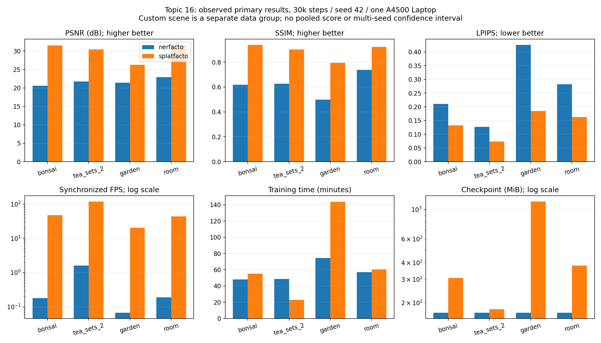
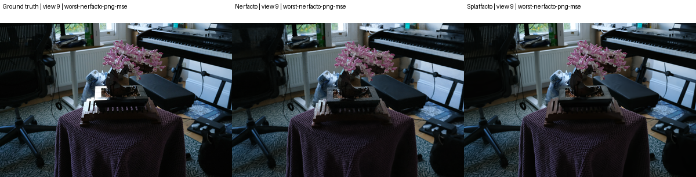
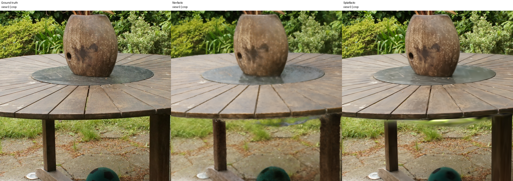
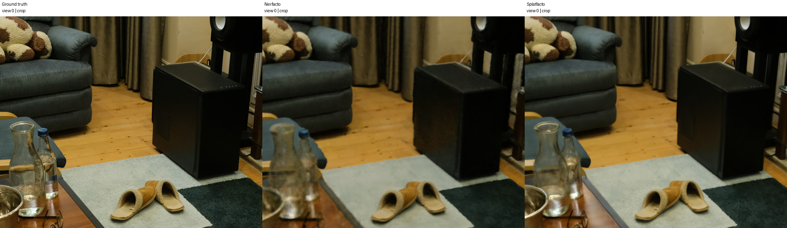
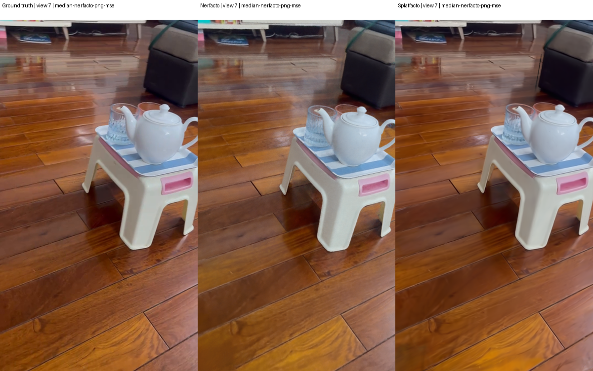
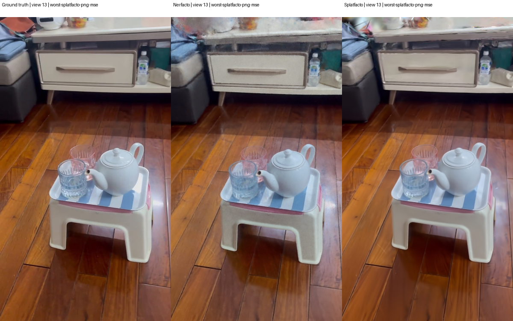

# Review nghiên cứu: Nerfacto và Splatfacto trên A4500 Laptop

Ngày lập: 2026-10-02. Tác giả phân tích: Codex (AI assistant). Trạng thái: **phân tích kỹ thuật đã có bằng chứng; chờ người nghiên cứu duyệt**. Bài này không phải chữ ký human review và không chứng nhận clean-machine GPU replay.

## 1. Tóm tắt và câu hỏi nghiên cứu

Thí nghiệm so sánh Nerfacto và Splatfacto trong Nerfstudio 1.1.5, cùng ảnh/camera/split đã khóa, 30.000 iterations, seed 42, downscale 2, một RTX A4500 Laptop 16 GB. Ba scene benchmark là bonsai, garden, room; custom tea_sets_2 được trình bày riêng. Poster là kiểm tra vận hành, không đưa vào bảng xếp hạng chính.

Trong phạm vi đã đo, Splatfacto có PSNR và SSIM cao hơn, LPIPS thấp hơn trên cả bốn scene chính. Chênh lệch PSNR từ +4,7980 đến +10,9122 dB; tốc độ render đồng bộ cùng camera cao hơn khoảng 74,76–308,46 lần. Chi phí không đồng nhất: garden cần thời gian train 1,936 lần, VRAM lấy mẫu 1,508 lần và checkpoint 6,849 lần Nerfacto. Custom Splatfacto vừa nhanh hơn khi train vừa dùng ít VRAM hơn. Đây là kết quả của cấu hình triển khai cụ thể, không phải kết luận rằng mọi 3DGS đều thắng mọi NeRF.

Câu hỏi được trả lời: với cùng dữ liệu quan sát và ngân sách số bước trên chiếc laptop này, phương pháp nào cho ảnh held-out tốt hơn, tốc độ render cao hơn, và chi phí thực tế ra sao? Thí nghiệm không đo độ đúng hình học tuyệt đối, khả năng nhận diện đồ vật hay khả năng tổng quát sang scene chưa train.

## 2. Phương pháp và đóng góp của project

Nerfacto là phương pháp mặc định của Nerfstudio cho cảnh tĩnh thực tế, kết hợp các kỹ thuật đã công bố như hash encoding, proposal sampling và appearance conditioning. Project sử dụng implementation upstream đã pin; không đề xuất mạng Nerfacto mới. [Tài liệu Nerfacto](https://docs.nerf.studio/nerfology/methods/nerfacto.html).

Splatfacto là implementation Gaussian Splatting của Nerfstudio, sử dụng gsplat. Biểu diễn Gaussian tường minh được tối ưu theo scene, khác với cách truy vấn trường mật độ/màu theo ray của Nerfacto. Bài 3DGS là nguồn thuật toán tham khảo, không phải chứng cứ rằng số đo của project phải bằng số trong paper. [Tài liệu Splatfacto](https://docs.nerf.studio/nerfology/methods/splat.html), [3D Gaussian Splatting](https://repo-sam.inria.fr/fungraph/3d-gaussian-splatting/).

Mỗi scene có bộ tham số riêng; chạy thêm garden không cập nhật trọng số của room hay tea_sets_2. Checkpoint 30k cho phép load lại scene đã học, không cung cấp một model nhận đồ vật mới rồi tự dựng chính xác tức thì. PLY Gaussian là biểu diễn để rasterize; point cloud xuất từ Nerfacto không tự động là mesh watertight có kích thước đúng thực tế.

Phần có thể trình bày như đóng góp kỹ thuật của project: canonical hóa ảnh/camera chung; frozen split và GT checksums; quản lý train/eval/render/export riêng; resume giữ budget, optimizer/RNG và ancestry; provenance gồm source ZIP, runtime và checkpoint; kiểm tra paired artifacts; phép đo FPS có CUDA synchronize; native Windows Unicode-path adapter; GPU watchdog cho laptop; tổng hợp kết quả có nguồn truy vết. Đây là xây dựng và kiểm chứng hệ thống thực nghiệm, chưa phải đổi mới thuật toán NeRF/3DGS. Quyền tác giả từng dòng code vẫn cần lịch sử commit và người thực hiện xác nhận; không suy từ việc AI nhìn thấy source.

## 3. Thiết kế thí nghiệm và tính công bằng

| Scene | Vai trò | Train / held-out | Độ phân giải eval |
|---|---|---:|---:|
| poster | Gate vận hành | 87 / 13 | Xem artifact-audit.json |
| bonsai | Calibration + benchmark | 255 / 37 | 1559 × 1039 |
| garden | Benchmark ngoài trời | 161 / 24 | 2593 × 1680 |
| room | Benchmark trong nhà | 272 / 39 | 1557 × 1037 |
| custom:tea_sets_2 | Capture riêng | 105 / 15 | 359 × 639 |

Ảnh official xuất phát từ dữ liệu mip-NeRF 360; project chuyển về ảnh pinhole canonical, undistort/crop và cập nhật intrinsics trước cả hai trainers. Kích thước trong bảng là kích thước thực tế của ảnh đánh giá, không suy bằng phép chia kích thước archive. Frozen split lưu filename, hash ảnh, pose, intrinsics và kích thước. `collect_pairs` xác nhận hai methods dùng cùng split và GT từng camera. [Nguồn dữ liệu mip-NeRF 360](https://jonbarron.info/mipnerf360/).

Primary protocol: 30k iterations, seed 42, downscale 2, eval mỗi ảnh thứ 8 theo contract. Runtime: Windows native PowerShell, Python 3.10, PyTorch 2.1.2+cu118, Nerfstudio v1.1.5/commit `6b60855003011b2ca23c2fe3f8e2ca6314c69924`, gsplat 1.4.0+pt21cu118, tiny-cuda-nn commit `2e757bbe781db59c4980d389d7dccbf5edc09669`. Pin executable và protocol nằm tại `configs/project.psd1`; snapshot đầy đủ nằm trong từng run.

Giữ method defaults. Một iteration ray-batch của Nerfacto không tương đương một iteration image-based của Splatfacto về lượng công việc. Vì vậy đây là so sánh **cùng số bước của hai cấu hình ứng dụng**, không phải cùng FLOPs, cùng số pixel cập nhật hay cùng thời gian train. Không có tuning riêng để cố nâng một method, cũng chưa có ablation để kiểm tra tối ưu nhất cho từng model.

GPU chạy tuần tự, clock cap 300–800 MHz, start dưới 65°C, watchdog dừng ở ngưỡng policy 78°C / 80 W / 95% VRAM và khi telemetry lỗi. Các ngưỡng này là policy project, không phải nhiệt độ tối đa nhà sản xuất. Không mở viewer khi đo. VRAM trong bảng là cực đại **đã lấy mẫu mỗi 10 giây**, có thể bỏ lỡ spike giữa các mẫu. Thời gian train theo execution manifest gồm các segment chạy, không tính thời gian máy tắt; Nerfacto bonsai và custom có ancestry resume, nên so sánh thời gian mang thêm overhead khởi động lại. Evidence chi tiết ở artifact-audit.json.

PSNR/SSIM/LPIPS lấy từ evaluator upstream trên đúng final checkpoint `step-000029999.ckpt`. PSNR/SSIM càng cao và LPIPS càng thấp càng tốt cho phép đo ảnh này; không diễn giải thành phần trăm accuracy. Các trường `_std` là độ biến thiên giữa views, không phải sai số giữa nhiều seed. Không có confidence interval của repeat training vì chỉ có một primary seed.

FPS lấy từ render contract cùng held-out camera hash, cùng kích thước và số frame, warm-up 3 frame, 3 lần đo, CUDA synchronize. Model loading, image IO và video encoding không nằm trong FPS. Không dùng FPS không đồng bộ trong metrics upstream. FPS garden và custom không so trực tiếp để kết luận scene custom dễ hơn: kích thước ảnh khác nhau rất lớn. Checkpoint MiB = bytes / 2²⁰; đây không phải kích thước PLY hoặc RAM của viewer web.

## 4. Kết quả định lượng

| Scene | Method | PSNR ↑ | SSIM ↑ | LPIPS ↓ | Train phút | VRAM MiB | Checkpoint MiB | FPS ↑ |
|---|---|---:|---:|---:|---:|---:|---:|---:|
| bonsai | nerfacto | 20.5936 | 0.6183 | 0.2103 | 48.08 | 6022 | 167.92 | 0.180 |
| bonsai | splatfacto | 31.5059 | 0.9381 | 0.1324 | 55.19 | 5572 | 306.60 | 47.359 |
| custom:tea_sets_2 | nerfacto | 21.7555 | 0.6255 | 0.1268 | 48.66 | 5904 | 167.85 | 1.607 |
| custom:tea_sets_2 | splatfacto | 30.4557 | 0.9013 | 0.0737 | 22.96 | 3410 | 179.13 | 120.155 |
| garden | nerfacto | 21.4435 | 0.4994 | 0.4255 | 74.32 | 6975 | 167.88 | 0.067 |
| garden | splatfacto | 26.2415 | 0.7937 | 0.1848 | 143.85 | 10520 | 1149.81 | 20.598 |
| room | nerfacto | 22.9068 | 0.7385 | 0.2821 | 56.95 | 7826 | 167.93 | 0.188 |
| room | splatfacto | 31.6652 | 0.9224 | 0.1627 | 60.52 | 6123 | 380.39 | 44.063 |

Nguồn chính thức: [results.json](../results.json), [results.csv](../results.csv). Số hiển thị được làm tròn; phép tính chênh lệch dùng số gốc. Custom là nhóm riêng, không gộp lấy trung bình với official benchmark.

| Scene | ΔPSNR dB | ΔSSIM | ΔLPIPS | FPS S/N | Train S/N | VRAM S/N | Checkpoint S/N |
|---|---:|---:|---:|---:|---:|---:|---:|
| bonsai | +10.9122 | +0.3198 | -0.0779 | 263.16× | 1.148× | 0.925× | 1.826× |
| custom:tea_sets_2 | +8.7002 | +0.2757 | -0.0532 | 74.76× | 0.472× | 0.578× | 1.067× |
| garden | +4.7980 | +0.2943 | -0.2407 | 308.46× | 1.936× | 1.508× | 6.849× |
| room | +8.7585 | +0.1840 | -0.1194 | 234.18× | 1.063× | 0.782× | 2.265× |

Δ = Splatfacto − Nerfacto; S/N = Splatfacto chia Nerfacto. Các tỷ lệ FPS lớn được giải thích trong phạm vi renderer, độ phân giải và GPU cap đã nêu; không phải tuyên bố tốc độ tổng quát hoặc lời hứa FPS của UI tương lai.

Bonsai cho chênh lệch chất lượng lớn nhất: +10,9122 dB PSNR, +0,3198 SSIM, −0,0779 LPIPS. FPS 47,36 so với 0,180; train Splatfacto dài hơn khoảng 14,8%, checkpoint lớn hơn khoảng 82,6%. Quan sát ảnh phù hợp với việc Splatfacto giữ chi tiết vải, đế cây và xe đạp tốt hơn. Không có thí nghiệm kiểm soát để quy toàn bộ chênh lệch cho một thành phần kiến trúc.

Garden có PSNR thấp nhất của Splatfacto trong bốn scene và LPIPS cao nhất của cả hai methods: cấu hình hiện tại xử lý cảnh này chưa tốt bằng các scene khác theo phép đo ảnh. Splatfacto cải thiện LPIPS mạnh, từ 0,4255 xuống 0,1848, nhưng cần 143,85 phút train so với 74,32 phút và sampled VRAM 10.520 MiB so với 6.975 MiB. Không OOM trong run này không có nghĩa scene lớn hơn sẽ luôn chạy được. Checkpoint khoảng 1.149,81 MiB so với 167,88 MiB là trade-off đáng kể khi lưu/chuyển model.

Room: +8,7585 dB PSNR, +0,1840 SSIM, −0,1194 LPIPS. Splatfacto 44,06 FPS ở 1557×1037, train dài hơn khoảng 6,3%, VRAM lấy mẫu thấp hơn khoảng 21,8%; checkpoint lớn hơn 2,265 lần. Kết quả hỗ trợ ưu tiên Splatfacto cho trình diễn room trên runtime hiện tại, nhưng chưa chứng minh viewer trình duyệt sẽ đạt cùng FPS.

Custom: +8,7002 dB PSNR, +0,2757 SSIM, −0,0532 LPIPS. Splatfacto train 22,96 phút so với 48,66 phút, sampled VRAM giảm từ 5.904 xuống 3.410 MiB. 120,16 FPS đo tại 359×639; không chuyển con số này thành FPS 1080p. Model này biểu diễn riêng bộ ấm/cốc cùng nền phòng đã quan sát.

## 5. Review định tính và failure analysis

Hình sử dụng ảnh GT/prediction đã lưu, không tạo lại ảnh bằng AI. Trong mỗi hàng: GT, Nerfacto, Splatfacto. Góc đầu tiên, góc PNG-MSE lớn nhất của mỗi method và góc trung vị của Nerfacto được chọn bằng quy tắc công bố trước diễn giải. Góc trùng nhau được gộp; tọa độ source/crop/hash lưu trong [case-selection.json](case-selection.json). Per-view PNG PSNR chỉ là diagnostic của ảnh 8-bit, có quantization; không thay PSNR float của evaluator upstream. Heatmap cùng scale absolute RGB error 0–0,15, không normalize riêng từng method để làm một bên trông tốt hơn.

### 5.1 Bonsai: cấu trúc mảnh và texture lặp

Ở camera held-out 0, Nerfacto làm mềm đường nối đế gỗ, texture khăn tím và cạnh/nét chữ khung xe; Splatfacto giữ các chi tiết này gần GT hơn. Cạnh cánh hoa/cành và phần background tối vẫn cần đối chiếu kỹ, không đủ cơ sở tuyên bố hoàn hảo.

Camera 9 là worst PNG-MSE của Nerfacto trong bộ held-out: ảnh Nerfacto có sai khác độ sáng/chi tiết ở vùng bàn, thân cây và nền; ảnh tổng thể không sụp đổ. Vì camera này chứa nhiều background, MSE toàn ảnh không đo riêng chất lượng bonsai. Đây là bằng chứng cần xem toàn cảnh cùng crop, không chỉ một ảnh đẹp đầu tiên.

### 5.2 Garden: foliage, occlusion và vật thể nhỏ

Camera 0: Nerfacto làm mịn nhiều cụm lá và đường vân/khe mặt bàn; bóng và mặt bình cũng có sai khác. Splatfacto giữ độ sắc của lá, mép bàn và vùng đất gần GT hơn, nhưng bóng xanh dưới bàn vẫn mềm và vùng foliage không trùng hoàn toàn. Từ ảnh này chỉ kết luận về appearance; không chứng minh số đo hình học chính xác của lá bị khuất.

Camera 4 là worst PNG-MSE của cả hai methods: crop cho thấy Nerfacto làm mềm các khe mặt bàn, hoa khô và nền lá; Splatfacto rõ hơn nhưng đĩa dưới bình và một số lá vẫn khác GT.

Các góc worst/median và heatmap được cung cấp trong case-selection.json để tránh suy toàn bộ scene từ một crop. Một vùng error lớn có thể đến từ pose/appearance/texture/visibility; chưa có ablation để xác định nguyên nhân. Không gắn nhãn “low-overlap failure” nếu chưa đo số camera quan sát/overlap của vùng đó.

### 5.3 Room: kính, phản xạ và biên vật thể

Camera 0: hình Nerfacto mất chi tiết trên chai/lọ thủy tinh ở tiền cảnh, texture sofa/rèm và mặt bên thiết bị đen; Splatfacto giữ hình chai và đường biên thiết bị rõ hơn. Kính và kim loại có thay đổi appearance theo góc nhìn; tương đồng ảnh tốt hơn không chứng minh model đã khôi phục đúng vật liệu quang học hoặc interior của chai.

Camera 29 (worst Nerfacto) cho thấy sách và lá cây bị mềm/đổi texture ở Nerfacto; Splatfacto giữ đường nét rõ hơn. Camera 36 (worst Splatfacto) nhìn xuống dép/thảm/sàn: Splatfacto vẫn có vùng nhòe ở mép sàn và tiền cảnh bên phải ảnh đầy đủ; Nerfacto sai khác rõ ở thảm và sàn bên trái. Đây là failure appearance có thật của cả hai, kể cả method thắng bảng trung bình. Chưa đo overlap/depth nên không khẳng định nguyên nhân là coverage thiếu.

Cả hai còn sai khác tại chi tiết nhỏ và mép vật thể. Cần xem ảnh crop ở kích thước source-pixel, tránh đánh giá chỉ bằng preview thu nhỏ hoặc MP4 có nén. Những artifacts chuyển động ở quỹ đạo mới chưa được xác nhận vì review này không chạy một trajectory inference mới.

### 5.4 Tea sets: đồ trong suốt, nền và tương quan video

Camera 10 (worst Nerfacto) cho thấy viền/nắp ấm và rãnh cốc đỏ bị làm mềm rõ; Splatfacto gần GT hơn nhưng viền cốc chưa trùng hoàn toàn.

Camera 0 và 7: Nerfacto làm mềm rãnh cốc, viền cốc, nắp/biên ấm và khe gỗ nền; Splatfacto giữ đường nét rõ hơn, nhưng vẫn có vùng mềm ở cốc và phản xạ nền. Camera 13 là worst PNG-MSE của Splatfacto: Nerfacto sai khác đáng kể ở background sáng/bàn/tủ; Splatfacto gần GT hơn nhưng hình cốc và vùng sáng chưa trùng hoàn toàn. Do đó chỉ số tốt không đồng nghĩa đồ vật được tái tạo 100%.

Video nguồn là một capture cảnh tĩnh, 120 frame đã chọn, 120/120 camera registered trong một connected COLMAP model. Split 105 train/15 eval. Held-out views nằm trong cùng video, có tương quan thời gian và coverage với train; kết quả chứng minh nội suy trong capture này, không phải thử trên đồ vật mới, video mới, thay ánh sáng hay backside chưa nhìn thấy. COLMAP dùng toàn bộ ảnh để ước lượng pose/sparse initialization; optimizer không nhận eval RGB làm training loss. Vì vậy đây là protocol known-camera/transductive SfM, không phải benchmark SfM chỉ dùng ảnh train. Các giới hạn này phải nói rõ khi báo cáo.

## 6. Audit, tính tái lập và giới hạn bằng chứng

Một Python venv mới, không pip/third-party packages, chạy native Windows `python -I` với bản sao các validator. Audit kiểm tra toàn bộ 10 run được chọn: final config/checkpoint/source archive/requirements, resume ancestry, safety records, frozen splits, GT/pred hashes, finite metrics, pairs, paired render và exports. Đã hash lại toàn bộ 1.008 ảnh input train/eval hiện tại cùng 10 pose/sparse files và xác nhận khớp frozen split; đây là integrity check của dữ liệu cũ, không phải prepare data mới. Bảng results tính lại khớp chính xác dữ liệu đã lưu. Kết quả và môi trường ở [artifact-audit.json](artifact-audit.json). CPU QA bằng cùng venv sạch cũng PASS 38 PowerShell parsers, 19 fixture successes và 75 Python tests; PSScriptAnalyzer chưa có nên SKIPPED, không phải lint PASS. Evidence: [cpu-qa.json](cpu-qa.json), [cpu-qa.log](cpu-qa.log). Lần đầu wrapper Test-Project gặp stderr progress của unittest; đã sửa xử lý native exit code rồi chạy lại toàn bộ thành công, giữ log attempt cũ. Sửa wrapper kiểm thử không đổi model, weight hoặc evaluator.

Audit này chia sẻ máy, dữ liệu và artifacts cũ; không có cài CUDA mới, prepare dataset mới, train mới hay evaluation inference mới. Nó kiểm chứng integrity và khả năng tính lại phân tích bằng Python sạch, **không hoàn thành independent clean-machine GPU replay**. Evidence không được nâng phạm vi chỉ vì exit code bằng 0.

Sửa runtime inventory đã áp dụng sau training để loại metadata `setuptools/_vendor` gây false dependency drift. Đây là sửa compatibility loader, không sửa trọng số hoặc metric. Provenance và source.zip của runs giữ nguyên. Regression evidence: `artifacts/logs/validation/runtime-snapshot-fix-20261002.json`. Replay phải lưu cả source của run gốc và source adapter hiện tại; chỉ checkout Git HEAD chưa đủ nếu code lúc chạy có file chưa commit.

Giới hạn cần giữ trong kết luận: một GPU/laptop/driver/OS, clock cap và thermal policy riêng, một seed, không repeat/ablation, số bước không tương đương công việc, độ phân giải khác giữa scene, canonical preprocessing khác pipeline paper, resumed-run time overhead, VRAM sampling bỏ lỡ spike, custom single-video interpolation, SfM dùng eval views, không có ground-truth 3D geometry, không đo mesh completeness/material accuracy, không có test mới độc lập ngoài held-out hiện tại. Không suy rằng project đã làm tốt nhất có thể hoặc model thông minh hơn qua nhiều scene.

## 7. Kết luận để trình bày

Trong cấu hình thực nghiệm này, Splatfacto phù hợp hơn để ưu tiên trình diễn scene đã train do chất lượng ảnh và synchronized render throughput. Garden cho thấy chi phí Gaussian representation có thể lớn về thời gian, VRAM và dung lượng. Nerfacto có checkpoint khá ổn định khoảng 168 MiB giữa scene nhưng chất lượng/tốc độ ở các runs hiện tại thấp hơn. Quyết định này là dựa trên số đo hiện có, có thể đổi khi thay protocol, model variant hoặc phần cứng.

Cách phát biểu trung thực: “Nhóm xây dựng pipeline so sánh Nerfacto và Splatfacto trên native Windows, cùng canonical input và frozen held-out cameras, có artifact contracts và replayable provenance. Trong bốn scene đã đo, Splatfacto cho ảnh tốt hơn và render nhanh hơn; chi phí train/lưu trữ phụ thuộc scene. Nhóm chưa đề xuất kiến trúc radiance-field mới và chưa chứng minh generalization hay geometric accuracy tuyệt đối.”

Việc cải thiện tiếp có thể tách thành repeat seeds 43/44, equal-time budget, ablation pose refinement/appearance, camera coverage test và held-out video độc lập. Các việc đó là nghiên cứu mới với report riêng; không cần ghi đè hoặc train lại các checkpoint hiện có chỉ để lập UI demo về sau.

## 8. Evidence và quyết định nghiệm thu

| Mục | Trạng thái có bằng chứng |
|---|---|
| 10 primary train/eval + paired render/export | PASS qua artifact validator |
| Bảng, chênh lệch, ảnh cùng camera/crop, worst/median, heatmap, limitations | Đã chuẩn bị để review |
| Clean Python artifact audit và recomputation | PASS, same-host CPU scope |
| Human research approval | Chưa có chữ ký/xác nhận |
| Independent clean-machine setup/data/train/eval | Chưa chạy, chưa có máy khác/người replay |
| G-Core | Giữ BLOCKED theo tiêu chí hiện hành |

Settings hash: `073b7afb201c242c211e556f8e07640b1d8a7187771976eedbe38e65e867efad`. Mười run keys chính xác có trong [review.pending.json](review.pending.json); bảng và ảnh là evidence của selection này. Người review cần đọc số liệu, kiểm tra ít nhất các góc worst của mỗi method, xác nhận wording/limitations và ghi danh tính/notes của mình. Không ký thay reviewer hoặc đánh dấu GPU replay bằng CPU audit.

Runbook phạm vi một máy/môi trường sạch và replay thực sự: [replay_runbook.md](replay_runbook.md). Đọc [review_checklist.md](review_checklist.md) trước khi endorse selection. Evidence index có checksum để phát hiện báo cáo bị sửa sau review.
